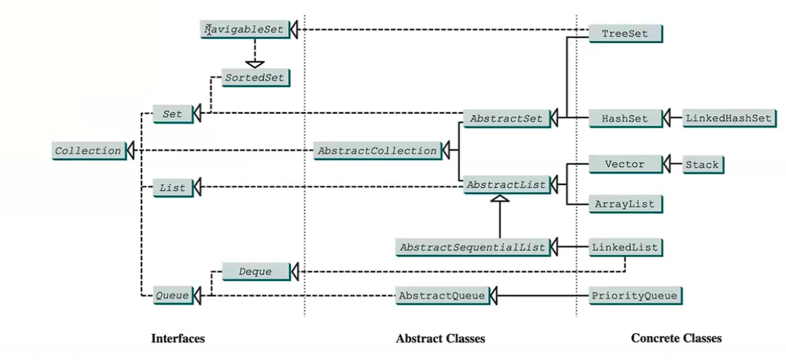

<h1 style=" color: cornflowerblue; text-align: center; font-family: 'Consolas', sans-serif;">
Data Structure And Algorithms | Collections: Introduction to Semantic Differences | USFQ | Santiago Arellano
</h1>

***
<ul>
<code>Main Information Section</code>
<li><b style="color: cornflowerblue; font-weight: bold">Date:</b>: 11th of September 2024</li>
<li><b style="color: cornflowerblue; font-weight: bold">Unit</b>: Unit 2</li>
<li><b style="color: cornflowerblue; font-weight: bold">Description</b>: This file contains information about: Java Collections framework, Collection interface, and
the semantic differences between different collections.</li>
</ul>

***
 
<h3 style=" color: cornflowerblue; text-align: center; font-family: 'Consolas', sans-serif;">
"Throwback to Java Collections ", "Throwback to Java Iterators ", "Throwback to Java Collections ", "Sets, Lists, LinkedLists,
Vectors, etc"
</h3>
<ul style="font-family: Consolas, sans-serif">
<li><code style="color: cornflowerblue; font-weight: bold">"Throwback to Java Collections"</code>:
Collections already implement some skeletons for implementing our own data structures. In general, they provide
various methods for working with collections and the methods expected to work in them. They allow you to work with different 
collections of data values.
<blockquote style="font-style: italic; color: black"> 
In Java, most interfaces and abstract classes are ADT, abstract data types. Furthermore, we must point out that it is
impossible for us to <code><b>instantiate them, only references can be made</b></code>.
</blockquote>
It is important for us to know what this looks like inside Java.
<blockquote style="font-style: italic; color: black"> 
<body>

</body>
Moreover,there are certain methods that must be implemented
<body>

</body>
</blockquote>
Java collections must have a series of methods. For instance, <code>add()</code>, <code>addAll() [Adding an entire collection
to another]</code>, <code>retainAll() [retains all elements shared between this() and another collection]</code>. These,
therefore, allow for the most basic control over collections of data, only supered by those in the concrete data type 
implementation.
  

Moreover, since we can <code><b>downcast a concrete implementation to its super interfaces (i.e. polymorphism)
</b></code> we are allowed to use a single reference for various Collections concrete types. However, we lose some 
functionality specific for some data types (e.g., lists and sets do not have the same add operations).

 

A container, as fausto says, can be defined as an object meant to store other objects.

<blockquote style="font-style: italic; color: black"> 
Depending on the data structure we are using, it is not the same complexity nor the same methods that need to be used. As
an example, if I have for instance an ArrayList, our contains() method would require either an index or an object, but it 
still runs linearly. However, if we have a queue, our contains might require us to move through the entire queue, popping and 
adding items back into it. This would be the same case for the stack, but it would look at it from the last element in to the
first element FILO. 
  
As a sidenote, a Stack is incredibly important for those programs which require inversion of data
</blockquote>
<blockquote style="font-style: italic; color: black"> In a basic collection, through the interface Collection, has a 
<code>contains()</code> method which runs linearly.</blockquote>
<blockquote style="font-style: italic; color: black"> 
Although we can try to force implementations and operations to be available in every data structure. Most structures are 
tailored for specific use cases where these operations have been optimized and pruned. 
</blockquote>
</li>
<!--! A Comment to separate them all -->
<li><code style="color: cornflowerblue; font-weight: bold">"Throwback to Java Iterators"</code>: Iterators are objects 
which allow us to traverse a Collection <code><b>without necessarily knowing how the data structure is stored 
in memory</b></code>. This means that the iterator allows for continuous retrieval or deletion of data without allowing
the user to know exactly which data structure, the concrete DS they are using is implemented on.

<blockquote style="font-style: italic; color: black"> 
Just as a reminder, for a program to implement polymorphism, we require to have references to base classes and a method that
is implemented in various classes to create a hierarchy.
</blockquote>
<blockquote style="font-style: italic; color: black"> 
Iterators usually belong to the collection they were created from, and they might have a predefined next value behavior.
These are two problems of an iterator because
<ul>
<li>If the iterator is created from a single data type or structure, we are not allowed to use it on anything else,
therefore it creates a single use reference.</li>
<li>If it has a predefined behavior for finding the .next() value, it might be bothersome for cases in which we need 
to apply some conditional logic or filtering logic for finding the .next() value</li>
</ul></blockquote>
</li>
<!--! A Comment to separate them all -->
<li><code style="color: cornflowerblue; font-weight: bold">"Throwback to Java Collections"</code>:
Java Collections, with an s in the end, is a framework with various methods for sorting, shuffling, and analyzing collections.
From sorts, shuffles, mix, and max, to complex operations like disjoint and frequency. These are all aimed at taking in a List
of data values and iterating over that list to return the given numerical <quantity class=""></quantity></li>
<li><code style="color: cornflowerblue; font-weight: bold">"Sets, Lists, LinkedLists,
Vectors, etc"</code>:
Most of the time we are working with already implemented data structures, and in Java most of the heavy lifting is done for us.
This of course does not mean that we do not need to know the backend implications of each design decision we take. For example
between the Sets, you can have Set, TreeSet, and HashSet, allowing for, normal set behavior, natural order ordering of the values,
faster access times while keeping input order, behavior.
  
The same can be said about lists, we can choose between ArrayLists, or LinkedLists, ArrayLists are most generally contiguous 
chunks of memory filled with the data we have, while linked lists are discontinuous memory locations that keep a pointer to the 
next in a successive linked chain of elements.
  
Moreover, it is important to consider the internal structure used to store data. For example, some data structures might have 
internal data structures to hold their data, this might make them more efficient if sorted when looking up values (searching), while others
might have another implementation that does not like being sorted. <code><b>It all depends on the internal data structure
the implementation chosen</b></code>
<blockquote style="font-style: italic; color: black"> 
Inside linked lists, sequential access is not necessarily as sequential as arrays. Rather we are moving "sequentially" through
memeory addresses. The second way we can address traversing a list is to keep a list of memory redirections 
of the table for each entry.
</blockquote>
<blockquote>
Priority Queues involve giving it a comparator implementation to define the order in which the entries inputted should be
ordered. 
</blockquote>
</li>

</ul>