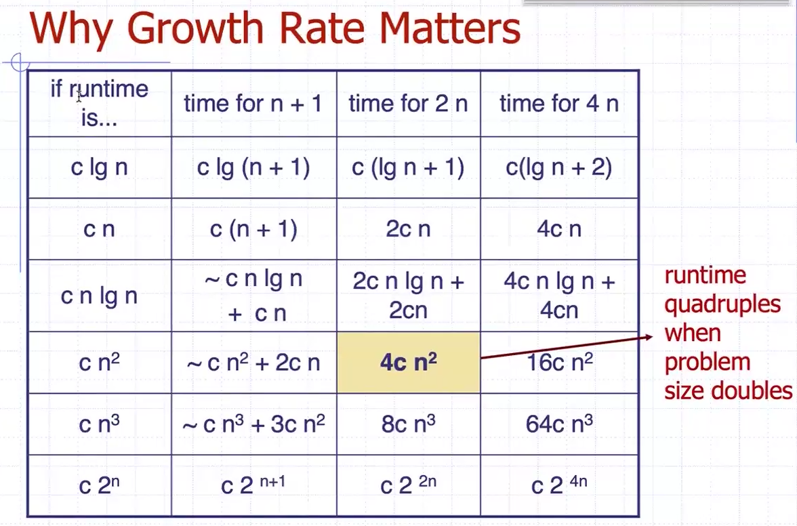
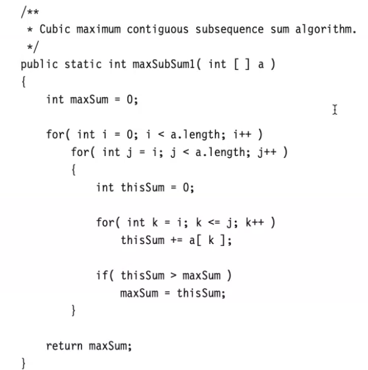
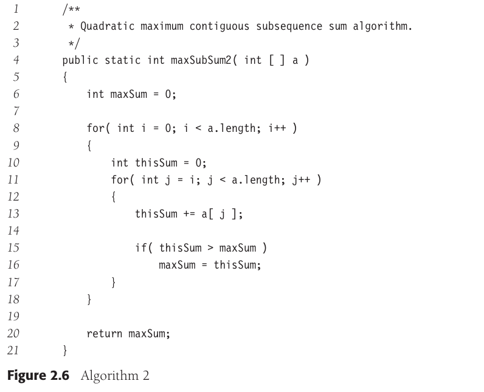
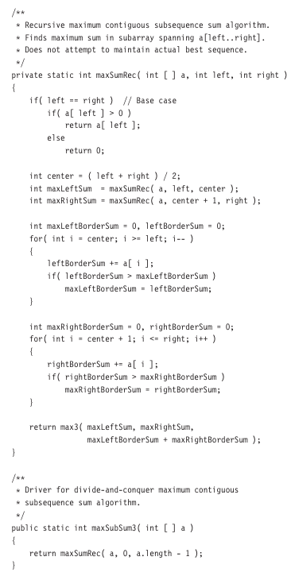
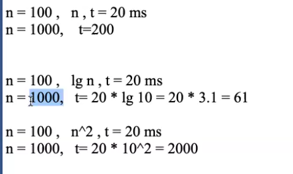

<h1 style=" color: cornflowerblue; text-align: center; font-family: 'Consolas', sans-serif;">
Data Structure And Algorithms | Algorithm Analysis Continuation | USFQ | Santiago Arellano
</h1>


***
<ul>
<code>Main Information Section</code>
<li><b style="color: cornflowerblue; font-weight: bold">Date:</b>: 28th of August 2024</li>
<li><b style="color: cornflowerblue; font-weight: bold">Unit</b>: Unit 1</li>
<li><b style="color: cornflowerblue; font-weight: bold">Description</b>: This file contains information about chapter 22 from Liang's book about
Java Algorithm Analysis</li>
</ul>

***
<br>
<h3 style=" color: cornflowerblue; text-align: center; font-family: 'Consolas', sans-serif;">
"Why Growth Rate Matters Graph ", "The Case Of Recursive Algorithms ", "Longest Sub-chain/Highest Sum In Array Case Study ",
"The Case For Analyzing Times With Growth Rates"
</h3>
<ul style="font-family: Consolas, sans-serif">
<li>
<code style="color: cornflowerblue; font-weight: bold">"Why Growth Rate Matters Graph"</code>: while this section requires one image
present in Fausto's Zoom meeting, it is important to note that the growth rate of <b>any algorithm is as important as the amount of data
that it will analyze</b>. This because as data increases, depending on the growth rate of the given algorithm, it will become 
harder to gather results and time and memory concerns will become primal in this analysis. Therefore, we must consider the efficiency of 
our algorithms and their growth rates, such that when we apply them we know how they will perform under heavy loads.
<blockquote style="font-style: italic; color: bisque">Image from Fautos's presentation
<br>


</blockquote>
<br><br>
<blockquote style="font-style: italic; color: bisque"> Interestingly, when we are looking at algorithms, one of the operations that often defines
the growth rate function that Big O will attain is the appearance of loops, particularly nested loops as they increase our 
asymptotic complexities.</blockquote>
</li>
<li>
<code style="color: cornflowerblue; font-weight: bold">"The Case Of Recursive Algorithms"</code>:
</li>
<blockquote style="font-style: italic; color: bisque"> In general terms, recursive algorithms can be linearly analyzed as the amount of calls
that it makes. In the case of a simple factorial algorithm, we say that its asymptotic complexity is O(N), however this changes when it comes to 
other more complex algorithms.
<br><br>
In the case of Fibonacci, asymptotic complexity is of k^N, meaning we have a certain base number raised to a certain exponential N.</blockquote>
One interesting algorithm that we should take a look at is the Euclides MCM Algorithm
<blockquote style="font-style: italic; color: bisque"> 
Euclidean MCM Algorithm
<body>

```java
package examples;

import java.util.concurrent.atomic.AtomicInteger;

public class hello {
    public static void EuclideanMCM(int left, int right) {
        AtomicInteger leftInternal = new AtomicInteger(left);
        AtomicInteger rightInternal = new AtomicInteger(right);
        int moduloResultant = left % right;
        while (moduloResultant != 0) {
                leftInternal.getAndSet(rightInternal);
                rightInternal.getAndSet(moduloResultant);
                moduloResultant = leftInternal.get() % rightInternal.get();
        }
        
        System.out.println("MCM: " + rightInternal.get());
    }
}
```
</body>
However interesting this algorithm might be, since it is not bound by any variable that might determine how much it moves,
iterations it does, etc. We do not know directly how to calculate its complexity. However, mathematicians have determined 
that in the worst ase scenario it behaves as <b> O(log2(N))</b>
</blockquote>
Another interesting detail that we need to have in mind are the basic restrictions to recursion that exist:
<blockquote style="font-style: italic; color: bisque"> 
<ul>
<code>Basic Guidelines For Writing Recursive Code</code>
<li><b style="color: cornflowerblue; font-weight: bold">Base Case</b>: a case that determines to the program where to 
stop the recursive calls</li>
<li><b style="color: cornflowerblue; font-weight: bold">Recursive calls point to base case</b> </li>
</ul></blockquote>
<li><code style="color: cornflowerblue; font-weight: bold">"Longest Sub-chain/Highest Sum In Array Case Study"</code>:
This is, given a sequence of positive and negative numbers, the highest valued summation between the numbers in the array.
This means that for any given array of length n, we are looking for some sub-chain of length m, which produces the highest
total value when its numbers are added up. There are various implementations of this algorithm, some use mostly double 
for loops, other's linear complexities and others try to make it faster and more efficient by looking into recursive's.
<br><br>
<blockquote style="font-style: italic; color: bisque">This algorithm does not shy away form sets of numbers that are 
ordered, it also works on unordered sets.</blockquote>
One of the main issues that we can find in this algorithm is that in the most basic, brute force, implementation of this 
algorithm we look at a double nested for loop which iterates, beginning from a single index, over every other index in the 
array.
<blockquote style="font-style: italic; color: bisque"> The problem with a double nested for loop is that it forces the 
program to run twice over every index, once in the outer loop, and another time in the inner loop. This is a waste of 
resources, of memory allocation, of speed and in general a bad implementation of this algorithm. Nevertheless, the code is provided as is
in here:
<br><br>
<body>



</body>
Notice that even though there are two main nested loops, <b>we added another one </b>, and now the asymptotic complexity
of this implementation is 0(N^3).
</blockquote>
Now, aside from this one there is another implementation that allows us to reduce the complexity down to O(N^2).
<blockquote style="font-style: italic; color: bisque">
The case of a Quadratic Implementation
<body>


</body>
As you can see this algorithm goes from three to two nested loops, doing basically the same arrangement as before, 
traversing, summing, checking and replacing if needed be. But this is now significantly more efficient in terms of <b>
operations</b> than the last one.</blockquote>
However, there is a third implementation that brings us down to O(N), known as Kadane's Algorithm
<blockquote style="font-style: italic; color: bisque"> 
<body>

```C++

void kadane_algorithm_from_index_zero()
{
    srand(time(NULL));
    array<int, 25> array_nums{};

    //! populate the array
    for (size_t index = 0; index < array_nums.size(); index++)
    {
        array_nums.at(index) = -50 + rand() % 101;
        cout << array_nums[index] << " ";
    }
    cout << endl;
    //! Kadane algorithm vars
    int sum_helper = 0;
    int sum_total = 0;
    const int lower_index = 0;
    int upper_index = 0;

    for (size_t index = 0; index < array_nums.size(); index++)
    {
        sum_helper += array_nums.at(index);
        if (sum_helper > sum_total)
        {
            sum_total = sum_helper;
            upper_index = index;
        }
    }
    cout << "Lower index: " << lower_index << endl;
    cout << "Upper index: " << upper_index << endl;
    cout << "Sum Total: " << sum_total << endl;
}
```
</body>
Although the previous implementation is in C++, it is clear that this is now linear time.
</blockquote>
Finally, for this case study we will show how to make this 100% better with recursiveness. This method takes into account
the size of the array and goes ahead and breaks it down like binary search. However, and this is something binary search 
addresses, the answer might not just be in either side, but also as a mixture of either side. For this reason, special 
measures had to be introduced to analyze both left, right, and side bounds.
<blockquote>
<body>



</body>
This Algorithm, because of its divide-and-conquer style of recursion, has a O(log2(n)) complexity
</blockquote>
</li>
<li><code style="color: cornflowerblue; font-weight: bold">"The Case For Analyzing Times With Growth Rates"</code>:
Generally, we do not think of growth rates nor increases in database sizes as being linearly related to an increase in
computation time for an algorithm. If anything, nothing but O(N) algorithms will ever have true linear increases
in their time of execution regardless of the way we increase the data. On the other hand, most algorithms have something,
that we have explored <i>previously</i>, known as <b>Growth Rates!</b>.
<br><br>
Growth rates are not only useful for determining the way an algorithm will behave in terms of operations when data size 
increases. It is also useful to kind of gauge the increase of time.
<br>
<blockquote style="font-style: italic; color: bisque"> 
As an example, consider the following cases:
<body>


</body>
If we go ahead and take a look at the linear case, we notice that indeed time increases <i>for this case</i> linearly along
with the increase in data input size. However, when we have logarithmic algorithms, we  see that to find the new time we 
need to <code>Use the defined growth rate, evaluated w.r.t the new data size, and added onto the base time.</code> Do care for this,
since it might come in the test.
</blockquote></li>
</ul>