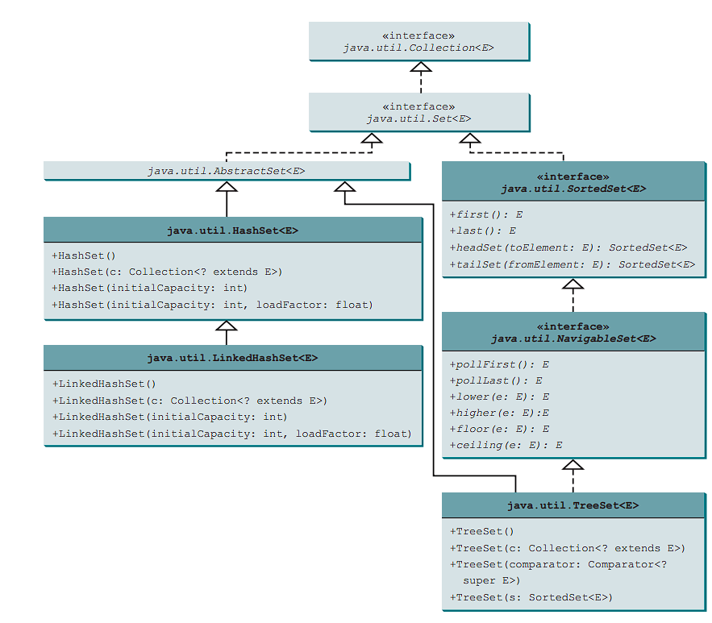
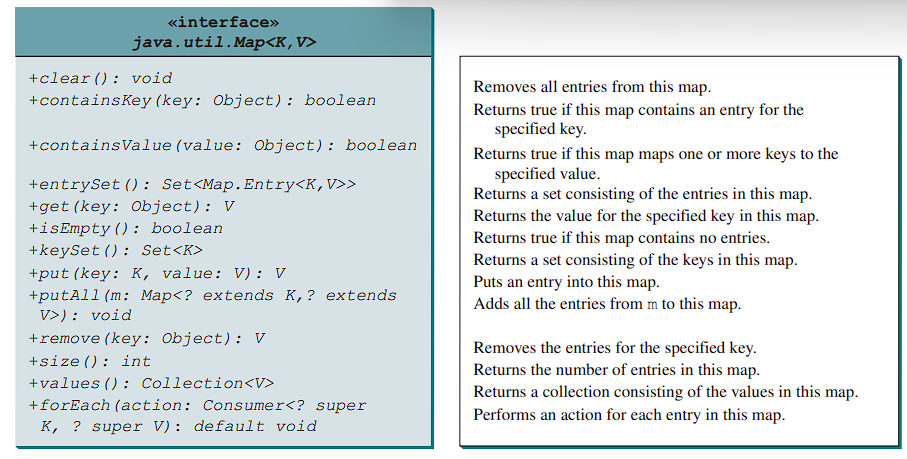

<h1 style=" color: cornflowerblue; text-align: center; font-family: 'Consolas', sans-serif;">
Data Structure And Algorithms | Sets And Maps | USFQ | Santiago Arellano
</h1>

***
<ul>
<code>Main Information Section</code>
<li><b style="color: cornflowerblue; font-weight: bold">Date:</b>: 16th of September 2024</li>
<li><b style="color: cornflowerblue; font-weight: bold">Unit</b>: Unit 3</li>
<li><b style="color: cornflowerblue; font-weight: bold">Description</b>: The following document contains information
pertaining the start of the third classes block for CS Data Structure And Algorithm.</li>
</ul>

***
 
<h3 style=" color: cornflowerblue; text-align: center; font-family: 'Consolas', sans-serif;">
"Sets ", "Maps "
</h3>
<ul style="font-family: Consolas, sans-serif">
<li><code style="color: cornflowerblue; font-weight: bold">"Sets"</code>:

Basically, a set is a vector of data with no repeated elements. We assume it like a vector due to the fact that it 
resizes dynamically based on a <code><b>load factor</b></code> provided during instantiation, or with the defined 
load factor of <b>0.75</b>
  
Sets in general will always guarantee that no duplicates are allowed, however for order of input in retrieval, and 
efficiency of method calls we ought to look at specific implementations (i.e., HashSet or TreeSet)

<blockquote style="font-style: italic; color: black">
A load factor is a value between 0.0 and 1.0 that represents the percentage of the set that must be full before 
resizing the entire thing. For example, if we have 20 items and a load factor of .75, we know that at 15 items the set, or 
any data structure that works with this will be resized (specifically, doubling the previously known capacity).
  
Often it is important to use this load factor when we know the size of our collection beforehand.
</blockquote>

In general, this class has three concrete implementations provided by Java. These are HashSet, TreeSet, and LinkedHashSet. 
All of them are presented in the following UML diagram.
<body>

</body>
As can be noted through the previous UML diagram, all Sets extend indirectly from Collection and Set interfaces. Moreover,
the existence of the Navigable set interface towards the TreeSet and SortedSet, this allows us to see that it will not only 
be sorted through some comparator conditional, but also that it will allow traversal over it in some way.

<blockquote style="font-style: italic; color: black"> 
<ul>
<code>Types of Sets</code>
<li><b style="color: cornflowerblue; font-weight: bold">HashSet</b>: This implementation of the Set interface does not
store the information pertaining input order of data, nor that any order will remain constant over time. However, 
it guarantees that <code>basic operations like <b>add, remove, contains and size</b> will be executed in <b>
constant time</b></code>.
  
<blockquote style="font-style: italic; color: black"><q>
Iterating over this set requires time proportional to the sum of the HashSet instance's size (the number of elements) 
plus the "capacity" of the backing HashMap instance (the number of buckets). Thus, it is crucial not to set the 
initial capacity too high (or the load factor too low) if iteration performance is important.
</q></blockquote>
Moreover, we must take note that this implementation is not synchronized for any concurrent use.
  
Hash sets do not use vectors
</li>
<li><b style="color: cornflowerblue; font-weight: bold">LinkedHashSets</b>: This implementation does guarantee that the 
iteration order once items begin to be added will be the same as when they are iterated. The implementation does this
<code><b>by keeping a Double Linked List running through the elements</b></code> storing the order in which they 
were inserted as the <code><b>encounter order</b>(i.e. iteration order)</code></li>
<li><b style="color: cornflowerblue; font-weight: bold">TreeSet</b>: TreeSet guarantees ordering based on a comparator
or the natural ordering. This implementation allows for navigating the set and slashing it into a smaller set of values.
For this we can do the following.
<ul>
<li>Having SortedSet implemented within it allows us to get the methods <code>first(), last(), headset(e), tailset(e)
</code> where for headset the elements will be <b>less than e</b> and tailset will be <b>higher than or equal to e</b>
</li>
<li>Navigable set allows us for getting various subsets based on higher, equal, lower than or equal to, lower splits</li>
</ul>
</li>
</ul>
</blockquote>
</li>
<li>
<code style="color: cornflowerblue; font-weight: bold">"Maps"</code>:

Maps are commonly designed and defined as structures which store tuples, or <b>key-value</b> pairs.
In general the value can be anything we would want. However, the key should not be anything. The key <code><b>
should be either an Integer or a String</b></code> for easier identification.

<blockquote style="font-style: italic; color: black"> 
The idea is that in a map you have constant time for insertion, contains, and removal operations. 
</blockquote>

The UML structure of the methods in the HashMap class is presented below.
<body>

</body>
As can be noted through the image, there are two new sets that can be acquired from this class. The <b>entrySet()</b> which
is a set made up of all the entry values, (i.e., the tuples in the map), and <b>keySet()</b>, made up of the
key values or first entries of the tuple. These two can be used for iteration, streams, etc. Moreover, we have the option
of retrieving a collection made up of the values in the map through <code><b>values()</b></code>, but this collection 
could be thought of as a view-shared container since the changes to the map will be represented here and viceversa.

As with Lists, there are three implementations for this interface <code><b>TreeMap, HashMap, and LinkedHashMap</b></code>

<blockquote style="font-style: italic; color: black"> 
<ul>
<code>Types of Maps</code>
<li><b style="color: cornflowerblue; font-weight: bold">HashMap</b>: This is your general map but supported behind by a 
HashTable, this means that it provides constant time for put and get operations if the HashFunction disperses the values
properly. This structure <b>does not provide a constant iteration order when values are entered.
</b>

This implementation allows you to duplicate elements in the map by replacing the new value associated with the key with
the previous one, duplicated values entirely are not allowed.

</li>
<li><b style="color: cornflowerblue; font-weight: bold">TreeMap</b>: This is a red-black implementation of a TreeMap,
based on a a TreeSet structure most likely. This implementation provides <code><b>O(log2(N))</b> for operations like
containsKey, get, put and remove operations.</code>. The nice thing about this one is that it sorts the elements 
based on their keys, and a natural order / comparator implementation, passed in during instantiation</li>
<li><b style="color: cornflowerblue; font-weight: bold">LinkedHashMap</b>: Double linked list hash table backed 
implementation of a map, this means that it is fast as hell in operations like get, put, remove, etc., but it also keeps
the input order and presents it as the iteration order of the map.</li>
</ul>
</blockquote>
</li>
</ul>