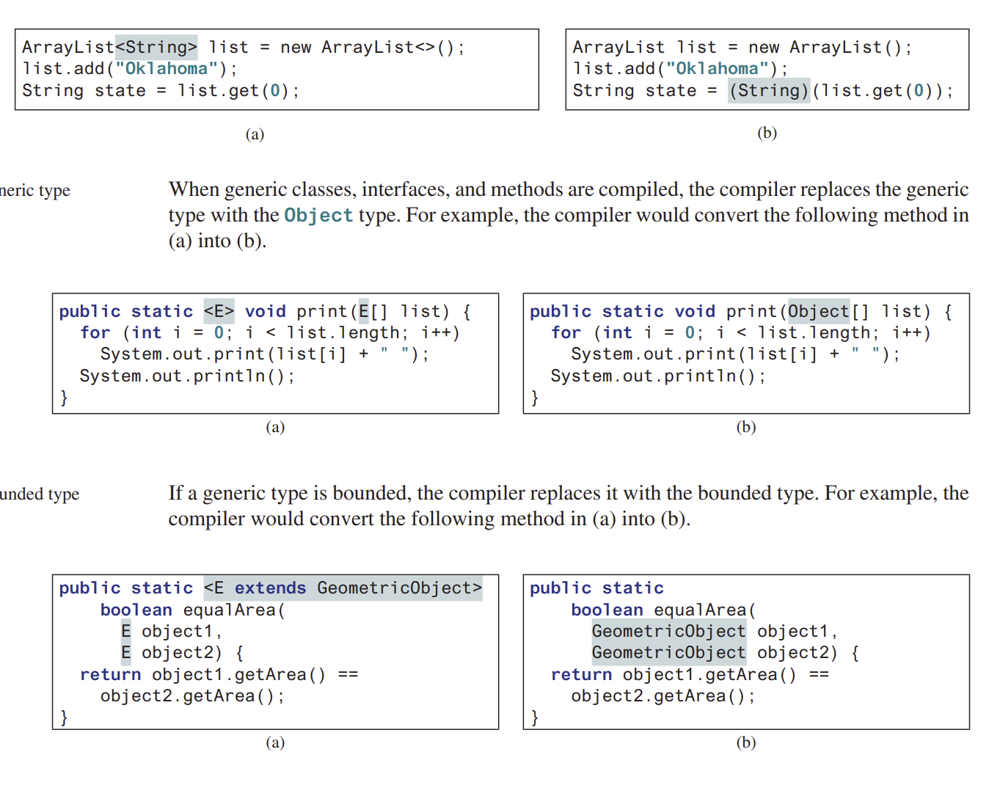

<h1 style=" color: cornflowerblue; text-align: center; font-family: 'Consolas', sans-serif;">
Data Structure And Algorithms | Syllabus Reading & Concept Recap | USFQ | Santiago Arellano
</h1>


***
<ul>
<code>Main Information Section</code>
<li><b style="color: cornflowerblue; font-weight: bold">Date:</b>: 19th of August 2024</li>
<li><b style="color: cornflowerblue; font-weight: bold">Unit</b>: Unit 1</li>
<li><b style="color: cornflowerblue; font-weight: bold">Description</b>: This file contains information about the main
class given on the 19th, the first class of the semester</li>
</ul>

***
<br>
<h3 style=" color: cornflowerblue; text-align: center; font-family: 'Consolas', sans-serif;">
Syllabus Reading, OOP Reminder, Course Short Description, Java VS C++
</h3>
<ul style="font-family: Consolas, sans-serif">
<li><code style="color: cornflowerblue; font-weight: bold">Syllabus Reading</code>:
Mostly, we have checked the information given in the syllabus, nothing too hard nor too out of the ordinary. 
TODO: Define the dates of upcoming tests in our calendar!.
</li>
<li><code style="color: cornflowerblue; font-weight: bold">Recap about Object Oriented Programming</code>:
It is of the upmost importance to have a language with OOP to work correctly and have the benefits 
of backwards compatibility in term sof methods, programming interfaces and APIs. Since OOP requires polymorphism, 
this means that most programs can extend on already built code to adapt programs onto older software.
<br>
<blockquote style="font-style: italic; color: bisque"> 
Recap of Concepts<blockquote style="font-style: italic; color: bisque"> 
<ul>
<li><b style="color: cornflowerblue; font-weight: bold">RTI</b>:Runtime type identification refers to the ability of programming
language to delay type identification to runtime to determine which method signatures from which classes it should call. This is different from CTI, which 
involves the compiler checking for types which results in only basic inheritance behavior
</li>
<li><b style="color: cornflowerblue; font-weight: bold">Polymorphism</b>: When trying to apply polymorphism, there are 
different things we need. First we need to be allowed to define overridable functions, and to be able to write abstract
methods.<br>
<br>
Polymorphism is defined as: A core component of OOP which allows objects of different classes to be treated as objects of
a common superclass. It enables objects to take on many forms.
<br><br>
<ul>
<code>Importance of Polymorphism</code>
<li><b style="color: cornflowerblue; font-weight: bold">Code Reusability</b>:Allows us to write code that can work with
other classes as long as hey share common superclasses or interfaces.</li>
<li><b style="color: cornflowerblue; font-weight: bold">Extensibility</b>:Allows us to extend existing code by creating 
new classes which inherit from a common superclass. We can add functionality without breaking the base class.</li>
<li><b style="color: cornflowerblue; font-weight: bold">Flexibility</b>:Provides flexibility when creating and using objects
</li>
</ul></li>
<li><b style="color: cornflowerblue; font-weight: bold">4 characteristics of an OOP framework</b>: 
<ul>
<li>Allows for polymorphism</li>
<li>Allows for inheritance</li>
<li>Allows for encapsulation</li>
<li>Allows for overloading of functions/operators</li>
</ul></li>
<li><b style="color: cornflowerblue; font-weight: bold">How to got From Inheritance To Polymorphism</b>: To pass from simple inheritance, to 
a polymorphic behaviour, we need two things: <b>Dynamic Linking</b>, and <b>Runtime Type Identification</b></li>
</ul>
</blockquote>
</blockquote>

</li>
<li><code style="color: cornflowerblue; font-weight: bold">Containers and the types that we will study about</code>:
We will be first taking a look at the implementation of most arrays and lists types, moving on we will see unordered data 
structures like trees (flattened, binary, red/black). We then will look at hash tables and maps, as well as maps on their own.
<br><br>
One of the most important things we will do, is analyzed and learn how to analyze algorithms, search, retrieval and 
ordering. 
<br>
<blockquote style="font-style: italic; color: bisque"> 
The prime risk of any software development program is the interaction between the program and the user. One technique 
to circumvent this issue is the use of strong code, redundancies and, most important of all, appropriate data 
structures.</blockquote>
</li>
<li><code style="color: cornflowerblue; font-weight: bold">Java VS C++</code>:

First and foremost, the main difference between the two is that C++ allows overloading operators and provides ways to 
manage memory dynamically through pointers. This means that in some cases:
<blockquote style="font-style: italic; color: bisque">Operator overloading refers to adapting existent operators in the 
programming language (i.e. C++) and adapt them to a class such that these operator make sense in the context of 
our application. 
<br>
To do this, we must analyze the use cases for the overloading of operators, making sure to find compelling use cases in 
the context of the application and classes. Moreover, this could add complexity into a program, or involve difficult 
design decisions that might make the usability of a function less straightforward.</blockquote>
Furthermore, Java does allow for overloading of functions, <b>meaning that we can have different functions with the same 
name, only differentiable through their argument list.</b>. However both languages support overwriting of functions, <b> 
which refers to overwriting the functionality of a function in different classes, provided they are declared in some way abstract or
are in a hierarchy tree (different considerations have to be analyzed in C++)</b>.
<br><br>

</li>
<li><code style="color: cornflowerblue; font-weight: bold">Templates</code>: Both Java and C++ provides functionality and code
keywords defined to be used in the creation of templates and generic code. In C++ we have to define both the typename and then 
the definition of said template. In Java however, we need only to add angled brackets in front of the name which must include 
the parameter list.
<blockquote style="font-style: italic; color: bisque"> 
<code>C++ ==> std::array< int, 17 > data = {};</code><br>
<code>Java => ArrayList< String > object = new ArrayList< >();</code></blockquote>
Extracts of how this can be done will be presented in the following blockquotes.
<body>
<blockquote style="font-style: italic; color: bisque"> 

```c++
template<typename Generic, size_t Size>
class GenericContainer
{
private:
    std::array<Generic, Size> data;
public:
    GenericContainer() = default;
};
```
</blockquote></body>
<body>

```java
import java.util.ArrayList;

public class GenericStorage<T, Integer>
{
    private ArrayList<T> dataStorage = null;
    
    public GenericStorage(T datatype, Integer size)
    {
        this.dataStorage = new ArrayList<T>(size);
    }
}
```
</body>
</li>
<li>
<code style="color: cornflowerblue; font-weight: bold">Home Study [Generics In Java]</code>:
In the following section, I will describe what I have studied about generics in Java like I did for JavaFX in the previous
Java university course. To this end, I will first analyze generics as presented in the textbook, Java's documentation, and 
my own reputable source (Amazon Q). 
<br><br>
Generics, as discussed by Deitel in his book are defined as:
<blockquote style="font-style: italic; color: bisque"> 
Generics by Deitel
<blockquote style="font-style: normal; color: whitesmoke"> 
Generics, lets you parametrize types. With this capability, you can define a class or a method with generic types that the 
compiler can replace it with concrete types.
</blockquote>
</blockquote>
As can be noted by the definition given before, the ideal of Generics is to define data structures, classes or even 
methods (more on this later) that allow for a plethora of types to be accepted as valid types for input values. These 
types, however, may or may not be appropriate for the generic type that will be expected. This could happen if the data type
is not supported by the inherent implementation of said generic method. This is often caught during compile time rather than
runtime in newer versions of Java and C++.
<br><br>
It is time now for us to take a look at how to define different types of generics in Java.
<body>
<ul>
<code>Defining Generic Classes</code>
<li>

```java

import java.util.ArrayList;
import java.util.List;

public class Generics<E, F extends CharSequence> {
    private ArrayList<F> dataExample = new ArrayList<E>(); //This is how you define variables with generics
    public List<F> listExample = null;

    public Generics() { //THe constructor stays the same in this type of classes
        //... your code goes here
        this.listExample = new ArrayList<String>();
    }

    //! This is how you define a method return type with generics
    public List<F> getListExample() {
        return listExample;
    }

    //! This is how you define a method that takes in a Generic type
    public <D> void redefineListExample(List<D> things) //THis order matters
    {
        this.listExample.clear();
        this.listExample = things;
    }
}
```
</li>
</ul>
</body>
There are other considerations that we ought to take into account, for starters there is the matter of type 
erasure that is done by the compiler. 
<blockquote style="font-style: italic; color: bisque">
In general, when we arr working with generics, <b>The information on generics is used by the compiler but is not 
availabe at runtime, this is know as type erasure. 
<blockquote>
In some cases, this manifests itself in translation, during compile time to a raw typed method, which then
the compiler knows how to decode and sent into the appropriate class


</blockquote></b>
One interesting detail is to noe the general restrictions that this means for the programmer in general
<ul>
<code>Restrictions on Usage of Runtime Generic Typed Variables</code>
<li><b style="color: cornflowerblue; font-weight: bold">Cannot use <code>new E()</code>
</b>: 
This one is pretty self explanatory, since the generic type is held  a) inside the generic class, and 
b) it becomes raw after compilation, it would be a Runtime error.</li>
<li><b style="color: cornflowerblue; font-weight: bold">Cannot use <code>new E[]</code></b>: 
This one is much of the same thing, you cannot explicitly declare this since the generic type is not 
available at runtime.</li>
<li><b style="color: cornflowerblue; font-weight: bold">Generic Type Parameter of a class is not allowed in 
Static Context</b>:This is generally known since the generic methods will be known in runtime to every instance 
of the generic class, but since the generic type is not available at runtime it breaks down</li>
<li><b style="color: cornflowerblue; font-weight: bold"> Exceptions Cannot be Generic</b></li>
</ul>
</blockquote>
Moreover, to this information it would be prudent of us to study Wildcard Generic Types, not in a ton of
detail, but in general theoretical approach.
<ul>
<code>You can use unbounded wildcards, bounded wildcards, or lower bound wildcards to specify
a range for a generic type</code>
<li><b style="color: cornflowerblue; font-weight: bold"></b>: <code> < ? > wildcard specification</code>
This is known as unbounded wildcard, it is the same as saying <code> < ? extends Object > </code>, which allows any 
class that directly inherits from Object, basically everything in Java.
</li>
<li><b style="color: cornflowerblue; font-weight: bold">Upper Bounded Wildcard</b>:This can be represented as <code>
< ? extends T ></code>where T is our upper bounded generic type, this indicates that the bound will be all classes that 
inherit from T downwards including T</li>
<li><b style="color: cornflowerblue; font-weight: bold">Lower Bounded Wildcard</b>:
This one is represented by <code> < ? super T></code> and basically means every class that is a supertype of T (
classes from which T inherits) and does include T
</li>
</ul>
</li>
</ul>