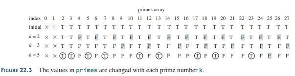
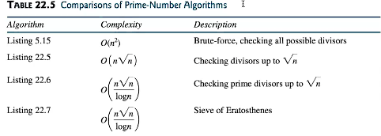

<h1 style=" color: cornflowerblue; text-align: center; font-family: 'Consolas', sans-serif;">
Data Structure And Algorithms | Defining Efficient Algorithms | USFQ | Santiago Arellano
</h1>


***
<ul style="list-style: lower-greek; font-family: Consolas, sans-serif; font-weight: bold; font-size: 12pt">
<code>Main Information Section</code>
<li><b style="color: cornflowerblue; font-weight: bold">Date:</b>: 4th August 2024</li>
<li><b style="color: cornflowerblue; font-weight: bold">Unit</b>: Unit 2</li>
<li><b style="color: cornflowerblue; font-weight: bold">Description</b>: This file contains information about the Sieve of Eratosthenes algorithm, its
description and most likely some implementations taken from Liang's Introduction to Java Programming
And Data Structures 12th Edition. Furthermore, we will touch on a revision for the exam we gave on Monday 2nd.
</li>
</ul>

***
<br>
<h3 style=" color: cornflowerblue; text-align: center; font-family: 'Consolas', sans-serif;">
"Exam Review ", "Throwback to Recursion ", "GDC Algorithm Versions And Complexities ", 
" Prime Number Algorithm Version and Complexities"
</h3>
<ul style="font-family: Consolas, sans-serif; list-style: lower-greek; font-size: 11pt">
<li><code style="color: cornflowerblue; font-weight: bold">"Exam Review"</code>:

<p>
For the theory questions, I will only type down the answer of which I failed to provide correctly in the exam, i.e. 
question 4.
</p>
<blockquote style="font-style: italic; color: black"> 
Question 4 Answer: <q>Can't be determined analytically. The data that research presents, doesn’t imply 
that the data is the most important aspect, rather than their relationship is. This means that the approx O(ln(n))
asymptotic complexity is not as accurate as the real big O complexity. </q>
</blockquote>
<p>
The following regards the numerical calculations of time complexities, specifically execution times based on 
growth rates and input sizes given.
</p>
<blockquote style="font-style: italic; color: black"> 
Review of millisecond timings depending on growth rate and element size.
<code>I will not write all of the results, rather point out the confusion I had: <b>To do this, we needed to essentially 
the growth between n` and N new by doing <i>N/n`</i>, with this we input it in the growth rate function, and through this
we calculate it by multiplying it to the base time.</b></code>
</blockquote>
<p>The next question we missed was the algorithmic complexity analysis, for example, 9.</p>
<blockquote style="font-style: italic; color: black"> 
The outer loop, iterates from <code> i = n towards i = 0 decreasing by one, therefore O(n)</code>, whilst 
the internal loop presents a <code><b>j*=3</b> condition, this means that it essentially moves in an exponential</code>,
to comprehend the complexity we move over to logarithms and we notice that <code><b>O(n&dot;lg_3(n))</b></code>.
</blockquote>
<p>That is the end of it all, thanks for coming to my review</p>
</li>
<!-- !!! A comment to separate them all !!! -->
<li><code style="color: cornflowerblue; font-weight: bold">"Throwback to Recursion"</code>:
<p>
Recursion is the usage of internal
tree like calls that trickle down a problem towards a base case, from which branches of the binary call tree, go back up and
return a result.
A better definition would be:
</p>
<blockquote style="font-style: italic; color: black"> 
Recursion is a programming technique where a function calls itself with a smaller input or a slightly different set of 
parameters until it reaches a base case (termination condition). It breaks down complex problems into smaller instances 
of the same problem, solving each instance and combining the results. Recursion typically involves two parts: 
a base case that stops the recursion and a recursive case that calls the function again with modified arguments. 
It leverages the call stack to maintain the state of each recursive call until the base case is reached. When used 
correctly, recursion can lead to elegant and concise solutions for problems that can be defined recursively.
</blockquote>
<p>Interestingly, there are two modes of work for recursion, linear and binary recursion</p>
<blockquote style="font-style: italic; color: black"> 
<ul>
<code>Linear and Binary Recursion Definitions</code>
<li><b style="color: cornflowerblue; font-weight: bold">Linear Recursion</b>: involves a single recursive call within the 
function, creating a linear chain of function invocations. Each call contributes to solving a portion of the problem 
until the base case is reached. 
<code>Examples are Factorial</code>
</li>
<li><b style="color: cornflowerblue; font-weight: bold">Binary Recursion</b>: involves two recursive calls within the 
function, dividing the problem into two smaller problems. This approach is often used in algorithms that operate on 
data structures like trees or lists, where the problem can be divided into two halves.
<code>Examples are Hanoi Tower Problem, Binary Search, Fibonacci</code>
</li>
</ul>
</blockquote>
<p>One of the many risks of incorrect recursion, or without proper memoization, is the increase memory usage due to 
the need for handling multiple similar calls, even to the same arguments, in many branches of recursion. This problem often 
<code>ends up with <b>boggling down stack's memory</b></code>. To fix this, we enter the world of <b>Dynamic Programming
</b></p>
</li>
<!--!!! A comment to separate them all !!!-->
<li><code style="color: cornflowerblue; font-weight: bold">"GDC Algorithm Versions And Complexities"</code>: 
<p>Most of the time, or mathematically wise we 
would like to know exactly what the GDC of two numbers (Greatest Common Divisor) is. For this reason, mathematicians and programmers 
alike have developed various algorithms. Here we shall take a look at their implementations based on worst to best Big O 
asymptotic complexity.
</p>
<blockquote style="font-style: italic; color: black"> 
<ul>
<code>Worst Case Possible O(n) algorithms</code>
<li><b style="color: cornflowerblue; font-weight: bold">Brute Force Method without optimizations</b>:This method is rather
archaic and rough on computers, it basically insists on checking all divisors in a straight line towards the GDC
<body>

```java
public static int gcd(int m, int n) {
    int gcd = 1;
     for (int k = 2; k <= m && k <= n; k++) {
        if (m % k == 0 && n % k == 0)
            gcd = k;
     }
    return gcd;
}
```
</body>
However, this is not the best way to do this. For once there are two improvements that we can make <code>
(1) The first improvement that we can do is considering descending from the target values towards 1, and (2) There are no
number whose divisor is larger than the half of that number, that is <b>for an input n no k divisor will exist such that
k > n/2</b>. Therefore we improve by writing
</code>
Therefore to this we do the following adjustments.
<body>

```java
public class MethodTwo
{
    public static int gdc(int m, int n)
    {
        int gdc = 1;
        //! Base Case: If they divide each other, then n is the GDC
        if (m % n == 0) {return n;}
        //! Inductive Step:
        for (int k = n /2; k >= 1; k--)
        {
            if ((m % k) ==0 && (n & k) == 0)
            {
                gdc= k;
                break;
            }
        }
        return gdc;
    }
}
```
</body>
Despite the improvements, the time of this algorithm is still on the O(n) linear complexity because it on the worst case
has to check all items of n before determining the GDC, or in the best case n /2 cases. 
</li>
<li><b style="color: cornflowerblue; font-weight: bold">Euclid's GDC</b>: Euclid developed this next algorithm in 
300 B.C. It works simply by using recursion. The base case involves, like the previous implementation, if <code>
m % n ==0, then gdc = n</code>. And the recursive steps work by making recursive calls in the form of <code>gdc(n, m %n)
</code>
To demostrate this, we proceed to implement the algorithm recursively.
<body>

```java
public class MethodThree
{
    public static int gdcEuclid(int m, int n)
    {
        //! Base Case: If they modulo each other out
        if (m % n == 0) {return n;}
        //! Recursive Calls
        else {
            return gdcEuclid(n, m %n);
        }
    }
}
```
</body>
The code presented here is significantly shorter and simpler, and the good news is that it runs, and this has been 
determined by various sources, in <code> O(log2(n)) complexity!</code>. However, this algorithm does struggle in one case,
<code>if the numbers m, n are <b>successive Fibonacci numbers</b>, the algorithm will do the maximum number of iterations
it can to produce the result.</code>.
</li>
</ul>
</blockquote>
<p>This now then leaves us with the following table of results</p>
<blockquote style="font-style: italic; color: black"> 
<table>
<tr><th>Algorithm Name</th><th>Complexity</th></tr>
<tr><td>Brute Force Linear Algorithm</td><td>Linear O(n) Complexity</td></tr>
<tr><td>Improved Brute Force (Half search range and reverse search)</td><td>Linear O(n) Complexity</td></tr>
<tr><td>Euclid's GDC</td><td>Logarithmic O(log2(n)) Complexity</td></tr>
</table>
</blockquote>
</li>
<!--!!! A comment to separate them all !!!-->
<li><code style="color: cornflowerblue; font-weight: bold">"Prime Number Algorithm Version and Complexities"</code>:
<p>One other fascinating aspect of computation is finding prime numbers, for years we've calculated them and used them
for everything from cryptography, communications, and even navigation. Scientists have looked for ways to calculate them 
easily for years, and now with the power of computation we can define incredibly efficient algorithms. To this end, 
the following algorithms, ranked from worse to best, will be presented, with tiny discussions of each and their 
implementations.</p>
<blockquote style="font-style: italic; color: black"> 
<ul>
<code>Prime Number Algorithms</code>
<li><b style="color: cornflowerblue; font-weight: bold">Basic Prime Numbers Looking up to Sqrt(n)</b>:Given a number n,
our previous approaches were always to iterate <b>linearly</b> through n -1 numbers to determine all the primes before that number
. While this was good for small numbers, it produces <t>    </t>oo much computational waste and its inefficient. For
this reason, the first algorithm we take a look at has the following changes<br><br>
<code>(1) The algorithm does not check all numbers, rather the factors up until the sqrt(n), and</code><br>
<code>(2) The algorithm stores the result of the square root for a single calculation</code>
<br>Now we turn our attention to its implementation. 
<body>

```java


public class MethodOne {
    public static boolean primesBeforeWithSquareRoot(int primeCandidate) {
        
        int number = 2;

        while (number < primeCandidate) {
            //! Define an initial assumption of primality
            boolean isPrime = true;
            int sqrt = (int) Math.sqrt(number);

            //!We test out every divisor after the base divisor to determine if they are prime
            for (int divisor = 2; divisor <= sqrt; divisor++) {
                if (number % divisor == 0) {
                    isPrime = false;
                    break;
                }
            }
            //! If isTenCentCoint is true, print the prime number
            if (isPrime) {
                System.out.println(number);
            }
            //! Keep looking 
            number++;

        }
    }
}
```

</body>
As could've been noted by the implementation of the algorithm, we are not exactly looking for a single prime, rather for the 
list of prime numbers that are beneath a certain number defined by the variable primeCandidate. Since we know that no 
number has multiples that are larger than its square root, we apply the same logic to know that we cannot find prime factors
that are larger than it. Therefore, we look over through the variable <code><b>number</b></code> to locate each prime 
sequentially. <br><br>
To do this we analyze the number compared to a divisor which will iterate sequentially until it finds a common multiple 
for the given divisor and the given number, as it iterates sequentially only up to the sqrt root of the number in question.
Once the prime is printed or rejected the running counter of <code><b>number</b></code> is updated to keep moving until 
we arrive at the target.
<br><br>
Despite these improvements however, <code><b>our time complexity for this algorithm is O(n*&#8730(n))</b></code>, which 
although its better than linear time, we still have room to go.
</li>
<li><b style="color: cornflowerblue; font-weight: bold">Efficient Prime Detector & Eratosthenes Sieve</b>: The following 
pair of algorithms will be the culmination of the development for prime listing that has been presented in the book. The 
two algorithms to be presented work similarly; however, they differ in two aspects, to be presented now
<ul>
<li><b style="color: cornflowerblue; font-weight: bold">Efficient Prime Detector utilizes a list</b>: this means 
that is typically stores the primes that it has found to reduce the complexity of further prime analysis, utilizing 
memoization and dynamic programming to achieve a faster result.</li>
<li><b style="color: cornflowerblue; font-weight: bold">Eratosthenes Sieve and its boolean array</b>: on the other hand, 
the Sieve of Eratosthenes uses a boolean array of length n (i.e., the input number) which occupies incredible amounts of 
memory and with larger inputs becomes an issue as it works by marking multiples of numbers as not prime, as we know
compound of multiple numbers will not be prime</li>
</ul>

With this introduction, it is now a problem of presenting both implementations
<body>
<code>Efficient Prime Detector</code>

```java
package Method2;

import java.util.List;

public class Method2 {
    public static void efficientPrimeDetector(int bigCeilingNumber, List<Integer> memoization) {

            int number = 2;
            int squareRoot = 1;
            
            while (number <= bigCeilingNumber)
            {
                boolean isPime = Boolean.TRUE;
                if (squareRoot*squareRoot < number) {squareRoot++;}
                for (int k = 0; k < memoization.size() && 
                memoization.get(k) <= squareRoot; k++)
                {
                    if (number % memoization.get(k) == 0)
                    {
                        isPime = false;
                        break;
                    }
                }
                
                if (isPime){
                    memoization.add(number);
                    System.out.println(number);
                }
                
                number++;
            }
    }
}


```
</body>
This algorithm Efficient Prime Detector, essentially works in a similar fashion to the previous algorithm. However, with 
the addition of the memoization section of this algorithm, we are able to cut down extensively on the time that it 
takes to produce a list of primes. We managed to produce an algorithm of time complexity <code><b>O([n*&#8730(n)]/log2(n))
</b></code>
<br><br>
Now let us take a look at the second algorithm of this last entry, The Eratosthenes Sieve is an algorithm developed by the 
greeks somewhere in the B.C. What it does differently is, as I mentioned before, uses an array of booleans to eliminate 
options based on multiples of numbers.
<body>


</body>
<body>

```java
package MethodFour;

import java.util.List;
import java.util.function.IntFunction;
import java.util.stream.IntStream;
import java.util.stream.Stream;
import java.util.stream.StreamSupport;

public static void SieveOfEratosthenes(int bigCeilingNumber) {

    //! Create the Sieve
    ArrayList<Boolean> sieve = new ArrayList<>(IntStream.range(0, bigCeilingNumber + 1).
            mapToObj(value -> Boolean.TRUE).toList());
    //! Iterate over the Sieve

    IntStream.rangeClosed(2, (int) Math.sqrt(bigCeilingNumber))
            .filter(i -> sieve.get(i))
            .parallel()
            .forEach(i -> IntStream.range(i * i, bigCeilingNumber + 1)
                    .filter(j -> j % i == 0)
                    .forEach(j -> sieve.set(j, Boolean.FALSE))
            );


    //! Print lines
    IntStream.range(2, sieve.size())
            .filter(i -> sieve.get(i))
            .forEach(System.out::println);
}
```
</body>
The previous code is the most up to date, functional programming friendly example out there of the Sieve of Eratosthenes,
it uses functional programming for everything from the generation of values to the analysis and iteration. It still runs 
in the same time complexity as the previous algorithm.</li>

</ul>
</blockquote>
<p>All in all these algorithms and complexities allow us to formulate this table.
<body>


</body>
</p>
</li>
</ul>