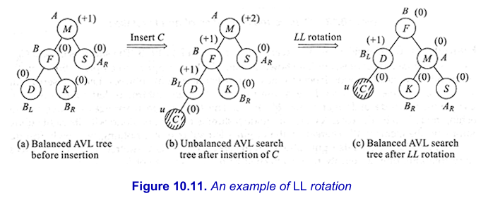
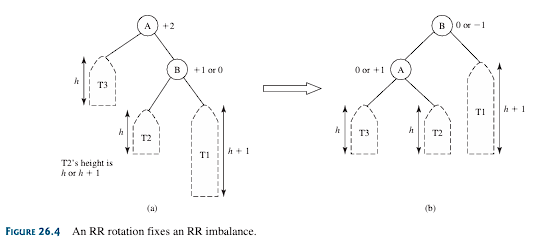

<h1 style=" color: cornflowerblue; text-align: center; font-family: 'Consolas', sans-serif;">
Data Structures And Algorithms | Trees | USFQ | Santiago Arellano
</h1>

***
<ul style="font-family: 'Consolas', sans-serif;">
<code >Main Information Section</code>
<li><b style="color: cornflowerblue; font-weight: bold">Date:</b>: October 23rd, 2024.  </li>
<li><b style="color: cornflowerblue; font-weight: bold">Unit</b>: Five.</li>
<li><b style="color: cornflowerblue; font-weight: bold">Description</b>: This file pertains the following contents: <code><b>
What are Trees? (Definition, Terms, Divisions), Binary Trees (Definition, uses, terms, how to define them), Balancing Trees,
AVL Trees.
</b></code>.</li>
</ul>

***
<br>
<h3 style=" color: cornflowerblue; text-align: center; font-family: 'Consolas', sans-serif;">
"What are Trees? ", "Traversal Methods for Trees ", "What are Binary Trees? ", "Self-Adjusting Trees (AVL) "
</h3>
<ul style="font-family: Consolas, sans-serif">
<li><code style="color: cornflowerblue; font-weight: bold">"What are Trees? "</code>:
<p>Trees are a type of data structure which, although they can have a linear backend implementation (to some extent), moves 
away from the linear implementations of lists, vectors, stacks, or queues, and introduces the concept of hierarchical data.
In this sense, trees are no longer organized in a single dimension, rather they are organized in many dimensions, one lower
than the other where data, often referred to as nodes, share these levels by being in the same one at any given time.
<br><br>
So then, while this definition has been long, and rather confusion, it is for this reason that we often turn to 
books to find definitions that are, despite longer, generally more though-out and simple to understand.</p>
<blockquote style="font-style: italic; color: whitesmoke"> On their own, in our textbook for Advanced Data Structures and 
Algorithms, the author states the following about trees.
<br>
<blockquote><q>The data structure of <b>Trees and Graphs</b> are termed <i>non-linear data structures</i>, this is because
they inherently two-dimensional in nature</q></blockquote>
On the other hand, our textbook for Data Structures and Algorithms in C++ skips completely over a textual definition of 
trees, therefore, for our common layperson understanding we shall call Amazon Q for aid.
<blockquote><q>In computer science, a tree is a hierarchical data structure composed of nodes connected by edges. It starts 
with a root node at the top and branches out to the child nodes below. Each node can have zero or more child nodes, but 
only one parent node (except for the root). Trees are non-linear and represent relationships between data elements in a 
way that allows for efficient searching, insertion, and deletion operations. They are widely used for organizing and 
representing hierarchical data, such as file systems, organization charts, and parsing expressions.</q></blockquote>
</blockquote>
<p>I believed that both with the original definition, my definition, and the Amazon Q more in depth explanation of what a Tree 
is we should now begin to tackle the ways in which we can define them in terms of structure</p>
<blockquote style="font-style: italic; color: whitesmoke"> <q>Thinking About Trees Structurally</q> 
<p>One of the most important things we have to think about when we discuss Trees as data structures, is not just 
their general structure (i.e., having a root node, zero, or many child nodes, or the order in which these are sorted to produce
said trees), rather we should focus on what these truly mean in terms of computation and how these rules are interconnected.
<br><br>
Trees are said to be defined through three main statements:</p>
<ul>
<li><b style="color: cornflowerblue; font-weight: bold">In regard to Node Content</b>: <b>A tree is defined as a finite
set of one or more nodes. However, an empty structure with no nodes can still be considered a tree</b></li>
<li><b style="color: cornflowerblue; font-weight: bold">In regard to Origin of the tree</b>: <b>A tree is said to have a single
node called the <code>Root Node</code> which through its children contains the entire tree</b></li>
<li><b style="color: cornflowerblue; font-weight: bold">In regard to Partitioning the tree (Disjointed Trees)</b>: <b>The rest
of the nodes could be partitioned into <span>t</span> disjoint sets (t >= 0) each set representing a tree T(i) where i 
is 1,2,...t known as a subtree of a tree.
<br><br>
Alternatively, if we have two disjoint trees, t1 and t2, then the tree whose <code>children nodes</code> are those nodes, t1, t2,
... tn, it is also a tree</b></li>
</ul>
<p>Generally speaking, we can think of these trees as being rules for defining any tree in general. Recall that up to this point, 
while we have touched on topics like Binary Trees, or even the binary tree structure of Merge Sort, we are still working on 
general, non concrete trees.</p>
</blockquote>
<p>Another interesting aspect of Trees is their properties and terminology, this is one aspect where we are surely going to see
some work and testing being done in the next few classes. For this reason I think we should delve into them in the following
blockquote.</p>
<blockquote style="font-style: italic; color: whitesmoke"> <q>Thinking about Trees Properties and Terminology</q> 
<p>There are two main properties that are remarked in the definition of Trees and its defining statements, which are more
precisely placed in the following extract from our Advanced Data Structures Book</p>
<blockquote>
<q>The definition of a tree emphasizes on the aspect of <b>(i) connectedness</b>, and the absence of closed loops which 
are known as <b> (ii) cycles</b>. Beginning with the root node , the structure of a tree guarantees connectedness of the 
root to every other node in the tree. <b>In general, any node is reachable from anywhere in a tree</b>.</q>
</blockquote>
<p>This is the best way to explain what trees are, as structures of data that facilitate traversal and organization while 
guaranteeing that you will not run into infinite loops or cycles amongst its nodes. It is important to emphasize this 
difference since when we talk about graphs, we will notice that connectedness and cycles are important properties that are 
not necessarily bad. Either way, for not I think it would be useful for us to take a look at definitions, definitions of course, 
of a tree's characteristics</p>
<ul>
<code>Node Definitions</code>
<li><b style="color: cornflowerblue; font-weight: bold"> Degree of a Node</b>: <b>Defined as the number of subtrees for any
given node.</b> Special cases of these are...</li>
<ul>
<li><b style="color: cornflowerblue; font-weight: bold">Terminal Nodes or Leaf Nodes</b></li>
</ul>
<li><b style="color: cornflowerblue; font-weight: bold">Non-Terminal Nodes </b>: <b>All those nodes whose degree is not equal
to zero</b></li>
<li><b style="color: cornflowerblue; font-weight: bold">Children Nodes </b>: <b>All of those branches that emanate from a given
node</b>. Those nodes from where Children emanate from are known as <b>Parent Nodes</b>. Children of the same parent are known as 
<b>Sibling Nodes</b></li>
<li><b style="color: cornflowerblue; font-weight: bold">Ancestor Node(s)</b>: <b>All of those nodes that happen behind the 
given node of analysis in the same path</b></li>
<li><b style="color: cornflowerblue; font-weight: bold">Level of a Node</b>: <b>Defined as the level in which a node sits, defining
the root being at level 1 and going on for each level of siblings in the tree.</b> Thus, the following relationship props up
<code>If the root of a node is in level i, then the children of said node are in level i +1</code></li>
<li><b style="color: cornflowerblue; font-weight: bold">Depth of a Node</b>: <b>Length of the path between the root and the given
node</b></li>
<code>Tree Definitions</code>
<li><b style="color: cornflowerblue; font-weight: bold">Degree of a Tree</b>: <b>Defined as the maximum degree of the 
nodes in a given tree</b></li>
<li><b style="color: cornflowerblue; font-weight: bold">Height (Depth) of a Tree</b>: <b>Defined as the maximum level of 
any node in a given tree</b> </li>
<li><b style="color: cornflowerblue; font-weight: bold">Arcs (Edges)</b>: <b>Defined as the connections between nodes.</b></li>
<li><b style="color: cornflowerblue; font-weight: bold">Length of a Path</b>: <b>Defined as the number of arcs (edges) in a given path between 
two nodes,or between the rote and a given node</b></li>
<li><b style="color: cornflowerblue; font-weight: bold">Forest</b>: <b>Defined as a set of zero or more disjoint trees</b>. This 
leads to the following relationship <code>the removal of a node always leads to a forest</code></li>
</ul>
</blockquote>
<p>As one can notice from the above blockquote, there are a bunch of terms to know, but this gets simpler if we categorize 
them as we did through Node and Tree definitions. Now it is time to turn into some graphic examples!
<br><br>
Sometimes I forget that too much text and no graphs are not that helpful either</p>
<blockquote style="font-style: italic; color: whitesmoke">  
<q>General View of a Tree</q>
<div style="display: flex; justify-content: center; align-content: center">


</div>
<p>Notice that in the previous graph we can see the levels, and we can see that a tree does not have to follow the 
two children rule of Binary Trees, nor does it have to be full. However, we will touch on these definitions later.</p>
<q>Examples of Trees</q>
<div style="display: flex; justify-content: center; align-content: center">


</div>
</blockquote>
<p>With the graphs above, I hope that once I study this again, or for anyone that I send this to, will be able to check 
the graphs and understand the concepts and definitions from above through the graphical view of below. For now, it is time 
for us to take a look at the common divisions or groupings of trees that exist in the world of computer science.</p>
<blockquote style="font-style: italic; color: whitesmoke"> 
<ul>
<code>Classifications of Tree Types</code>
<!-- Binary Trees -->
<li><b style="color: cornflowerblue; font-weight: bold">Binary Trees</b>: A binary tree can be described, in an essentialist, 
way, through its most obvious characteristic <b>Any given Node (n) can only have at most two children (nLeft, nRight)</b>. 
This means then that at most all nodes have a <b>degree of 2</b>. 
<br><br>
<p>It is important to bring up the <code> difference between binary trees and regular trees </code> correctly</p>
<blockquote style="font-style: italic; color: whitesmoke">  
<q>While a binary tree can be empty with zero nodes, a tree can never be empty. Again, while ordering of the subtrees in a 
tree is immaterial, in a binary tree the distinction of left and right subtrees are very clearly maintained</q>
</blockquote>
<p>Aside from this, there are three crucial observations to be taken when it comes to binary trees</p>
<blockquote style="font-style: italic; color: whitesmoke"> 
<ul style="list-style: lower-alpha">
<li>The maximum number of nodes on the <b>ith </b> level of a binary tree is <b>2^(i-1), i >= 1</b> (This of course applies if
the root level is defined as one or zero, where the formula can be updated to <b>2^i</b>)</li>
<li>The maximum number of nodes in a binary tree of height <b>h</b> is <b>2^(h)-1 , h>= 1</b></li>
<li>For any non-empty binary trees, if t0 is the number of terminal nodes, and t2 is the total of degree 2 nodes, 
then <b>t0 = t2 + 1</b></li>
</ul></blockquote>
Internally, Binary Trees have another characterization, which 
can be defined as follows</li>
<ul>
<li><b style="color: cornflowerblue; font-weight: bold">Full Binary Tree of Height (h)</b>: is defined to be a tree of hiehgt
h which has all its permissible maximum number of nodes for each level.</li>
<li><b style="color: cornflowerblue; font-weight: bold">Complete Binary Tree of Height (h)</b>: is defined to be a tree
where, given it has <b>n</b> nodes, and a height of <b>h</b> all of its nodes follow a sequential numbering that increments from a 
<code>left-to-right and top-to-bottom fashion</code>. As a sidenote, the height of a complete binary tree with n elements, 
has a height defined as <b>h = [log2(n+1)]</b>
<br>
<p>A complete binary tree follows these rules for the numbering of its nodes</p>
<blockquote>
<ul>
<li>If a parent node has a number <b>i</b> then its left child has the number <b>2*i (2*i <= n)</b>, if 2*i is higher than n
then i has no left child</li>
<li>If a parent node has a number <b>i</b> then its right child has the number <b>2*i + 1 (2*i +1 <=n)</b>, if the operation
is higher than n, then node i has no right child.</li>
<li>If a child node (left or right) has number i, then the parent node has the number <b> floor(i/2</b> if i != 1 of course</li>
</ul>
</blockquote>
</li>
<li><b style="color: cornflowerblue; font-weight: bold">Left Skewed or Right Skewed Binary Tree</b>: these are defined, respectively,
if they are dominated solely by left child or right child nodes.</li>
<li><b style="color: cornflowerblue; font-weight: bold">K-ary Tree</b>: defined as one where every node has either 0 or k child nodes </li>
</ul>
<!-- Binary Search Trees -->
<li><b style="color: cornflowerblue; font-weight: bold">Binary Search Trees (BST)</b>: A binary tree with the property that 
for each node, all elements in the left subtree are smaller, and all elements in the right subtree are larger. (This will be 
expanded further in later subsections</li>
<li><b style="color: cornflowerblue; font-weight: bold">AVL Trees</b>: An Adelson-Velskii and Landis (1962) tree is a specific
type of balanced trees or height-balanced trees. This one is specific is a self-balancing binary search tree where the heights 
of the left and right subtree of any node differ by at most one</li>
<li><b style="color: cornflowerblue; font-weight: bold">Red-Black Trees</b>:Another type of self-balancing binary search tree with an extra bit per
node for color (red or black) used to ensure that the tree remains balanced during insertions and deletions. (To be Expanded Further in other 
sections)</li>
<li><b style="color: cornflowerblue; font-weight: bold">Splay Trees</b>: defined as binary search trees with a self-adjusting 
mechanism, which renders them remarkably efficient over a sequence of accesses. Those who are frequently are moved towards 
the root, thereby rendering further same-item retrievals efficient</li>
<li><b style="color: cornflowerblue; font-weight: bold">B-Trees</b>: defined as self-balancing trees that maintain sorted 
data and allow searches, sequential access, insertions, and deletions in logarithmic time. Commonly used in databases and 
file systems.</li>
<li><b style="color: cornflowerblue; font-weight: bold">Trie (Prefix Tree) Trees</b>: defined as a tree-like data structure
used to store associative arrays where the keys are usually strings.</li>
<li><b style="color: cornflowerblue; font-weight: bold">Segment Trees</b>: user for storing information about intervals or 
segments, allowing for efficient query processing</li>
<li><b style="color: cornflowerblue; font-weight: bold">Heap Trees</b>: defined as a specialized tree-base data structure that 
satisfies either the max or min heap properties</li>
<li><b style="color: cornflowerblue; font-weight: bold">Expression Trees</b>: used to represent mathematical expressions where 
leaft nodes are operands and internal nodes are operators.</li>
</ul>
</blockquote>
<p>Having gone through the lengths of briefly describing each type of tree that we could study (hoping to study all of them on my own).
We can move onto the real world cases where these things are used.</p>
<blockquote style="font-style: italic; color: whitesmoke"> <q>Thinking about Real World Uses</q> 
<body>

```plantuml

package RealWorldApplicationsTrees {

interface TreeApplications

TreeApplications : [1] **File Systems**: Trees are used to represent file systems where directories are the nodes and files are the leaves.
TreeApplications : [2] **Database Indexes**: Trees, like B-trees and B+ trees, are utilized for indexing databases to make search queries efficient.
TreeApplications : [3] **Organization Charts**: Trees represent hierarchical relationships in organizations, showing the structure from top executives down to entry-level employees.
TreeApplications : [4] **XML/HTML Parsing**: DOM trees are used to represent the structure of XML and HTML documents, making it easy to navigate and manipulate the document.
TreeApplications : [5] **Network Routing**: Trees help in optimizing routing protocols and represent the hierarchy of networks.
TreeApplications : [6] **Artificial Intelligence**: Decision trees and other tree-based algorithms are fundamental in AI for making decisions based on criteria.
TreeApplications : [7] **Game Development**: Trees are used in designing scenarios such as game maps, decision trees for AI behaviors, and more.
TreeApplications : [8] **Compilers**: Abstract Syntax Trees [AST] represent the structure of the source code for syntax and semantic analysis during compilation.
TreeApplications : [9] **Event-Driven Systems**: Trees represent the flow of events and handlers in systems to manage event-driven programming.
TreeApplications : [10] **Genetics and Phylogenetics**: Trees are used to visualize evolutionary relationships between species or genetic lineages.

}
```
</body>
</blockquote>
<p>As can be seen, there are various uses, and it now seems of upmost importance that we learn about these structures and their 
implementation, methods, and inner-workings.</p>
</li>
<!--! A comment to Separate them all -->
<li><code style="color: cornflowerblue; font-weight: bold">"Traversal Methods for Trees"</code>:
<p>Before we continue in our discussion of Trees and head towards binary trees full on, it would be beneficial for us to 
learn about the ways in which we can traverse a tree. Generally, there are three main ways (which will be covered here), 
that we can use to traverse a tree, these are <b><code>Inorder (LPR), Preorder (PLR), Postorder (LRP)</code></b> tranversals, 
where the important distinction is the <b>P</b> operation, which specifically refers to the processing operation, these 
will be expanded upon in the next blockquote</p>
<blockquote style="font-style: italic; color: whitesmoke">  
<q>Thinking about Traversal Methods</q>
<p>One of the most important aspects of traversing nodes in a tree (independently of its type) is the processing of information,
or the P in the previous three traversals defined. This is the step where the data stored in the node we are standing on
is processed according to some user defined method. This means that the tree in many cases has to do many traversal moves through
nodes before it executes a process (P) operation. <br><br>
The idea will become clearer in the following list.</p>
<ul>
<code>Basic Traversal Methods</code>
<li><b style="color: cornflowerblue; font-weight: bold">InOrder Traversal [L  <-> P <--> R]</b>:
<p>This is one of the most basic methods that there exist both to implement and to understand. The method works by iteratively, 
or recurisely, going down a branch of computation until it cannot find a left child node, then processes the data where it 
is standing, and once this is done it proceeds to do the same thing with the right side. Generally, this becomes clearer 
with a little pseudocode</p>
<body>

```text
function inorderTraversal(Node* root):
    input: root (a node representing the root of the given tree),
    output: value depending on the user-defined processing function,
    
    if root is not empty or null:
        // Working on the Left Subtree of every Node gathered through root->left
        inorderTraversal(root->left);
        // Working on the processing function in the given node a.t.m.
        processInput(root)
        // Working on the right Subtree of every Node gathered through root->right
        inorderTraversal(root->right);
```
</body>
<p>As can be noted through the previous pseudocode, the algorithm defined is recursive in nature, and it will create a binary tree 
of calls for each level of root (i.e., for every root->left or root-> right operation). This means that the method will 
recursively try to find the deepest level of the left subtree before moving back to its original caller and executing the analysis.
<br><br>
Once this section is done it will do the same recursive depth analysis of the right subtree before moving back to process 
a given node. Now of course, this is nothing without some good old code, and the way we are going to do this is first
C++ code and then Java Code, like before!</p>
<blockquote>
<ul>
<li><b style="color: cornflowerblue; font-weight: bold">Recursive C++ Implementation</b>: 
<body>

```C++
template <Class T>
void Tree<T>::inorder(Node<T> *root){
    if (root != 0) // Check for null{
        inorder(p->left);
        process(p);
        inorder(p->right);
    }
}
```
</body>
</li>
<li><b style="color: cornflowerblue; font-weight: bold">Non Recursive C++ Implementation</b>: 
<body>

```C++
template<class T>
void Tree<T>::iterativeInorder(Node<T>* root){
    std::Stack<Node<T>*> traversalStack;
    Node<T>* p = root;
    while (p != 0){
        while (p != 0){
            if (p->right){
                traversalStack.push(p->right);
            }
            traversalStack.push(p);
            p = p->left;
        }
        p = travStack.pop(); // pop a node with no left child
        while (!travStack.empty() && p->right == 0) { // visit it 
            visit(p); // and all nodes with no right 
            p = travStack.pop(); // child;
        }
        visit(p); // visit also the first node with
        if (!travStack.empty()) // a right child (if any);
            p = travStack.pop();
        else p = 0;
    }
}
```
</body>
</li>
<li><b style="color: cornflowerblue; font-weight: bold">Recursive Java Implementation</b>:
<body>

```java
package Inorder;

import Trees.BinaryTreeNode;

public static <E extends Comparable<E>> void inorderRecursive(BinaryTreeNode<E> Root){
    if (Root != null){
        inorderRecursive(Root.getLeftOrThreadedChild());
        System.out.println("Root Value At the Time= " + Root.getInternalStoredData());
        inorderRecursive(Root.getRightOrThreadedChild());
    }
}

```
</body>
</li>
<li><b style="color: cornflowerblue; font-weight: bold">Non Recursive Java Implementation</b>: 
<body>

```java
package Inorder;

import Trees.BinaryTreeNode;
import java.util.Stack;

public static <E> iterativeInorder(BinaryTreeNode<E> root) {
    Stack<BinaryTreeNode<E>> travStack = new Stack<>();
    BinaryTreeNode<E> refToRoot = root;
    while (refToRoot != null) {
        while (refToRoot != null) {
            if (refToRoot.getRightOrThreadedChild()) {
                travStack.push(refToRoot.getRightOrThreadedChild());
            }
            travStack.push(refToRoot);
            refToRoot = refToRoot.getLeftOrThreadedChild();
        }
        refToRoot = travStack.pop();
        while (!travStack.isEmpty() && refToRoot.getRightOrThreadedChild() == null){
            System.out.println(refToRoot.getInternalStoredData());
            refToRoot = travStack.pop();
        }
        System.out.println(refToRoot.getInternalStoredData());
        if (!travStack.empty()){
            refToRoot = travStack.pop();
        }
        else {
            refToRoot = null;
        }
    }
}
public static <E extends Comparable<E>>
 Optional<List<E>> inorderIterative(BinaryTreeNode<E> Root, Function<E, Optional<E>> userDefinedProcessing)
        throws NullPointerException{
    if (Root == null || userDefinedProcessing == null){
        throw new NullPointerException("Error Code 0x001 - [Raised] Either of the parameters passed into this function was null.");
    }

    Stack<BinaryTreeNode<E>> travStack = new Stack<>();
    BinaryTreeNode<E> refToRoot = Root;
    List<E> resultsList = new ArrayList<>();
    while (refToRoot != null) {
        while (refToRoot != null) {
            if (refToRoot.getRightOrThreadedChild() != null) {
                travStack.push(refToRoot.getRightOrThreadedChild());
            }
            travStack.push(refToRoot);
            refToRoot = refToRoot.getLeftOrThreadedChild();
        }
        refToRoot = travStack.pop();
        while (!travStack.isEmpty() && refToRoot.getRightOrThreadedChild() == null){
            var result = userDefinedProcessing.apply(refToRoot.getInternalStoredData());
            result.ifPresent(resultsList::add);
            refToRoot = travStack.pop();
        }
        var result = userDefinedProcessing.apply(refToRoot.getInternalStoredData());
        result.ifPresent(resultsList::add);
        if (!travStack.empty()){
            refToRoot = travStack.pop();
        }
        else {
            refToRoot = null;
        }
    }
    return (!resultsList.isEmpty() ? Optional.of(resultsList): Optional.empty());
}
```
</body>
</li>
</ul>
<p>While someone could argue that the non-iterative version is useful, it is hard to argue for its usage given the complexity
both in implementation and understanding of such a method. Moreover, as the authors of Data Structures and Algorithms 
in C++ mentioned,  <q style="font-weight: normal; font-family: 'Cambria Math', sans-serif">iterativeInorder() can be defended only in a single case: if it is shown that 
there is a substantial gain in execution time and that the function is called often in a 
program; otherwise, inorder() is preferable to its iterative counterpart.</q></p>
</blockquote>
</li>
<li><b style="color: cornflowerblue; font-weight: bold">PreOrder Traversal [P <--> L <--> R]</b>: 
<p>This method is to some extent similar to the others in the sense that it at some point processes the data stored
in any given node. However, in the case of a preorder traversal, the processing of information is done at entry level 
for each node independently of their position in the recursive tree call.
<br><br>
This therefore means that the recursion moves in the same way as before. However, the value of the node is printed quickly
at each recursion level and with each node value. As always this might be easier to understand with some pseudocode
</p>
<body>

```text
function preorderTraversal(Node* root):
    input: root (a node representing the root of the given tree),
    output: value depending on the user-defined processing function,
    
    if root is not empty or null:
        // Working on the processing function in the given node a.t.m.
        processInput(root)
        // Working on the Left Subtree of every Node gathered through root->left
        preorderTraversal(root->left);
        // Working on the right Subtree of every Node gathered through root->right
        preorderTraversal(root->right);
```
</body>
<p>As can be noted through the previous block of code, the methods we have defined earlier will only change slightly for 
the recursive versions, the iterative approach will change slightly again.</p>
<blockquote>
<ul>
<li><b style="color: cornflowerblue; font-weight: bold">Recursive C++ Implementation</b>: 
<body>

```C++
template<class T>
void Tree<T>::preorder(Node<T>* root){
    process(root);
    preorder(root->left);
    preorder(root->right);
}
```
</body>
</li>
<li><b style="color: cornflowerblue; font-weight: bold">Iterate C++ Implementation</b>: 
<body>

```C++
template<class T>
void BST<T>::iterativePreorder() { 
    Stack<BSTNode<T>*> travStack;
    BSTNode<T> *p = root;
    if (p != 0) {
        travStack.push(p);
        while (!travStack.empty()) {
            p = travStack.pop();
            visit(p);
            if (p->right != 0)
                travStack.push(p->right);
            if (p->left != 0) // left child pushed after right
                travStack.push(p->left); // to be on the top of 
        } // the stack;
    }
}
```
</body>
</li>
<li><b style="color: cornflowerblue; font-weight: bold">Recursive Java Implementation </b>: 
<body>

```Java
package postOrder;

import Trees.BinaryTreeNode;

public static <E extends Comparable<E>> void preorderRecursive(BinaryTreeNode<E> Root) {
        if (Root != null) {
            System.out.println("Root Value At the Time= " + Root.getInternalStoredData());
            preorderRecursive(Root.getLeftOrThreadedChild());
            preorderRecursive(Root.getRightOrThreadedChild());
        }
    }
```
</body>
</li>
<li><b style="color: cornflowerblue; font-weight: bold">Iterative Java Implementation</b>:
<body>

```java
package postOrder;

import Trees.BinaryTreeNode;

import java.util.Stack;

public static <E> void iterativePreorder(BinaryTreeNode<E> root) {
    Stack<BinaryTreeNode<E>> travStack;
    BinaryTreeNode<E> p = root;
    if (p != null){
        travStack.push(p);
        while (!travStack.empty()){
            p = travStack.pop();
            System.out.println(p.getInternalStoredData());
            if (p.getRightOrThreadedChild() != null){
                travStack.push(p.getRightOrThreadedChild());
            }
            if (p.getLeftOrThreadedChild() != null){
                travStack.push(p.getLeftOrThreadedChild());
            }
        }
    }
}
public static <E extends Comparable<E>> Optional<List<E>> preorderIterative(BinaryTreeNode<E> Root, Function<E, Optional<E>> userDefinedProcessing) {
    if (Root == null || userDefinedProcessing == null){
        throw new NullPointerException("Error Code 0x001 - [Raised] Either of the parameters passed into this function was null.");
    }

    Stack<BinaryTreeNode<E>> travStack = new Stack<>();
    List<E> resultList = new ArrayList<>();
    BinaryTreeNode<E> p = Root;
    if (p != null){
        travStack.push(p);
        while (!travStack.empty()){
            p = travStack.pop();
            var result = userDefinedProcessing.apply(p.getInternalStoredData());
            result.ifPresent(resultList::add);
            if (p.getRightOrThreadedChild() != null){
                travStack.push(p.getRightOrThreadedChild());
            }
            if (p.getLeftOrThreadedChild() != null){
                travStack.push(p.getLeftOrThreadedChild());
            }
        }
    }
    return (!resultList.isEmpty() ? Optional.of(resultList): Optional.empty());
}
```
</body>
</li>
</ul>
</blockquote>
</li>
<li><b style="color: cornflowerblue; font-weight: bold">PostOrder Traversal [L <--> R <--> P]</b>: 
<p>The last of the big three basic methods that we can study here is the postOrder traversal. This one is the opposite 
from the ones before in the sense that the processing of data comes at the latest stage possible (the end of each recursive
tree per each node). This means that the processing of values stored in each node will happen once for each once every 
other recursive call has concluded. The pseudocode for this one is the same just with the slightests of variations</p>
<body>

```text
function postOrderTraversal(Node* root):
    input: root (a node representing the root of the given tree),
    output: value depending on the user-defined processing function,
    
    if root is not empty or null:
        // Working on the Left Subtree of every Node gathered through root->left
        postOrderTraversal(root->left);
        // Working on the right Subtree of every Node gathered through root->right
        postOrderTraversal(root->right);
        // Working on the processing function in the given node a.t.m.
        processInput(root)
```
</body>
<p>Having seen the previous pseudocode we can see that the way in which this method changes is simply where the processing
function appears in the chain of calls (i.e., in the end of all recursive calls). For now let us delve into our C++
and Java Implementations</p>
<blockquote>
<ul>
<li><b style="color: cornflowerblue; font-weight: bold">Recursive C++ Implementation</b>:
<body>

```C++
template<class T>
void Tree<T>::postorder(Node<T>* root){
    if (root != 0){
        postorder(root->left);
        postorder(root->right);
        process(root);
    }
}
```
</body>
</li>
<li><b style="color: cornflowerblue; font-weight: bold">Iterative C++ Implementation</b>:
<body>

```C++
template<class T>
    void Tree<T>::iterativePostorder() { 
    Stack<BSTNode<T>*> travStack;
    BSTNode<T>* p = root, *q = root;
    while (p != 0) {
        for ( ; p->left != 0; p = p->left)
            travStack.push(p);
        while (p->right == 0 || p->right == q) {
            visit(p);
            q = p;
            if (travStack.empty())
                return;
            p = travStack.pop();
        }
        travStack.push(p);
        p = p->right;
    }
}
```
</body>
</li>
<li><b style="color: cornflowerblue; font-weight: bold">Recursive Java Implementation</b>: 
<body>

```java
package postOrder;

import Trees.BinaryTreeNode;

public static <E extends Comparable<E>> void postorderRecursive(BinaryTreeNode<E> Root) {
    if (Root != null){
        postorderRecursive(Root.getLeftOrThreadedChild());
        postorderRecursive(Root.getRightOrThreadedChild());
        System.out.println("Root Value At The Time = " + Root.getInternalStoredData());
    }
}
```
</body>
</li>
<li><b style="color: cornflowerblue; font-weight: bold">Iterative Java Implementation</b>: 
<body>

```java
package postOrder;

import Trees.BinaryTreeNode;
import java.util.*;
import java.util.function.Function;
import java.util.Stack;

public Optional<List<E>> postorderIterative(BinaryTreeNode<E> Root, Function<E, Optional<E>> userDefinedProcessing) {
    if (Root == null || userDefinedProcessing == null){
        throw new NullPointerException("Either of the parameters passed into this function was null.");
    }
    Stack<BinaryTreeNode<E>> travStack = new Stack<>();
    BinaryTreeNode<E> p = Root, q = Root;
    List<E> resultList = new ArrayList<>();
    while (p != null){
        for(; p.getLeftOrThreadedChild() != null; p = p.getLeftOrThreadedChild()){
            travStack.push(p);
        }
        while (p.getRightOrThreadedChild() == null || p.getRightOrThreadedChild() == q){
            var result = userDefinedProcessing.apply(p.getInternalStoredData());
            result.ifPresent(resultList::add);
            q = p;
            if (travStack.isEmpty()){return (!resultList.isEmpty() ? Optional.of(resultList): Optional.empty());}
            p = travStack.pop();
        }
        travStack.push(p);
        p = p.getRightOrThreadedChild();
    }
    return (!resultList.isEmpty() ? Optional.of(resultList) : Optional.empty());
}

```
</body>
</li>
</ul>
</blockquote>
</li>
</ul>
</blockquote>
<p>Having seen these basic methods for tree traversal, let us take a look at some other traversals which might be required
in our future classes, algorithms, and implementations. It is important to note that the previous methods are all <b>Depth-First
Traversal Methods</b></p>
<blockquote style="font-style: italic; color: whitesmoke"> <q>Thinking about Breath-First Traversals</q> 
<p>
Breath first traversal is a method where we are not recursively finding the deepest point of any subtree we look at, rather
it is a method through which we try to analyze all the nodes in a single level (Be it in a left-to-right or right-to-left 
fashion), either going top-down or down-up. This means that this algorithm does not just guarantee the exploration of all nodes
it also guarantees iteration over all same-level nodes.
<br><br>
To grasp this concept further I have included a breath-first traversal pseudocode for the base case top-down left-right 
case.
</p>
<blockquote>
<body>

```text
function breathFirstTraversal(Node root):
    input: root node for tree traversal,
    output: value dependent of user-defined processing function.
    procedure:
        Node temp = root
        Queue<E> nodequeue <- new Queue<>(); 
        if temp node is not null:
            enqueue temp node in the queue
            while nodequeue is not empty:
                temp <-- dequeue the top element of the queue
                if temp.left is not null:
                    enqueue temp.left into nodequeue
                if temp.right is not null:
                    enqueue temp.right into nodequeue
```
</body>
</blockquote>
<p>As can be noted, it is a matter of first adding the root node into the queue, then popping it to traverse it, before 
adding each left and right node into the queue. If my analysis of how the queue works, in a FIFO pattern, then we know
that the second node analyzed would be the second (left child) of the root, of which all of its children from left to right 
would be appended and analyzed as such.
<br><br>
Either way it is clear to see now that the usage of a queue in this algorithm reduces the overall complexity of the 
implementation, and with a translation into Java code will provide us with great understanding of it. Since there are four
variations of this algorithm, I will include all of them in the same blockquote.</p>
<blockquote style="font-style: italic; color: whitesmoke"> 
<ul>
<code>Breath-First Traversal Variations</code>
<li><b style="color: cornflowerblue; font-weight: bold">Top-Bottom & Left-Right Traversal</b>: 
<body>

```java
package BFS;

import Trees.BinaryTreeNode;
import java.util.ArrayDeque;
import java.util.Queue;

public static <E> topBottomLeftRightBFS(BinaryTreeNode<E> root) {
    Queue<BinaryTreeNode<E>> nodeQueue = new ArrayDeque<>();
    BinaryTreeNode<E> nodeTemp = root;
    if (nodeTemp != null){
        nodeQueue.offer(nodeTemp);
        while (!nodeQueue.isEmpty()){
            nodeTemp = nodeQueue.poll();
            System.out.println(nodeTemp.getInternalStoredData());
            if (nodeTemp.getLeftOrThreadedChild() != null){
                nodeQueue.offer(nodeTemp.getLeftOrThreadedChild());
            }
            if (nodeTemp.getRightOrThreadedChild() != null){
                nodeQueue.offer(nodeTemp.getRightOrThreadedChild());
            }
        }
    }
}
```
</body>
</li>
<li><b style="color: cornflowerblue; font-weight: bold">Top-Bottom & Right-Left Traversal</b>: 
<body>

```java
package BFS;

import Trees.BinaryTreeNode;

import java.util.ArrayDeque;
import java.util.Queue;

public static <E> topBottomRightLeftBFS(BinaryTreeNode<E> root) {
    Queue<BinaryTreeNode<E>> nodeQueue = new ArrayDeque<>();
    BinaryTreeNode<E> nodeTemp = root;
    if (nodeTemp != null){
        nodeQueue.offer(nodeTemp);
    }
    while (!nodeQueue.isEmpty()){
        nodeTemp = nodeQueue.poll();
        System.out.println(nodeTemp.getInternalStoredData());
        if (nodeTemp.getRightOrThreadedChild() != null){
            nodeQueue.offer(nodeTemp.getRightOrThreadedChild());
        }
        if (nodeTemp.getLeftOrThreadedChild() != null){
            nodeQueue.offer(nodeTemp.getLeftOrThreadedChild());
        }
    }
}
```
</body>
</li>
<li><b style="color: cornflowerblue; font-weight: bold">Bottom-Top & Left-Right Traversal</b>: 
<body>

```java
package BFS;

import Trees.BinaryTreeNode;

import java.lang.reflect.Array;
import java.util.*;

public static <E> void bottomTopLetRightBFS(BinaryTreeNode<E> root) {
    Queue<BinaryTreeNode<E>> nodeQueue = new ArrayDeque<>();
    ArrayList<ArrayList<E>> levelList = new ArrayList<>();
    BinaryTreeNode<E> rootTemp = root;
    if (rootTemp != null) {
        nodeQueue.offer(rootTemp);
    }
    while (!nodeQueue.isEmpty()) {
        int levelSize = nodeQueue.size();
        ArrayList<E> currentLevel = new ArrayList<>();
        for (int i = 1; i <= levelSize; i++) {
            rootTemp = nodeQueue.poll();
            currentLevel.add(rootTemp.getInternalStoredData());

            if (rootTemp.getLeftOrThreadedChild() != null) {
                nodeQueue.offer(rootTemp.getLeftOrThreadedChild());
            }
            if (rootTemp.getRightOrThreadedChild() != null) {
                nodeQueue.offer(rootTemp.getRightOrThreadedChild());
            }
        }
        levelList.add(currentLevel);
    }
    Collections.reverse(levelList);
    for(ArrayList<E> level: levelList){
        for(E value: level){
            System.out.println(value);
        }
    }
}
```
</body>
</li>
<li><b style="color: cornflowerblue; font-weight: bold">Bottom-Top & Right-Left Traversal</b>: 
<body>

```java
package BFS;

import Trees.BinaryTreeNode;

import java.util.Queue;
import java.util.ArrayList;
import java.util.ArrayDeque;
public static <E> void bottomTopRightLeftBFS(BinaryTreeNode<E> root){
    Queue<BinaryTreeNode<E>> nodeQueue = new ArrayDeque<>();
    ArrayList<ArrayList<E>> levelList = new ArrayList<>();
    BinaryTreeNode<E> rootTemp = root;
    if (rootTemp != null) {
        nodeQueue.offer(rootTemp);
    }
    while (!nodeQueue.isEmpty()) {
        int levelSize = nodeQueue.size();
        ArrayList<E> currentLevel = new ArrayList<>();
        for (int i = 1; i <= levelSize; i++) {
            rootTemp = nodeQueue.poll();
            currentLevel.add(rootTemp.getInternalStoredData());

            if (rootTemp.getRightOrThreadedChild() != null) {
                nodeQueue.offer(rootTemp.getRightOrThreadedChild());
            }
            if (rootTemp.getLeftOrThreadedChild() != null) {
                nodeQueue.offer(rootTemp.getLeftOrThreadedChild());
            }
        }
        levelList.add(currentLevel);
    }
    Collections.reverse(levelList);
    for(ArrayList<E> level: levelList){
        for(E value: level){
            System.out.println(value);
        }
    }
}
```
</body>
</li>
</ul>
</blockquote>
</blockquote>
<p>Additionally, there are various methods which can be discussed like Dijkstra or A*, but those are more for graph traversal
rather than binary tree traversals, for this reason these methods are all that will be studied here.</p>
</li>
<!--! A comment to Separate them all -->
<li><code style="color: cornflowerblue; font-weight: bold">"What are Binary Trees?"</code>:
<p>Binary trees, as can be found in the previous content of this document, are sub-specifications of trees, where there 
are three specific rules to follow. For study simplicity, these rules are retyped here.</p>
<blockquote style="font-style: italic; color: whitesmoke"> <q>Thinking about Binary Trees Rules</q> 
<ul>
<li>The maximum number of nodes on the <b>ith </b> level of a binary tree is <b>2^(i-1), i >= 1</b> (This of course applies if
the root level is defined as one or zero, where the formula can be updated to <b>2^i</b>)</li>
<li>The maximum number of nodes in a binary tree of height <b>h</b> is <b>2^(h)-1 , h>= 1</b></li>
<li>For any non-empty binary trees, if t0 is the number of terminal nodes, and t2 is the total of degree 2 nodes, 
then <b>t0 = t2 + 1</b></li>
</ul>
<p>Aside from these rules, there are a seires of new considerations that we have to take into account. For example, <code>
given a node, if this node has its two children as other nodes, then we say that this node is a <b> full node</b></code>.
<br>On the other hand, if we have a node whose left or right children is missing whilst the other is present <code><b>
we address these as one child-internal nodes</b></code></p>
</blockquote>
<p>Having defined the rules for a basic binary tree, then it becomes a matter of understanding what operations one must do
upon it and the ways in which we can store it in memory.</p>
<blockquote style="font-style: italic; color: whitesmoke"> <q>Thinking About Binary Tree Representations</q> 
<p style="text-underline-color: aqua; text-decoration: underline aquamarine">Naive Implementation Through Lists</p>
<p>The naive implementation of a binary tree consists of a two-dimensional matrix, where the original column represents 
the indices representing each node in the list. <code>Recall that these do not need to exist, as each row is conventionally
defined to be a single node in the array</code>.
<br><br>
In general, then the other columns can be defined as: (0) Index (1) Information (2) Left Child (3) Right Child. Where 
either left or right or both can be -1 to show the absence of a connection to another node (i.e., leave nodes) However, 
this analysis often requires more memory that is required and generally complicates the model completely because of resizing
and deletion operations. This means that while we can do it like this, it is not generally recommended to do so.</p>
<p style="text-underline-color: aqua; text-decoration: underline aquamarine"> Concrete Implementation Through Linked Nodes</p>
<p>Another way we can do this is through Nodes that contain information that is stored within them and two pointer fields (C++, or 
reference fields in the case of Java) to a set of up to two nodes (left and right pointers) which allow for iteration over 
the structure.</p>
<p>In this analysis, then, we would have structures that look in the following way.</p>
<div style="display: flex; justify-content: center; align-content: center" >


</div>
<p>Moreover, we would have two new rules to add into our original set of three if we were to go with this design</p>
<ul>
<li>If a binary tree has n nodes, then the number of pointers used in its linked representation is 2 * n</li>
<li>The number of null pointers used in the linked representation of a binary tree with n nodes is n + 1.</li>
</ul>
</blockquote>
<p>Having defined our optimal way of defining binary trees, we should take a look at how they are defined in terms of their
operations. Commonly, we would like to do additions, removals, retrievals (with search), sorting, size, height, and 
a long series of helper methods like traversing the tree. For this reason, we will devote a full blockquote to operations,
with a further deeper description in each of them. While the operations below will initially be defined for general binary trees.
To Follow along with the book description of Trees we will inevitably render our analysis down to just binary search trees.</p>
<blockquote style="font-style: italic; color: whitesmoke"> <q>Thinking About Binary Tree's Operations</q>
<ul>
<!--! Adding a Node -->
<li><b style="color: cornflowerblue; font-weight: bold">Adding an element into a Binary Tree</b>: 
<p>
One of the key ideas behind insertion is that this is one of those operations that change the tree structure. For example,
when we were looking at iteration, or when we will look at searching, well realize that these operations, at least for
iteration do not change the tree necessarily, but with the right process() method they could. In contrast, insertion 
of a node in the tree will always change the way it is structured by adding new nodes to those that have leftover children.
<br><br>
One way to better visualize this is through a pseudocode example. This example of course is directed for Binary Search Trees
given that it requires knowing what higher than or less than in the tree means. After this block, I will present the same
method but adapted for general binary trees.
</p>
<body>

```text
routine nodeInsertionForBinarySearchTree(E element):
    input: E // generic data type representing a value to be stored in the new node in its new location (has to be of the same data type as the tree)
    output: void or value // This depends on the way the method is structured, e.g., boolean for safety checks
    function:
        nodeAtAnalysis = root // start with the root node
        while nodeAtAnalysis is not null:
            if element is less than the value stored in nodeAtAnalysis:
                if left child of nodeAtAnalysis is null:
                    create a new node with element and set it as the left child
                    return
                else:
                    move to the left child
            else if element is greater than the value stored in nodeAtAnalysis:
                if right child of nodeAtAnalysis is null:
                    create a new node with element and set it as the right child
                    return
                else:
                    move to the right child
            else: // element is equal to the value stored in nodeAtAnalysis
                // value is already stored; optionally handle duplicates
                return
```
</body>
<p>The previous pseudocode presents us with the main way this algorithm works over a binary search tree. Our search begins in the 
head of the tree, root node, and then progressively modes through right or left subtrees depending on the value of the node.
This is because in a binary tree, we know that all values higher than the root will be on its right subtree, and all 
smaller nodes will be in the left subtree
<br><br>
However, this is not the only way in which we can write this insertion method. One way to do this without going into binary search
trees is to focus on finding the first empty children in any given leaf node to add this element in.
</p>
<body>

```text
routine nodeInsertionForBinaryTree(E element):
    input: E //generic data type representing a value to be stored in the new node in its new location 
            // (has to be of the same type as the Tree's generic type.
    output: void or value //Same as previous listing
    function:
        elementNode <-- create a new node with data: element;
        if internal.root is null:
            internal.root <-- set the root to be the elementNode;
            return;
        
        nodeQueue <-- create a new Queue to hold nodes as they are analyzed and enqueue the root node;
        while nodeQueue is not empty:
            nodeAtAnalysis <-- dequeue a node from nodeQueue;
            
            if left child of nodeAtAnalysis is null:
                nodeAtAnalysis.left <-- set this left node to be the new elementNode;
                return;
            else:
                enqueue the left child of nodeAtAnalysis;
            
            if right child of nodeAtAnalysis is null:
                nodeAtAnalysis.right <-- set this right node to be the new elementNode;
                return;
            else:
                enqueue right child of nodeAtAnalysis; 
```
</body>
<p>As we can see, the way in which these two algorithms change is basically through the way they iterate over the nodes to
find the location of or new node. In the first (BST) example, we saw that the algorithm iterates over the left or right subtree
since it knows that in any case, if the node is higher than or less than the root, its value has to go somewhere along the
higher than or lower than root. However, in the case of a general tree, we can see that analysis and iteration is done 
through a BFS Top-Bottom, Left-Right analysis in which as soon as we find an open position, we place the item in.
<br><br>
For further comprehension, we should implement these methods in Java mostly, since our C++ implementations will have to 
take second place due to importance.
</p>
<br>
<p style="text-underline-color: aqua; text-decoration: underline aquamarine">Java Binary Search Tree
Insertion Method</p>
<body>

```java
package insertionInBinaryTrees;

import Trees.BinaryTreeNode;

//! This method would be part of a larger class where the root node 20.is accessible directly
public <E extends Comparable<E>> void insertingNodeInBinarySearchTree(E element) {
    BinaryTreeNode<E> nodeAtAnalysis = this.root;
    while (nodeAtAnalysis != null){
        if (element.compareTo(nodeAtAnalysis.getInternalStoredData()) < 0){
            if (nodeAtAnalysis.getLeftOrThreadedChild() == null){
                nodeAtAnalysis.setLeftOrThreadedChild(new BinaryTreeNode<>(element));
                return;
            }
            else {
                nodeAtAnalysis = nodeAtAnalysis.getLeftOrThreadedChild();
            }
        }
        else if (element.compareTo(nodeAtAnalysis.getInternalStoredData()) > 0){
            if (nodeAtAnalysis.getRightOrThreadedChild() == null){
                nodeAtAnalysis.setRightOrThreadedChild(new BinaryTreeNode<>(element));
            }
            else {
                nodeAtAnalysis = nodeAtAnalysis.getRightOrThreadedChild();
            }
        }
        else {
            return;
        }
    }
} 
```
</body>
<br>
<p style="text-underline-color: aqua; text-decoration: underline aquamarine">Java Binary Tree Insertion Method</p>
<body>

```java
package insertionInBinaryTrees;

import Trees.BinaryTreeNode;//! As before, this method should be part of a larger implementation for general trees

import java.util.ArrayDeque;
import java.util.Queue;

public  <E extends Comparable<E>> void insertionInGeneralBinaryTree(E element) {
    BinaryTreeNode<E> elementNode = new BinaryTreeNode<>(element);
    if (internal.root == null) {
        internal.root = elementNode; //Defining the internal root node to be the new node if the tree is empty.
    }
    Queue<BinaryTreeNode<E>> nodeQueue = new ArrayDeque<>();
    nodeQueue.offer(internal.root);
    while (!nodeQueue.isEmpty()){
        BinaryTreeNode<E> nodeAtAnalysis = nodeQueue.poll();
        if (nodeAtAnalysis.getLeftOrThreadedChild() == null){
            nodeAtAnalysis.setLeftOrThreadedChild(elementNode);
            return;
        }
        else{
            nodeQueue.offer(nodeAtAnalysis.getLeftOrThreadedChild());
        }
        
        if (nodeAtAnalysis.getRightOrThreadedChild() == null){
            nodeAtAnalysis.setRightOrThreadedChild(elementNode);
            return;
        }
        else{
            nodeQueue.offer(nodeAtAnalysis.getRightOrThreadedChild());
        }
    }
}
```
</body>
<p>While these are the two most common methods we can define for now, there are also Threaded Binary Trees, which will be 
discussed in other sections, these add different methods that add upon the ones shown here.</p>
</li>
<!--! Deleting a Node -->
<li><b style="color: cornflowerblue; font-weight: bold">Deleting an element from a Binary Tree</b>: 
<p>This is one of those operations that, as discussed prior, can change the structure of the tree along with balancing 
of trees. In the case that we would like to remove a node we have to consider the following:
<br><br>
</p>
<blockquote>
<q>The level of complexity in performing the operation [deletion] depends on the position of the node to be deleted in the 
tree. <b>It is by far more complex to delete a noe having two subtrees than to delete a leaf</b></q>
</blockquote>
<p>This of course means that the complexity of this algorithm stems from the number of nodes that a node has in the given 
binary tree. Following this, it is clear that there are three possible cases for deletion operations</p><br>
<p>Although the book gives us the implementations for the methods necessary to handle the third case. I do not wish to forget
about the previous two and before we delve into the two non-null children node deletion, I will present various methods for both 
binary Trees and BST trees for each method.</p>
<ul>
<li><b style="color: cornflowerblue; font-weight: bold">The node is a leaf and has no children</b>: This is the easiest case, 
as it only requires us to remove the reference to it from its parent to null. Something that looks like this
<br><br>
<div style="display: flex; justify-content: center; align-content: center" >


</div>
</li>
<li><b style="color: cornflowerblue; font-weight: bold">The node has one non-null child</b>: This is relatively 
straightfoward. We can bring the reference of the child node up one level to be the new child of the parent node of the 
deleted node. This, of course, requires us to know if the value will maintain the structural order of the given tree. This can be seen 
like the following.
<br><br>
<div style="display: flex; justify-content: center; align-content: center">


</div>
</li>
<li><b style="color: cornflowerblue; font-weight: bold">The node has two non-null children</b>: This is the worst case
scenario for a deletion operation, and could be the most common if we are working with larger trees with various inner nodes. This is not as simple 
as removing two nodes and just appending their references, rather it becomes a more complicated matter closely resembling re-balancing a tree.</li>
</ul> 
<p>Having defined generally how these operations are done, we should now be equipped to tackle a little bit of pseudocode before we jump back in 
our programs and code this thing up </p>
<body>

```text
routine deleteLeafNode(E element):
    input: element // Generic value of type E which represents the node to be deleted, or at least its information
    output: void or boolean // Depends on the implementation (i.e., we want a warning if no action done or not)
    function:
    
    //! We will use the two pointer approach
    nodeParent <== internal.root;
    nodeNow <== internal.root;
    if nodeNow is null{ // Means that tree is empty
        return;
    }
    
    while (nodeNow is not null){
        // Traverse to find the node
        if element < nodeNow.value{
            nodeParent <== nodeNow;
            nodeNow <== nodeNow.left;
        }
        else if (element > nodeNow.value){
            nodeParent <== nodeNow;
            nodeNow <== nodeNow.right;
        }
        else{                
            // Check for single node case
            if nodeNow.left is null && nodeNow.Right is null {
                if (nodeNow is internal.root){
                    internal.root <== null;
                    nodeParent <== null;
                    nodeNow <== null;    
                }
                else if (nodeParent.left is nodeNow){
                     nodeParent.Left <== null;         
                }
                else {
                    nodeParent.right <== null;
                }                
            }
            // Check for Node with a single child node
            if (nodeNow.right is null || nodeNow.left is nul {
                childNode <== null;
                if (node.left is not null){
                    childNode <== nodeNow.left; 
                }else{
                    childNode <== nodeNow.right;
                }
                
                if nodeNow == internal.root{
                    internal.root <== childNode;    
                } else if (nodeParent.left == nodeNow){
                    nodeParent.left <== childNode;
                } else {
                    nodeParent.right <== childNode;
                }
                return;
            }
            //Check for the case in which we have to children and leave this open for any other implementation
            if (node.left is not null && nodeNow.right is not null){
                //Execute here either a reference method to Deletion by merging or Deleting by copying.
            }
        } //Else bracket
    }
        
```
</body>
<p>The previous block of code presents a general deletion of a node algorithm which handles both the initial case (i.e.,
when there is just one node or a leaf node), the second case (i.e., where there is at least one children node), and 
leaves out a possible extension frame for the methods for the third case. 
<br><br>
Based on this then, we should generally see that there is something missing that is crucial for a real world application
of this, this can be tied up then to the missing deletion methods directed to those tree nodes with two children. (Recall that this 
implementation is about Binary Search Trees directly, Binary Trees will be tackled later on
</p>
<body>

```java
package DeletingTreeNode;

import Trees.BinaryTreeNode;

//? As with our previous implementations this should be put inside a BinaryTree Class

public void deleteNode(E element) {
    BinaryTreeNode<E> nodeParent = this.getEInternalRoot(), nodeNow = this.getEInternalRoot();

    if (nodeNow == null){
        return; // Tree is empty
    }

    while (nodeNow != null){
        int compareResult = element.compareTo(nodeNow.getInternalStoredData());

        if (compareResult < 0){
            nodeParent = nodeNow;
            nodeNow = nodeNow.getLeftOrThreadedChild();
        }
        else if (compareResult > 0){
            nodeParent = nodeNow;
            nodeNow = nodeNow.getRightOrThreadedChild();
        }
        else {
            //! 1. Check for the single node case
            if (nodeNow.getLeftOrThreadedChild() == null && nodeNow.getRightOrThreadedChild() == null){
                if (nodeNow == this.getEInternalRoot()){
                    this.eInternalRoot = null;
                }
                else if (nodeParent.getLeftOrThreadedChild() == nodeNow){
                    nodeParent.setLeftOrThreadedChild(null);
                }
                else {
                    nodeParent.setRightOrThreadedChild(null);
                }
            }
            //! 2. Check for Node with a single child node
            else if (nodeNow.getRightOrThreadedChild() == null || nodeNow.getLeftOrThreadedChild() == null){
                BinaryTreeNode<E> childNode;
                if (nodeNow.getLeftOrThreadedChild() != null){
                    childNode = nodeNow.getLeftOrThreadedChild();
                }
                else {
                    childNode = nodeNow.getRightOrThreadedChild();
                }

                if (nodeNow == this.getEInternalRoot()){
                    this.setInternalRoot(childNode);
                }
                else if (nodeParent.getLeftOrThreadedChild() == nodeNow){
                    nodeParent.setLeftOrThreadedChild(childNode);
                }
                else {
                    nodeParent.setRightOrThreadedChild(childNode);
                }
            }
            //! 3. Check for Node with two children
            else if (nodeNow.getLeftOrThreadedChild() != null && nodeNow.getRightOrThreadedChild() != null){
                // * ...
            }
            return;
        }
    }
}

```
</body>
<p>The previous block of quote, while presents a complete way to remove either leaf nodes or single child nodes, we 
still have to see methods for removing. The removing of a node with two children has to be tackled with special algorithms,
these are Deletion by Merging and Deletion by Insertion, which will be touched upon now.</p>
<ul>
<li><b style="color: cornflowerblue; font-weight: bold">Deletion By Merging</b>: 
<p>One of the ways to solve the issue of removing a node which has two active child nodes is to apply deleting by merging.
One of the things that we can do is then to attach two subtrees, one left and one right subtree of the given node.  
<br><br>
The key lies behind the way the tree internally stores its data with respect to the ordering of left lower subtree and right
higher subtree. To quote from our wonderful C++ Algorithms Book.
</p>
<blockquote style="font-style: italic; color: whitesmoke"> 
<q>
By the nature of Binary Trees, every key in the right subtree is greater than every key of the left subtree, so the best thing
to do is to find in the left subtree the node with the <b>greatest key</b> and make it a parent of the right subtree.
</q>
</blockquote>
<p>(This can kind of be understood as getting the largest node in the left subtree to guarantee that the rules are followed,
and then append the right subtree to this node)</p> 
<br><br>
<p>The main idea behind this is that we would have to locate the rightmost node of the left subtree,
this is because we would move to try and find a right node which does not have any children, whose pointers 
could be fixed to be the ones from the original subtrees. 
<br><br>
Thinking about this, raises various questions about implementation and security,
however, these might be soon addressed over our newly added quote from AmazonQ.</p>
<blockquote>
<q>Deletion by merging is a technique used to remove a node with two children from a binary search tree (BST) while 
maintaining the BST property. The main idea is to merge the two subtrees of the node being deleted in a way that 
preserves the ordering of the tree.

<ul style="list-style: -moz-japanese-formal">
<code>How it Works:</code>
<li>Locate the Node to be Deleted</li>
<li>If the node has two children</li>
<ul style="list-style: lower-alpha">
<li>Find the largest node in the left subtree(InOrder predecesor)</li>
<li>Attach the right subtree of the node being deleted to this larger node</li>
<li>Replace the node being deleted with the root of its left subtree</li>
</ul>
</ul>
</q>
</blockquote>
<p>Having defined how this method works, I think it is best for us to take a look at its implementation to in Java
to see how it would appear within a class</p>
<body>

```java
package DeletionByMerging;

import Trees.BinaryTreeNode;

public void deleteByMerging(BinaryTreeNode<E> node) {
    BinaryTreeNode<E> leftChild = node.getLeftOrThreadedChild();
    BinaryTreeNode<E> rightChild = node.getRightOrThreadedChild();
    

    // Find the rightmost node of the left subtree
    BinaryTreeNode<E> rightmost = leftChild;
    BinaryTreeNode<E> parentOfRightmost = node;
    while (rightmost.getRightOrThreadedChild() != null) {
        parentOfRightmost = rightmost;
        rightmost = rightmost.getRightOrThreadedChild();
    }

    // Attach the right subtree to the rightmost node of the left subtree
    if (parentOfRightmost != node) {
        parentOfRightmost.setRightOrThreadedChild(rightmost.getLeftOrThreadedChild());
        rightmost.setLeftOrThreadedChild(leftChild);
    }

    rightmost.setRightOrThreadedChild(rightChild);

    // Replace node with the rightmost node
    if (node == this.getEInternalRoot()) {
        this.setInternalRoot(rightmost);
    } else {
        updateParentReference(node, rightmost);
    }
}

private void updateParentReference(BinaryTreeNode<E> node, BinaryTreeNode<E> newChild) {
    BinaryTreeNode<E> parent = this.getEInternalRoot();
    while (parent != null) {
        if (parent.getLeftOrThreadedChild() == node) {
            parent.setLeftOrThreadedChild(newChild);
            break;
        } else if (parent.getRightOrThreadedChild() == node) {
            parent.setRightOrThreadedChild(newChild);
            break;
        }

        int compareResult = node.getInternalStoredData().compareTo(parent.getInternalStoredData());
        parent = compareResult < 0 ? parent.getLeftOrThreadedChild() : parent.getRightOrThreadedChild();
    }
}
```
</body>
<p>Another interesting algorithm that we can use to work around removing nodes that have two children is to use Deletion 
by Merging, this new method is deletion by Copying that in most situations is known to be better than Deletion by Merging
and to a certain extent thread safe.</p>
</li>
<li><b style="color: cornflowerblue; font-weight: bold">Deletion By Copying</b>: 
<p>Deletion by copying is one process that works oppositely to the one presented in Deletion by merging. Specifically, 
it works by identifying the leftmost node in the right subtree. More technically, our C++ Data Structures ad Algorithms 
says the following.</p>
<br>
<blockquote style="font-style: italic; color: whitesmoke"> <q>
If the note has two children, the problem can be reduced to one of the two simple cases: <code>
the node is a leaf node or the node ahs only one nonempty child.</code>[...] a key's predecessor is the key in the rightmost node
in the left subtree (and analogically, its immediate successor is the key in the leftmost node in the right subtree.

</q> </blockquote>
<p>In general, to do this, we move one step to the left by first reaching the root of the node's left subtree, then moving as far to the right as possible. 
<br><br>
Finally, deletion b copying removes a key <code>k1</code> by overwriting it by another key <code>k2</code>, and then 
replacing it with the node that holds k2. </p>
<br><p>Once we have defined the way this method works, it is time to translate the C++ code presented in our book to Java</p>
<body>

```java
package DeletionByCopying;

import Trees.BinaryTreeNode;

public void deleteByCopying(BinaryTreeNode<E> node){
    BinaryTreeNode<E> previous, temp = node;

    if (node.getRightOrThreadedChild() == null){
        node = node.getLeftOrThreadedChild();
    } else if (node.getLeftOrThreadedChild() == null){
        node = node.getRightOrThreadedChild();
    } else {
        // Find the rightmost node in the left subtree
        previous = node;
        temp = node.getLeftOrThreadedChild();

        while (temp.getRightOrThreadedChild() != null) {
            previous = temp;
            temp = temp.getRightOrThreadedChild();
        }

        // Copy the data
        node.setInternalStoredData(temp.getInternalStoredData());

        // Delete the rightmost node in the left subtree
        if (previous.getRightOrThreadedChild() == temp) {
            previous.setRightOrThreadedChild(temp.getLeftOrThreadedChild());
        } else {
            previous.setLeftOrThreadedChild(temp.getLeftOrThreadedChild());
        }
    }
}
```
</body>
</li>
</ul>
</li>
<li><b style="color: cornflowerblue; font-weight: bold">Balancing Trees</b>: 
<p>
Another interesting operation, given that we are working with various data points is the balancing of a tree. Sometimes 
when our data points are entered sequentially or in an array into our tree, we might come into a point where our data points
form a sequential line (somewhat like a linked list). This might happen if the data points are already sorted as they go in,
if the sorting is ascending then we would have a <b>right skewed binary tree</b>, or if the data points are sorted in 
descending order, then our binary tree will become <b>left skewed</b>. For this reason, we ought to find a way to add a
large number of data points into our binary tree given that we are presented with various data points regardless of their sorting
algorithm.
</p>
<br><br>
<p>However, before moving into the algorithms themselves, it might be good for us to take a look at what concepts matter the most
in the case of balancing trees.</p>
<blockquote style="font-style: italic; color: whitesmoke"> 
<q>
Thinking about Balancing Trees
</q> 
<ul>
<code>Concepts</code>
<li><b style="color: cornflowerblue; font-weight: bold">Height Balanced Binary Tree</b>: <b> a binary tree is height-balanced or simply 
balanced if the difference in height of both subtrees of any node in the tree is either zero or one.</b></li>
<li><b style="color: cornflowerblue; font-weight: bold">Perfectly Balanced Tree</b>: <b>a tree is considered perfectly 
balanced if it is balanced and all leaves are to be found on one level or two levels.</b> </li>
</ul>
</blockquote>
<p>There are a number of techniques to properly balance a binary tree, <q>some of them consist of constantly restructuring the tree 
when elements arrive and lead t an unbalance tree. Some of them consist of reordering the data themselves and 
then building a tree.</q></p>
<br><br>
<p>In this section, we will study two methods. The first takes a given array of numbers, sorts them in ascending order, 
and performs binary search through each half to find the fittest root and then continuously append nodes to each side
to create a perfect binary tree with a division in the middle element. The second caes, will take an approach known as <code>
restructuring by rotations to the right of nodes</code></p>
<ul>
<li><b style="color: cornflowerblue; font-weight: bold">Balancing Using External List of Numbers</b>: 
<p>In general, this approach involves the usage of an array structure through which to store the incoming numbers or values 
to be stored inside the binary tree, once these are stored, we proceed with a sorting algorithm that can efficiently order them
in an ascending nature. Once these are correctly ordered, we can move to adding them recursively by appending each 
bound or subdivision as if we were looking at a pseudo-binary search in which we first insert the root, then its left child.
<br><br>
The algorithm essentially works recursively to split up our list into ranges and append those ranges recursively to the tree. While the explanation I have proposed is
not too clear; I hope that this algorithm will help.
</p>
<body>

```java
package balancingTrees;

public static <E extends Comparable<E>> void balanceWithList(E[] list, int first, int last){
    if (list != null){
        if (first <= last ){
            int mid = (first + last) /2;
            this.insertionBinaryTree(list[mid]);
            balanceWithList(list, first, mid -1);
            balanceWithList(list, mid+1, last);
        }
    }
}
```
</body>
<p>In the previous code, we notice that in general it is like a quicksort with a division in the middle with recursive calls
to add data rather than like merge sort to duplicate the array with each successive call. This means that our algorithm 
while efficient with additional memory, will cause some overhead given the recursive nature of it.</p>
<br>
<p>In general, one of the drawbacks is that our data has to be stored outside. This can lead towards an issue with memory
overhead and most importantly, it can give us issues when we have to append data to the tree since we need to make the tree 
empty, as this data is (by implementation) going to overwrite whatever is already stored in the tree.
<br><br>
Given that we are moving quite hastily in class, I will postpone our analysis on DSW algorithms for balancing trees, 
and rather will move directly to AVL Trees</p>
<q>Heh no, I will continue working on my Markdown document because I think it is a fun way to spend time in Computer Science</q> <p>Santiago Arellano 00328370</p>
</li>
<li><b style="color: cornflowerblue; font-weight: bold">DSW Balancing Method</b>: The DSW balancing method is another one presented in our C++ course book 
for balancing trees. It is specifically defined in the following way:
<br><q>There are, algorithms that require little additional storage for intermediate variables and use no sorting procedure.
Ther very elegant DSW algorithm was devised by Colin Day and later improved by Quentin F.Stout, and Bette L. Warren</q>
<br><br>
<p>As the book mentions, the building blocks for three transformations in this algorithm are the rotations introduced by AVL trees. In these types of trees there are
two types of rotations <code><b>left and right rotations which are symmetrical to another</b></code>. To better understand these rotations, it would be wise for us to review
the following procedures</p>
<blockquote style="font-style: italic; color: whitesmoke"> 
<q>Rotation Right Routine</q>
<body>

```text
routine rotateRight(GrandParentOfNode, ParentOfNode, ChildrenNode):
    if ParentOfNode is not the root of the tree //i.e., if GrandParentOfNode is not null
        GrandParentOfNode of ChildrenNode becomes ChildrenNodes' parent;
    right subtree of ChildrenNode becomes left subtree of ChildrenNode parent ParentOfNode;
    node ChildrenNode acquires ParentOfNode as its right child;
```

<div style="display: flex; justify-content: center; align-content: center"> 


</div>
</body>
</blockquote>
<p>The DSW algorithm works by iteratively breaking down a tree into a linked list by means of <code>transforming a tree into a linked list called a backbone 
or vine</code>. After this pass, the tree is transformed in a series of passes into a perfectly balanced tree, by repeatedly rotating every second node 
of the backbone about its parent.
<br>
The process behind the backbone, or vine, creation can be best seen in the following routine, which will also be implemented in Java
</p>
<blockquote style="font-style: italic; color: whitesmoke"> <q>Thinking about DSW Balancing: Backbone Creation</q> 
<body>

```text
routine createBackBone(root):
    tmp = root;
    while (tmp != null)
        if tmp has a left child:
            rotate this child about tmp;
            set temp to the child that just became parent;
        else 
            set tmp to its right child;
```
</body>
<p>Given the previous two methods, which are still testing pending, you should be able to transform a given binary tree right
down onto a linked list. The algorithms presented should output something in the likes of the following image.</p>
<div style="display: flex; justify-content: center; align-content: center">


</div>
<q>Thinking about DSW Balancing: Putting it All Back</q>
<body>

```text
routine createPerfectTree()
    n = numberOfNodes;
    m = 2^(lg(n + 1)) -1;
    make n-m rotations starting from the top of backbone;
    while (m > 1)
        m = m/2
        make m rotations starting from the top of backbone;
```
</body>
<p>While this method is pure mathematical, I am trying actively to find an implementation in Java or in C++, authored by 
a respect university or reliable source (not just GeeksForGeeks) from which I could lift the code and present it here. For now, 
if we try to take a look at the previous routine, we can notice that it is doing the power of two of a logarithmic amount, 
guessing from the previous variable declaration that is getting the log of the number of nodes, plus one, and then 
upping that to the power of two.
<br><br>
One reason this might be done is, actually the real reason for this is <b style="font-weight: bolder; font-family: 'Bodoni MT Black'"><code>m represents the number of nodes
of th closests complete binay tree</code></b>, this is a difference that is taken into account from the actual number of nodes of the tree in the first iteration of the method 
(as mentioned in our C++ book)
<br><br>
Now one thing to consider about this algorithm is that it not only does right rotations, as originally assumed here, but it also 
does left-rotations as mentioned in the course material. Therefore, for us to truly understand and write te DSW algorithm we need to
note all transformation methods, both left and right, the backbone and the tree creation based on this roated backbone.
</p>
<p>To do this, we ought to embark now in the definition of our methods, making sure that they are usable given a non-null tree
in an external class capable of doing these rotations on an external tree</p>
<blockquote style="font-style: italic; color: whitesmoke"> <q>DSWBalancer External Class</q> 
<body>

```java
package Trees;

/**
 * @author : Santiago Arellano (With Help of Online Sources of Course)
 * @Date: November 5th, 2024
 * @Description: The present static helper class presents a single entry point method designed to allow the user to balance
 * their own tree based on the <b>DSW algorithm defined in my Tree Document</b>, the idea behind it is that it first grabs
 * the tree and it forces it down to a single right skewed linked-list which is then decompressed into a sorted tree
 * using rotations (to the right to compress, and to the left to decompress). The method has been tested in another file
 * <code>DSWBalancerTests</code> where all the tests logically pass, some inconsistencies with Online sources answers have been found
 * however the main logic and balancing remains and has shown itself to work properly.
 * <br><br>
 * <p>To accomplish this implementation, the file <code>DSWBalancer</code> was devised and through iterations and outside
 * sources its code was updated to provide a more mathematically approximate method which produces the overall balanced
 * tree.</p>
 * <br>
 * <br>
 * <p>The sources used were</p>
 * <ul>
 *     <li><a href="https://dl.acm.org/doi/pdf/10.1145/358105.358191">Efficient Algorithms to Globally Balance a Binary Search Tree</a></li>
 *      <li><a href="https://research.cs.wisc.edu/wpis/papers/sas06-dsw.pdf>Automated Verification of the Deutsch-Schorr-Waite  Tree-Traversal Algorithm</a></li>
 *      <li><a href="https://www.geeksforgeeks.org/day-stout-warren-algorithm-to-balance-given-binary-search-tree/">Day-Stout-Warren algorithm to balance given Binary Search Tree</a></li>
 *      <li><a href="https://xuyuanguo.wordpress.com/2013/02/06/dsw-algorithm-balancing-binary-search-tree/">DSW algorithm (balancing binary search tree) | Guo, Xuyuan's Blog</a></li>
 *      <li><a href="http://www.smunlisted.com/day-stout-warren-dsw-algorithm.html">The Day-Stout-Warren (DSW) Algorithm</a></li>
 * </ul>
 */
public class DSWBalancerVerTwo {
    public static <E extends Comparable<E>> void balanceYourTree(BinaryTree<E> externalTree) {
        if (externalTree == null || externalTree.getEInternalRoot() == null) {
            return;
        }

        // Create dummy root for consistent handling
        BinaryTreeNode<E> dummyRoot = new BinaryTreeNode<>();
        dummyRoot.setRightOrThreadedChild(externalTree.getEInternalRoot());

        // Create the initial vine (backbone)
        int nodeCount = createBackbone(dummyRoot);

        // Calculate perfect tree height and nodes
        int h = (int)(Math.log(nodeCount + 1) / Math.log(2));
        int m = (int)Math.pow(2, h) - 1;

        // Perform the initial compression for excess nodes
        compress(dummyRoot, nodeCount - m);

        // Perform the remaining compressions
        for (m = m / 2; m > 0; m /= 2) {
            compress(dummyRoot, m);
        }

        // Update the tree's root
        externalTree.setInternalRoot(dummyRoot.getRightOrThreadedChild());
    }

    private static <E extends Comparable<E>> int createBackbone(BinaryTreeNode<E> dummyRoot) {
        int count = 0;
        BinaryTreeNode<E> current = dummyRoot.getRightOrThreadedChild();
        BinaryTreeNode<E> parent = dummyRoot;

        while (current != null) {
            if (current.getLeftOrThreadedChild() == null) {
                // Move to next node if no left child
                count++;
                parent = current;
                current = current.getRightOrThreadedChild();
            } else {
                // Perform right rotation
                BinaryTreeNode<E> leftChild = current.getLeftOrThreadedChild();
                current.setLeftOrThreadedChild(leftChild.getRightOrThreadedChild());
                leftChild.setRightOrThreadedChild(current);
                parent.setRightOrThreadedChild(leftChild);
                current = leftChild;
            }
        }
        return count;
    }

    private static <E extends Comparable<E>> void compress(BinaryTreeNode<E> dummyRoot, int count) {
        BinaryTreeNode<E> scanner = dummyRoot;

        for (int i = 0; i < count; i++) {
            BinaryTreeNode<E> child = scanner.getRightOrThreadedChild();
            BinaryTreeNode<E> grandChild = child.getRightOrThreadedChild();

            scanner.setRightOrThreadedChild(grandChild);
            child.setRightOrThreadedChild(grandChild.getLeftOrThreadedChild());
            grandChild.setLeftOrThreadedChild(child);
            scanner = grandChild;
        }
    }

    // Helper method to calculate log base 2
    private static int log2(int n) {
        return (int)(Math.log(n) / Math.log(2));
    }
}
```

</body>
</blockquote>
<p>Sadly, after day and a half of trying to make the previous methods to work I could not fix the left rotate method, therefore
the code had to be adjusted to one based on the online sources I cited above.</p>
</blockquote>
</li>
</ul>
</blockquote>
</li>
<li><code style="color: cornflowerblue; font-weight: bold">"Self-Adjusting Trees (AVL)"</code>:
<p>Many of the operations presented before (including the DSW algorithm that is missing), focused on balancing the 
entirety of the tree that the user has once it has already been defined. As such, these methods tend to be heavy in memory use, or if 
light in memory use, they tend to be slow, going to linear complexities which for large tries could result in significant downtimes 
and execution times.
<br><br>
For this reason, one of the main solutions devised after the global balancing algorithms discussed before is the concept of
<b>localized, per operation, balancing. </b>These operations can be done right after node insertion, deletion, or even modification,
which in theory could significantly reduce the height of the tree (balancing it) and reducing the time cost per balancing operation
spreading them over time and over operations.
<br><br>
An interesting type of Trees which are designed to handle this type of behavior are AVL Trees. A little bit of background 
should be given to define them as they are an important data structure to discuss
</p>
<blockquote style="font-style: italic; color: whitesmoke"> <q>
AVL trees, named after their Russian Computer Scientist inventors G.M.Adelson-Velsky and E.M.Landis, invented these types of 
trees in 1962. In general, it can be shown that in an AVL tree the difference between the heights of every node's two subtrees 
is 0 or 1, where the maximum height of this tree type is shown to be <code>O(log(n))</code></q> </blockquote>
<p>Despite the intimidating name and the inner working premise that this tree has, its insertion, deletion, traversal
and lookup methods are all just like those of a normal BST. However, the main change is that a tree might or might not 
need some kind of balancing after insertion or deletion, all determined through another constant value for all nodes, height 
which is the maximum height of its subtree.</p>
<br><br>
<p>The core changes in this class then come from the different node type that has to be used and the different methods that have to be used
to determine balancing. Before we do this however, it would be ideal to define the ways in which a Tree can become unbalanced 
and how AVL Trees' methods attempt to solve these imbalances.</p>
<blockquote style="font-style: italic; color: whitesmoke"> <q>Thinking About AVL Trees:Types of Imbalances</q> 
<p>Inside your typical tree, there can be four types of imbalances, these often come from additions or removal operations as mentioned above.
</p>
<ul>
<li><b style="color: cornflowerblue; font-weight: bold">[Left-Left (LL) Imbalance</b>: This is one of the two basic ways a tree
can get unbalanced after a certain setos of operations; the idea is that we have a clearly defined unbalance as follows.
<br>
<br>
<blockquote style="font-style: italic; color: whitesmoke"> <q>LL imbalance occurs at a node Aa, such that A has a balance
factor of -2 and a left child B with a balance factor of -1 or 0</q> </blockquote>
<p>Thankfully for us, this type of imbalance can be fixed through a single rotation on A</p>
<div style="display: flex; justify-content: center; align-content: center">


</div>
<p>While a picture certainly speaks louder than a thousand words, this is not the case, and definitely not the major
where this can happen. For this reason, I think it would be appropriate for us to break down this method (as well as the other 
three) through our third Data Structures And Algorithms Book where these methods are described in detail.
<br><br>
Assume that we grab a node <i  style="font-weight: bold">u</i>, and once we insert this node it turns out to fall
on the left side of the left sub-tree taken from the nearest <code>ancestor</code> node, that being in our analysis A. So at this point
we have an ancestor node A (that although in the graphs appears to be the root can in essence be anywhere in the tree), has found 
its balance factor modified by the addition of a new node <i>u</i> into the mix which was connected onto the left subtree 
of the left subtree of A. 
<br><br>
The idea of this type of imbalance is that the tree has found itself left-heavy (to be explained further ahead), and as such
finds that it has a balance factor of +2 (on A) and +1(on B), where B is the actual parent of the tree that holds <i>u</i>.
</p>
<div style="display: flex; justify-content: center; align-content: center">


 </div>
<p>Now for the observant readers, one must see that the values in this case are not negative, whereas in our original doctrine
they should be negative (specifically -2 for A and -1 for B), this is because, as we mentioned before, conventions are not 
clear on the way these should be calculated, however our notions of same symbols identifying same side rotations do stand.
<br><br>
The Left-Left rotation then works in the following way
<q>[To balance the tree], the LL rotation pushes B up as the root of the AVL Tree, which results in node A slumping downwards
to its left along with its right subtree. Then the right subtree of B is joined into A as its left subtree.</q>
</p>
<div style="display: flex; justify-content: center; align-content: center"> 


</div>
<div style="display: flex; justify-content: center; align-content: center"> 


</div>
</li>
<li><b style="color: cornflowerblue; font-weight: bold">[Right-Right (RR) Imbalance]</b>:<p>This is another one of the simpler 
two main methods in which a tree can be unbalanced. The main idea behind it is that a simple rotation to the right should fix it.
<br>More formally, this method follows this convention</p>
<blockquote style="font-style: italic; color: whitesmoke"> <q>
RR imbalance occurs at a node A, such that A has a balance factor of +2 and a right child B has a balance factor of +1 or 0
</q> </blockquote>
<div style="display: flex; justify-content: center; align-content: center">


</div>
<p>One clear and defining aspect of this method is again lost by the simplification the book does upon its explanations. For this
reason, I have decided to further review the information we have presented in this method to handle this case better
<br><br>
The main thing to notice here is that <code>the RR rotation is symmetric with any LL rotation we do</code>, therefore the method
doesn't neccesarilly changes, rather what changes are the way in which we handle these references and update nodes on the tree.
</p>
<div style="display: flex; justify-content: center; align-content: center"> 


</div>
<p>As one can see in the picture, we first begin with a normal tree where we addition (insert) a node called <i><b>u</b></i>.
This node, by virtue of its value ends up on the right subtree of A's subtree, the closest ancestor node in the 
tree to our new node u (recall that although this is shown to happen on the root node, it can happen anywhere in the tree). The idea then is 
that by virtue of the symbols that we are given (-2 and -1 respectively) we are being told that there is an imbalance in between the 
nodes A and node B (now representing the right subtree of A). For this reason we will do a switch between sections</p>
<div style="display: flex; justify-content: center; align-content: center"> 


</div>
<p>The last image showcases the switch method beautifully, which in turn can be described as follows <b><q>[To balance the tree]
we first move rotate node B to become the root of the tree (to its location w.r.t to A w.r.t parentOfA outside of root edge case),
with this rotation we then attach the left subtree of B onto the right subtree of A, while also attaching A to the left subtree 
of B. This way, A will contain an undisturbed Left Subtree, whilst the right subtree of B (where node u was inserted) will also
remain undisturbed w.r.t to B</q></b></p>
<div style="display: flex; justify-content: center; align-content: center"> 


</div>
</li>

***
<p>As one can notice, these two previous methods relied on having an imbalance of <b>the same sign (e.g., +,+ for the RR or 
-,- for the LL imbalances respectively</b>, and doing some rotation mechanism to either of those sides to fix the imbalance. Conversely
the methods that are to be presented in front of this text box are not so easy to see.</p>

***
<li><b style="color: cornflowerblue; font-weight: bold">[Left-Right (LR) Imbalance]</b>: <p>This is one of the two complicated
methods for fixing an imbalance in a tree, the idea here is not just to have a double sign unbalance with either of the children, 
the idea here is that we might have a difference so large between sub-trees that the tree is practically being skewed to
one or the other side. More technically</p>
<blockquote style="font-style: italic; color: whitesmoke"> <q>
An LR imbalance occurs at a node A, such that A has a balance factor of -2 and a left child B has a balance factor of +1
</q> </blockquote>
<p>Based on this premise, the solution to this is not as simple as a single rotation to either side of the imbalance; rather we have to do a <b>
double rotation (first a single left rotation at B, then a single right rotation at A)</b>. This is better shown in the following image</p>
<div style="display: flex; justify-content: center; align-content: center">


</div>
<p>As with the previous two methods, it appears beneficial to explain them further than just the way our main coursebook has done.
The idea behind this type of rotation is the presence of mismatched trees. This could mean then, that the node that caused
the imbalance (<i><b> u</b></i>) might end up on the right subtree of the left subtree from A (it's second to last ancestor node,
while it could also mean that the node lies on the left subtree of the right subtree from A. In our example, we assume that the node u lies on the right subree of the A's 
left subtree, where A takes the role of second to last ancestor node. In this path then, our real node where our balancing would have to happen is at A, 
but the places where the imbalance actually happens and bobble up to A are underneath, on the nodes B and C on the <code>path</code> 
towards the imbalanced node.
</p>
<div style="display: flex; justify-content: center; align-content: center">


</div>
<p>It is important to note that now, once we have the node added, there are certain steps that are classic to this rotation. Since our 
model has chosen the right subtree of A's subtree our switching operations will follow this design; however, these are generalizable. 
<br>
<br>
When it comes to our examples we define the movement as follows <b><q>The LR rotation rearranges the tree by first shifting C to the root node, then the left subtree of 
C is shifted to the right subtree of B, and the right subtree of C is shifted to the left subtree of A</q></b>. In my opinion, 
a way to generalize this method would be by defining the method in terms of what would happen in the case u lands on the left subtree. Since the method begins by 
pushing C (i.e. the root cause of the imbalance to the root), we can continue from here, and proceed with a reciprocal rotation, 
i.e., the right subtree of C (where the node is) now moves to be the left subtree of B, then the left subtree of C moves to be the right subtree of A.</p>
<div style="display: flex; justify-content: center; align-content: center"> 


</div>
<p>As before we can notice that the sign umbalance remains, only that in the examples I added, I challenge our notions of right height minus left height by making
it the opposite.</p>
<div style="display: flex; justify-content: center; align-content: center"> 


</div>
</li>
<li><b style="color: cornflowerblue; font-weight: bold">[Right-Left (RL) Imbalance]</b>: <p>The last of the methods we ought to 
study for rotations, this generally occurs when the balance is so skewed towards the right the difference becomes positive in some 
nodes and negative in sub-tree nodes. More technically</p>
<blockquote style="font-style: italic; color: whitesmoke"> <q>
An RL imbalance occurs at a node A, such that A has a balance factor of +2 and a right child B with a balance factor of -1
</q> </blockquote>
<p>As before the solution to our problem lies in a set of rotations: <b>first single right rotation to the right at B, 
then a single left rotation at A</b></p>
<div style="display: flex; justify-content: center; align-content: center">


</div>
<p>Lastly, the case of an RL rotation is straightforward, it is the mirror image of the LR rotation that in turn means that the node
changes are the ones I brought up in the previous section.For this reason I will not be adding further information here aside 
from a clearer view of the way this method changes the nodes. In general, this method does the following: <q>
based on our new node <i>u</i> being inserted on the right subtree of the left subtree, from the right subtree of A (our 
second to last ancestor node), we can determine the following rotations. Node C, holding the branch with node u moves to the root
(or the original position of A if anywhere else in the tree.<br><br>
Its right child (including node u) has to be attached to the left subtree of B (our last ancestor node, prior to C), then 
C's left child has to be connected to the right of A. Finally, A is connected as the left children of C and B is connected
as the right children of C.
</q></p>
<div style="display: flex; justify-content: center; align-content: center"> 


</div>

</li>
</ul>
</blockquote>
<p>Aside from thinking about the way these rotations can happen, and why they happen, one key thing to note is the way we 
determine programmatically (mathematically too if you look real hard) the balance factors for each of the nodes in our tree
since, as we know, these provide the way for us to determine which way the tree is skewed. For this we turn to our book for the 
definition!</p>
<blockquote style="font-style: italic; color: whitesmoke"> <q>Thinking about AVL Trees: Balance Factors</q>
<p>The balance factor of a node is defined as <b>the height of its right subtree, minus the height of its left subtree</b>
(please recall that these definitions can change per implementation). <br><br>
A node is said to be <b><code>balanced</code> if its balance factor is -1, 0 or 1.</b>
<br>A node is said to be <b><code>left-heavy</code> if its balance factor is -1 or less</b>
<br>A node is said to be <b><code>right-heavy</code> if its balance factor is +1 or greater</b>
</p>
<p>It is interesting to note that there additional rules that exist and govern the way we work with these nodes and the 
height of each subtree. In general, as Vijayalakshmi Pai puts it</p>
<blockquote style="font-style: italic; color: whitesmoke"> <q>For the initiation of rotations, it is required that the balance factors
<b><code>of all nodes in the unbalanced tree are limited to -2, -1, 0, 1, +2</code></b>.Additionally, rotations are initialized with respect
to an ancestor node that is closest to the newly inserted node and whose balance factor is +2 or -2</q></blockquote>
<p>The main idea behind these rotations is straightforward, there are two specific cases in which we can lay, these are</p>
<ul style="list-style: -moz-japanese-formal">
<li>if a node w, after insertion of node u reports a balance factor of <b>+2 or -2</b>, then its balance factor before 
insertion should be +1 or -1 respectively</li>
<li>if the closest ancestor node of the inserted node u has a balance factor of <b>+2 or -2</b>, then prior to insertion, 
the balance factor of all nodes on the path from this ancestor to u, must have been 0</li>
</ul>
<p>Lastly, we should note one important consideration <b><code>The insertion of a node can only change the balance factor 
of those nodes on the path from the root to the inserted node.</code></b></p>
</blockquote>
<p>Now that we are aware of how to calculate these, and what their meaning is, we should take a look at how we implement 
them in a given node. Given that we are defining a whole new tree type we are going to be redefining our AVLTreeNode class with 
a little flair to it. Moreover, we will be following the book's implementation of each of the methods needed to handle balancing 
in operation like insertion, or deletion. Outside of this document, there will be test cases which we can compare with other 
global balancing methods</p>
<blockquote style="font-style: italic; color: whitesmoke"> <q>Thinking About AVL Trees: Defining AVL Nodes</q> 
<p>One of the good things about AVL Trees is that they use the same methods as regular BST do. However, since we did not 
define any interface for nodes, we will have to generate our own class again (sorry).</p>
<body>

```java
package Trees;

public class AVLTreeNode<E extends Comparable<E>> {
    //! Defining internal variables
    private E internalStoredData;
    private Integer internalBalanceFactor = 0;
    private AVLTreeNode<E> leftOrThreadedChild;
    private AVLTreeNode<E> rightOrThreadedChild;

    public Integer getInternalLocalizedHeight() {
        return internalLocalizedHeight;
    }

    public void setInternalLocalizedHeight(Integer internalLocalizedHeight) {
        this.internalLocalizedHeight = internalLocalizedHeight;
    }

    private Integer internalLocalizedHeight;

    //! Constructors
    public AVLTreeNode(E externalData) throws NullPointerException{
        this.setInternalStoredData(externalData);
    }

    public AVLTreeNode(){;}

    //! Setters
    public void setInternalStoredData(E externalData) throws NullPointerException{
        if (externalData == null){
            throw new NullPointerException("Null AVLTreeNode.internalStoredData input");
        }
        this.internalStoredData = externalData;
    }
    public void setLeftOrThreadedChild(AVLTreeNode<E> leftOrThreadedChild1){
        this.leftOrThreadedChild = leftOrThreadedChild1;
    }
    public void setRightOrThreadedChild(AVLTreeNode<E> rightOrThreadedChild1){
        this.rightOrThreadedChild = rightOrThreadedChild1;
    }
    public void setInternalBalanceFactor(Integer internalBalanceFactor1){
        this.internalBalanceFactor = internalBalanceFactor1;
    }

    //! Getters
    public E getInternalStoredData(){return this.internalStoredData;}
    public AVLTreeNode<E> getLeftOrThreadedChild(){return this.leftOrThreadedChild;}
    public AVLTreeNode<E> getRightOrThreadedChild(){return this.rightOrThreadedChild;}
    public Integer getInternalBalanceFactor(){return this.internalBalanceFactor;}

}

```
</body>
<p>With the previous implementation, sadly I had to redo it all; we can see that the only difference comes from the 
internal balance factor field and the height field that we have to keep track of. Now the issue lies in the way we calculate these values and 
populate these fields, does it have to be done inside the node itself?, or, can it be done outside with helper methods per 
level?</p>
<p>To answer these questions, we must begin with our implementation of the AVLTree Class</p>
</blockquote>
<blockquote style="font-style: italic; color: whitesmoke"> <q>Thinking About AVL Trees: Defining AVL Trees</q> 
<body>

```java
package Trees;


import java.util.*;
import java.util.function.Function;


public class AVLTree<E extends Comparable<E>> {

    //! Let us define the internal variables required
    private Integer eTreeSize = 0;
    private AVLTreeNode<E> eRoot;

    //! Let us define constructors, just as in the BinaryTree<E> Case
    public AVLTree(E  toHeadElement) throws IllegalArgumentException{
        if (toHeadElement != null){
            this.setInternalRoot(new AVLTreeNode<>(toHeadElement));
            this.eTreeSize++;
        }
        else{
            throw new IllegalArgumentException("Error Code 0x001 - [Raised] Value passed into this function was null");
        }
    }
    public AVLTree(AVLTreeNode<E> rootToPlace) throws NullPointerException{
        this.setInternalRoot(rootToPlace);
        this.eTreeSize++;
    }
    public AVLTree(E[] elementsToAdd){
        this.addAll(Arrays.asList(elementsToAdd));
    }
    public AVLTree(AVLTreeNode<E>[] nodesToAdd){
        this.insertionOfVariousNodesForTrees(nodesToAdd);
    }
    public AVLTree(Collection<E> nodesToAdd){
        this.insertionOfVariousNodesForTrees(nodesToAdd);
    }
    public AVLTree(BinaryTree<E> treeToAdd){
        Optional<List<E>> result = treeToAdd.topBottomLeftRightBFS(treeToAdd.getEInternalRoot(), Optional::of);
        result.ifPresent(this::insertionOfVariousNodesForTrees);
    }
    public AVLTree( AVLTree<E> treeToAdd){
        Optional<List<E>> traversalResult = treeToAdd.topBottomLeftRightBFS(treeToAdd.getERoot(),Optional::of);
        traversalResult.ifPresent(this::insertionOfVariousNodesForTrees); //suppress
    }


    //? Main Internal Adding Elements Methods
    public boolean add(E elementToInsert){

        if (this.getERoot() == null){
            this.setInternalRoot(new AVLTreeNode<>(elementToInsert));
            this.eTreeSize++;
            return true;
        }

        AVLTreeNode<E> refToRoot = this.eRoot;
        AVLTreeNode<E> parentOfref = null;
        while (refToRoot != null){
            parentOfref = refToRoot;
            if (elementToInsert.compareTo(refToRoot.getInternalStoredData()) < 0){
                if (refToRoot.getLeftOrThreadedChild() == null){
                    refToRoot.setLeftOrThreadedChild(new AVLTreeNode<>(elementToInsert));
                    this.eTreeSize++;
                    break;
                }
                else{refToRoot = refToRoot.getLeftOrThreadedChild();}
            }
            else if (elementToInsert.compareTo(refToRoot.getInternalStoredData())> 0){
                if (refToRoot.getRightOrThreadedChild() == null){
                    refToRoot.setRightOrThreadedChild(new AVLTreeNode<>(elementToInsert));
                    this.eTreeSize++;
                    break;
                }
                else {refToRoot = refToRoot.getRightOrThreadedChild();}
            }
            else {
                return false;
            }
        }

        this.balancingAPath(elementToInsert);
        return true;
    }
    private void addAll(List<E> list) {
        this.insertionOfVariousNodesForTrees(list);
    }
    private void insertionOfVariousNodesForTrees(AVLTreeNode<E>[] nodesToAdd) {
        if (nodesToAdd != null){
            Integer index = 0;
            if (nodesToAdd.length >= 1 && this.eRoot == null){
                this.setInternalRoot(nodesToAdd[index++]);
            }
            for(int i = index; i < nodesToAdd.length; i++){
                this.add(nodesToAdd[i].getInternalStoredData());
            }

        }
        else {
            throw new NullPointerException("Eror Code 0001 - [Raised] The collection of nodes passed into this method" +
                    "was null.");
        }
    }
    private void insertionOfVariousNodesForTrees(Collection<E> nodesToAdd){
        if (nodesToAdd != null) {
            Integer index = 0;
            List<E> nodesToAddTwo = nodesToAdd.stream().toList();
            if (nodesToAdd.size() >= 1 && this.eRoot == null) {
                this.setInternalRoot(new AVLTreeNode<>(nodesToAddTwo.get(index++)));
            }
            for(int i = index; i < nodesToAdd.size(); i++){
                this.add(nodesToAddTwo.get(i));
            }
        }
        else {
            throw new NullPointerException("Error Code 0x0001 - [Raised] The collection of nodes passed into this method " +
                    "was null.");
        }
    }

    //? Main Internal Removing Element Methods

    public void delete(E elementToInsert){
        AVLTreeNode<E> nodeNow = this.getERoot(), nodeParent = this.getERoot();
        while (nodeNow != null){
            if (elementToInsert.compareTo(nodeNow.getInternalStoredData()) < 0){
                nodeParent = nodeNow; nodeNow = nodeNow.getLeftOrThreadedChild();
            }
            else if (elementToInsert.compareTo(nodeNow.getInternalStoredData()) > 0){
                nodeParent = nodeNow; nodeNow = nodeNow.getRightOrThreadedChild();
            }
            else {
                //! Analyze first case
                if (nodeNow.getLeftOrThreadedChild() == null
                        && nodeNow.getRightOrThreadedChild() == null){
                    if (nodeNow == this.getERoot()){
                        this.setInternalRoot(null);
                    }

                    if (nodeParent.getLeftOrThreadedChild() == nodeNow){
                        nodeParent.setLeftOrThreadedChild(null);
                    }
                    else {nodeParent.setRightOrThreadedChild(null);}
                    balancingAPath(nodeNow.getInternalStoredData());
                }
                //! Aanlyze second case
                else if (nodeNow.getLeftOrThreadedChild() == null || nodeNow.getRightOrThreadedChild() == null){
                    AVLTreeNode<E> childNode = null;
                    if (nodeNow.getLeftOrThreadedChild() != null){childNode = nodeNow.getLeftOrThreadedChild();}
                    else if (nodeNow.getRightOrThreadedChild() != null){childNode = nodeNow.getRightOrThreadedChild();}

                    if (nodeNow == this.getERoot()){
                        this.setInternalRoot(childNode);
                    }

                    if (nodeParent.getLeftOrThreadedChild() == nodeNow){
                        nodeParent.setLeftOrThreadedChild(childNode);
                    }
                    else {
                        nodeParent.setRightOrThreadedChild(childNode);
                    }
                }
                else if (nodeNow.getLeftOrThreadedChild() != null && nodeNow.getRightOrThreadedChild() != null){
                    this.deleteByMerging(nodeNow);
                }

                reBalancePath(nodeParent);
                break;
            }
        }
    }

    private void reBalancePath(AVLTreeNode<E> startNode) {
        while (startNode != null) {
            balancingAPath(startNode.getInternalStoredData());
            startNode = findParent(this.eRoot, startNode.getInternalStoredData());
        }
    }

    private AVLTreeNode<E> findParent(AVLTreeNode<E> rootNode, E data) {
        AVLTreeNode<E> parent = null;
        AVLTreeNode<E> current = rootNode;

        while (current != null && !current.getInternalStoredData().equals(data)) {
            parent = current;
            if (data.compareTo(current.getInternalStoredData()) < 0) {
                current = current.getLeftOrThreadedChild();
            } else {
                current = current.getRightOrThreadedChild();
            }
        }
        return parent;
    }
    private void deleteByMerging(AVLTreeNode<E> nodeToDelete){
        AVLTreeNode<E> leftChild = nodeToDelete.getLeftOrThreadedChild(); AVLTreeNode<E> rightChild = nodeToDelete.getRightOrThreadedChild();
        AVLTreeNode<E> rightMost = leftChild; AVLTreeNode<E> parentOfRightMost = nodeToDelete;
        while (rightMost.getRightOrThreadedChild() != null){
            parentOfRightMost = rightMost;
            rightMost = rightMost.getRightOrThreadedChild();
        }

        if (parentOfRightMost != nodeToDelete){
            parentOfRightMost.setRightOrThreadedChild(rightMost.getLeftOrThreadedChild());
            rightMost.setLeftOrThreadedChild(leftChild);
        }

        rightMost.setRightOrThreadedChild(rightChild);

        if (nodeToDelete == this.getERoot()){
            this.setInternalRoot(rightMost);
        }
        else {
            updateParentReference(nodeToDelete, rightMost);
        }
    }

    private void updateParentReference(AVLTreeNode<E> nodeNow, AVLTreeNode<E> newChild){
        AVLTreeNode<E> parent = this.getERoot();
        while (parent != null) {
            if (parent.getLeftOrThreadedChild() == nodeNow) {
                parent.setLeftOrThreadedChild(newChild);
                break;
            } else if (parent.getRightOrThreadedChild() == nodeNow) {
                parent.setRightOrThreadedChild(newChild);
                break;
            }

            int compareResult = nodeNow.getInternalStoredData().compareTo(parent.getInternalStoredData());
            parent = compareResult < 0 ? parent.getLeftOrThreadedChild() : parent.getRightOrThreadedChild();
        }
    }


    //? Main internal setters and Getters
    public void setInternalRoot(AVLTreeNode<E> rootToPlace) throws NullPointerException{
        if (rootToPlace == null){throw new NullPointerException("Error Code 0x001 - [Raised] Node passed into this function " +
                "is null.");}
        else{
            this.eRoot = rootToPlace;
            this.eTreeSize++;
        }
    }


    //? Main Balancing Method Prototypes
    private void balancingAPath(E elementToInsert){
        ArrayList<AVLTreeNode<E>> path = this.path(elementToInsert);
        for (int i = path.size() - 1; i >= 0; i--) {
            AVLTreeNode<E> A = path.get(i);
            updateHeight(A);
            AVLTreeNode<E> parentOfA = (i > 0) ? path.get(i -1) : null;

            switch (balanceFactor(A)) {
                case -2: {
                    if (balanceFactor(A.getLeftOrThreadedChild()) <= 0) {
                        balancingLLImbalance(A, parentOfA); // Perform LL rotation
                    } else {
                        balancingLRImbalance(A, parentOfA); // Perform LR rotation
                    }
                    break;
                }
                case +2: {
                    if (balanceFactor(A.getRightOrThreadedChild()) >= 0) {
                        balancingRRImbalance(A, parentOfA); // Perform RR rotation
                    } else {
                        balancingRLImbalance(A, parentOfA); // Perform RL rotation
                    }
                    break;
                }
            }
        }
    }
    private void updateHeight(AVLTreeNode<E> node) {
        if (node.getLeftOrThreadedChild() == null && node.getRightOrThreadedChild() == null) // node is a leaf
            node.setInternalLocalizedHeight(0);
        else if (node.getLeftOrThreadedChild() == null) // node has no left subtree
            node.setInternalLocalizedHeight(1 + node.getRightOrThreadedChild().getInternalLocalizedHeight());
        else if (node.getRightOrThreadedChild() == null) // node has no right subtree
            node.setInternalLocalizedHeight(1 + node.getLeftOrThreadedChild().getInternalLocalizedHeight());
        else
            node.setInternalLocalizedHeight( 1 +
                    Math.max(node.getRightOrThreadedChild().getInternalLocalizedHeight(),
                            node.getLeftOrThreadedChild().getInternalLocalizedHeight()));
    }
    private ArrayList<AVLTreeNode<E>> path(E e) {
        ArrayList<AVLTreeNode<E>> list = new java.util.ArrayList<>();
        AVLTreeNode<E> current = this.eRoot; // Start from the root

        while (current != null) {
            list.add(current); // Add the node to the list
            if (e.compareTo(current.getInternalStoredData()) < 0) {
                current = current.getLeftOrThreadedChild();
            }
            else if (e.compareTo(current.getInternalStoredData())> 0) {
                current = current.getRightOrThreadedChild();
            }
            else
                break;
        }

        return list; // Return an array list of nodes
    }
    private int balanceFactor(AVLTreeNode<E> node) {
        //! Base Case: in the case that our node is null, then we return a zero.
        if (node == null) {
            return 0;
        }

        int leftSubtreeHeight = (node.getLeftOrThreadedChild() == null) ? -1: node.getLeftOrThreadedChild()
                .getInternalLocalizedHeight();
        int rightSubtreeHeight =(node.getRightOrThreadedChild() == null) ? -1: node.getRightOrThreadedChild()
                .getInternalLocalizedHeight();

        return rightSubtreeHeight - leftSubtreeHeight;
    }
    private void balancingLLImbalance(AVLTreeNode<E> A, AVLTreeNode<E> parentOfA){
        AVLTreeNode<E> B = A.getLeftOrThreadedChild(); // A is left-heavy and B is left-heavy

        if (A == this.eRoot) {
            this.eRoot = B;
        }
        else {
            if (parentOfA.getLeftOrThreadedChild() == A) {
                parentOfA.setLeftOrThreadedChild(B);
            }
            else {
                parentOfA.setRightOrThreadedChild(B);
            }
        }

        A.setLeftOrThreadedChild(B.getRightOrThreadedChild()); // Make T2 the left subtree of A
        B.setRightOrThreadedChild(A); // Make A the left child of B
        List.of(A,B).forEach(this::updateHeight);
    }
    private void balancingRRImbalance(AVLTreeNode<E> A, AVLTreeNode<E> parentOfA){
        AVLTreeNode<E> B = A.getRightOrThreadedChild(); // A is right-heavy and B is right-heavy

        if (A == this.eRoot) {
            this.eRoot = B;
        }
        else {
            if (parentOfA.getLeftOrThreadedChild() == A) {
                parentOfA.setLeftOrThreadedChild(B);
            }
            else {
                parentOfA.setRightOrThreadedChild(B);
            }
        }

        A.setRightOrThreadedChild( B.getLeftOrThreadedChild()); // Make T2 the right subtree of A
        B.setLeftOrThreadedChild(A);
        List.of(A,B).forEach(this::updateHeight);
    }
    private void balancingLRImbalance(AVLTreeNode<E> A, AVLTreeNode<E> parentOfA){
        AVLTreeNode<E> B = A.getLeftOrThreadedChild(); // A is left-heavy
        AVLTreeNode<E> C = B.getRightOrThreadedChild(); // B is right-heavy

        if (A == this.eRoot) {
            this.eRoot = C;
        }
        else {
            if (parentOfA.getLeftOrThreadedChild() == A) {
                parentOfA.setLeftOrThreadedChild(C);
            }
            else {
                parentOfA.setRightOrThreadedChild(C);
            }
        }

        A.setLeftOrThreadedChild( C.getRightOrThreadedChild()); // Make T3 the left subtree of A
        B.setRightOrThreadedChild(C.getLeftOrThreadedChild()); // Make T2 the right subtree of B
        C.setLeftOrThreadedChild(B);
        C.setRightOrThreadedChild(A);

        // Adjust heights
        List.of(A,B,C).forEach(this::updateHeight);

    }
    private void balancingRLImbalance(AVLTreeNode<E> A, AVLTreeNode<E> parentOfA){
        AVLTreeNode<E> B = A.getRightOrThreadedChild(); // A is right-heavy
        AVLTreeNode<E> C = B.getLeftOrThreadedChild(); // B is left-heavy

        if (A == this.eRoot) {
            this.eRoot = C;
        }
        else {
            if (parentOfA.getLeftOrThreadedChild() == A) {
                parentOfA.setLeftOrThreadedChild(C);
            }
            else {
                parentOfA.setRightOrThreadedChild(C);
            }
        }

        A.setRightOrThreadedChild( C.getLeftOrThreadedChild()); // Make T2 the right subtree of A
        B.setLeftOrThreadedChild( C.getRightOrThreadedChild()); // Make T3 the left subtree of B
        C.setLeftOrThreadedChild(A);
        C.setRightOrThreadedChild(B);

        // Adjust heights
        List.of(A,B,C).forEach(this::updateHeight);
    }


    //? Generate Getter methods
    public Integer size(){
        return this.eTreeSize;
    }


    public Optional<List<E>> topBottomLeftRightBFS(AVLTreeNode<E> Root, Function<E, Optional<E>> userDefinedProcessing) {
        if (Root == null || userDefinedProcessing == null){
            throw new NullPointerException("Error Code 0x001 - [Raised] Either of the parameters passed into this function " +
                    "was null");
        }
        List<E> resultList = new ArrayList<>();
        Queue<AVLTreeNode<E>> nodeQueue = new ArrayDeque<>();
        AVLTreeNode<E> nodeTemp = Root;
        if (nodeTemp != null){
            nodeQueue.offer(nodeTemp);
            while (!nodeQueue.isEmpty()){
                nodeTemp = nodeQueue.poll();
                var result = userDefinedProcessing.apply(nodeTemp.getInternalStoredData());
                result.ifPresent(resultList::add);
                if (nodeTemp.getLeftOrThreadedChild() != null){
                    nodeQueue.offer(nodeTemp.getLeftOrThreadedChild());
                }
                if (nodeTemp.getRightOrThreadedChild() != null){
                    nodeQueue.offer(nodeTemp.getRightOrThreadedChild());
                }
            }
        }
        return (!resultList.isEmpty() ? Optional.of(resultList): Optional.empty());
    }
    public final AVLTreeNode<E> getERoot(){
        return this.eRoot;
    }
}

```
</body>
<p>To not infringe on anyone's rights, the previous code is an adaptation of various knowledge sources, and code bases. 
It mainly takes away the methods for balancing from Daniel Liang's Introduction to Java Programming Coursebook, while
other adjustments specifically in the way the nodes are balanced were courtesy of Vijayalakshmi Pai's A Textbook of 
Data Structures and Algorithms Volume 3.
</p>
<p>As can be seen above, some of the main methods from our BinaryTreeClass have been rewritten, and adapted to suit the needs
of this new AVL class, this because they required external, special steps for balancing a tree. The main ways in which 
our class changed are in the extra steps at the deletion and adding algorithms, the rest of the code up to the constructors
is the same as was before. An interesting thing to note is that it would be better to isolate traversal behaviours in an 
external method-based class since these were needed in this AVLTree class, but I did not want to rewrite them to their
entirety. As always, the most useful of them BFS came to the rescue for us to be able to see how the tree changes in real
time through continuous insertions and deletions.</p>
</blockquote>
</li>
</ul>