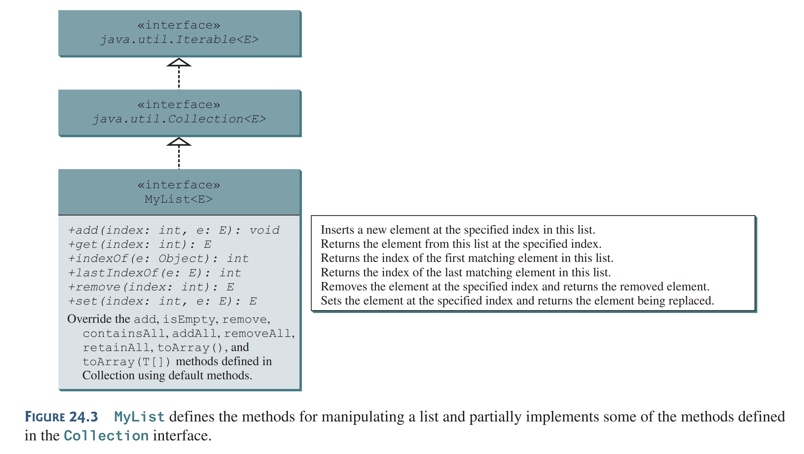

<br>
<h1 style=" color: cornflowerblue; text-align: center; font-family: 'Consolas', sans-serif;">
 Data Structures and Algorithms | Exam Revision And Theory | USFQ | Santiago Arellano
</h1>


***
<ul style="font-family: 'Consolas', sans-serif;">
<code >Main Information Section</code>
<li><b style="color: cornflowerblue; font-weight: bold">Date:</b>: 18th of September 2024 </li>
<li><b style="color: cornflowerblue; font-weight: bold">Unit</b>: Three </li>
<li><b style="color: cornflowerblue; font-weight: bold">Description</b>: This file pertains the following contents:
<code><b></b></code>.</li>
</ul>

***
<br>
<h3 style=" color: cornflowerblue; text-align: center; font-family: 'Consolas', sans-serif;">
"Exam Revision ", "Implementing an ArrayList", 
</h3>
<ul style="font-family: Consolas, sans-serif">
<li><code style="color: cornflowerblue; font-weight: bold">"Exam Revision"</code>:
<p>For this section, I will not be taking notes because this is an insult to my study and to my intelligence.
I am fully aware of the information that I put in, and the correctness of it all. Now, the questions from Fausto, 
did not make sense. And, to some extent, I misread a series of questions that caused issues here</p>
<br><p>For the next exam, in probably two weeks, we ought to study in the same way. However, we should also <b>take into 
account the minuscule details that fausto stays in. For example, ADTs and their definitions.</b>
Moreover, take into account that in last class we went ahead and looked <b>at the methods from the Set and Maps</b>
their ADTs define. Make sure to know these.</p></li>
<!--! A comment to Separate them all -->
<li><code style="color: cornflowerblue; font-weight: bold">"Implementing an ArrayList"</code>:
<p>When it comes to implementing data structures, we have different examples that we could do to gain an understanding
of the inner workings of these classes. Some of them, like lists, set, stacks, queues, etc., allow us to learn about the 
simple ways in which we can do this.
<br><br>
For this section, we will present two ways of implementing the <code> List &lt;T&gt; </code>, either as an <code>
ArrayList or a LinkedList</code></p>
<blockquote style="font-style: italic; color: black"> 
An ArrayList is a concrete implementation of the <code>List &lt;T&gt; </code> interface. This interface 
inherits directly from the <code> Collection and Iterable</code>. For this reason there are many methods that we have to 
implement on our own, and others that are brought over from the to implement interfaces.
<br><br>
<body>


</body>
As can be noted by the UML diagram from before, there are several methods that we need
to implement on our own, but also methods that we have to overwrite from the Collection interface.
<br><br>
To further understand this code, we are going to take a look at the MyList implementation 
from the book
</blockquote>
<blockquote style="font-style: italic; color: black"> 
<body>

```java
package chapter24;

import java.util.Collection;

public interface MyList<E> extends Collection<E> {
  /** Add a new element at the specified index in this list */
  public void add(int index, E e);

  /** Return the element from this list at the specified index */
  public E get(int index);

  /** Return the index of the first matching element in this list.
   *  Return -1 if no match. */
  public int indexOf(Object e);

  /** Return the index of the last matching element in this list
   *  Return -1 if no match. */
  public int lastIndexOf(E e);

  /** Remove the element at the specified position in this list
   *  Shift any subsequent elements to the left.
   *  Return the element that was removed from the list. */
  public E remove(int index);

  /** Replace the element at the specified position in this list
   *  with the specified element and returns the new set. */
  public E set(int index, E e);
  
  @Override /** Add a new element at the end of this list */
  public default boolean add(E e) {
    add(size(), e);
    return true;
  }

  @Override /** Return true if this list contains no elements */
  public default boolean isEmpty() {
    return size() == 0;
  }

  @Override /** Remove the first occurrence of the element e 
   *  from this list. Shift any subsequent elements to the left.
   *  Return true if the element is removed. */
  public default boolean remove(Object e) {
    if (indexOf(e) >= 0) {
      remove(indexOf(e));
      return true;
    }
    else
      return false;
  }

  @Override
  public default boolean containsAll(Collection<?> c) {
    // Left as an exercise
    return true;
  }

  @Override
  public default boolean addAll(Collection<? extends E> c) {
    // Left as an exercise
    return true;
  }

  @Override
  public default boolean removeAll(Collection<?> c) {
    // Left as an exercise
    return true;
  }

  @Override
  public default boolean retainAll(Collection<?> c) {
    // Left as an exercise
    return true;
  }

  @Override
  public default Object[] toArray() {
    // Left as an exercise
    return null;
  }

  @Override
  public default <T> T[] toArray(T[] array) {
    // Left as an exercise
    return null;
  }
}
```
</body>
As one might be able to notice now, there are various methods introduced to the new List. Namely
<ul>
<li><code>get(int index)</code></li>
<li><code>add(int index, E e) or add(E, e)</code> (where the first one puts it in a known index, whilst
the second appends it to the end)</li>
<li><code>remove(int index)</code>, which allows you to remove an element based on its known index</li>
<li><code>size()</code> which is brought from the Collection interface</li>
<li><code>indexOf(Object e) or lastIndexOf(Object e)</code>, which allows you to find the index of an item in the 
collection. However, <code>Collection interface</code> also provides a contains(Object e) method which would \
have to be implemented in the concrete ArrayList.</li>
</ul>
<p>Moreover, there are methods that come from the previous Collection interface which by now have a default implementation.
This way we give some semblance of an interface that provides the user with a basic implementation to not get 
<b>yelled at by the compiler for Collections methods that have not been implemented.</b></p>
</blockquote>
<p>Now, since we know the interface, we can take a look at the implementation of the class MyArrayList</p>
<blockquote style="font-style: italic; color: black"> 
<body>

```java
package chapter24;

public class MyArrayList<E> implements MyList<E> {
  public static final int INITIAL_CAPACITY = 16;
  private E[] data = (E[])new Object[INITIAL_CAPACITY];
  private int size = 0; // Number of elements in the list

  /** Create an empty list */
  public MyArrayList() {
  }

  /** Create a list from an array of objects */
  public MyArrayList(E[] objects) {
    for (int i = 0; i < objects.length; i++)
      add(objects[i]); // Warning: don’t use super(objects)! 
  }

  @Override /** Add a new element at the specified index */
  public void add(int index, E e) {   
    // Ensure the index is in the right range
    if (index < 0 || index > size)
      throw new IndexOutOfBoundsException
        ("Index: " + index + ", Size: " + size);
    
    ensureCapacity();

    // Move the elements to the right after the specified index
    for (int i = size - 1; i >= index; i--)
      data[i + 1] = data[i];

    // Insert new element to data[index]
    data[index] = e;

    // Increase size by 1
    size++;
  }

  /** Create a new larger array, double the current size + 1 */
  private void ensureCapacity() {
    if (size >= data.length) {
      E[] newData = (E[])(new Object[size * 2 + 1]);
      System.arraycopy(data, 0, newData, 0, size);
      data = newData;
    }
  }

  @Override /** Clear the list */
  public void clear() {
    data = (E[])new Object[INITIAL_CAPACITY];
    size = 0;
  }

  @Override /** Return true if this list contains the element */
  public boolean contains(Object e) {
    for (int i = 0; i < size; i++)
      if (e.equals(data[i])) return true;

    return false;
  }

  @Override /** Return the element at the specified index */
  public E get(int index) {
    checkIndex(index);
    return data[index];
  }

  private void checkIndex(int index) {
    if (index < 0 || index >= size)
      throw new IndexOutOfBoundsException
        ("Index: " + index + ", Size: " + size);
  }
  
  @Override /** Return the index of the first matching element 
   *  in this list. Return -1 if no match. */
  public int indexOf(Object e) {
    for (int i = 0; i < size; i++)
      if (e.equals(data[i])) return i;

    return -1;
  }

  @Override /** Return the index of the last matching element 
   *  in this list. Return -1 if no match. */
  public int lastIndexOf(E e) {
    for (int i = size - 1; i >= 0; i--)
      if (e.equals(data[i])) return i;

    return -1;
  }

  @Override /** Remove the element at the specified position 
   *  in this list. Shift any subsequent elements to the left.
   *  Return the element that was removed from the list. */
  public E remove(int index) {
    checkIndex(index);
    
    E e = data[index];

    // Shift data to the left
    for (int j = index; j < size - 1; j++)
      data[j] = data[j + 1];

    data[size - 1] = null; // This element is now null

    // Decrement size
    size--;

    return e;
  }

  @Override /** Replace the element at the specified position 
   *  in this list with the specified element. */
  public E set(int index, E e) {
    checkIndex(index);
    E old = data[index];
    data[index] = e;
    return old;
  }

  @Override
  public String toString() {
    StringBuilder result = new StringBuilder("[");

    for (int i = 0; i < size; i++) {
      result.append(data[i]);
      if (i < size - 1) result.append(", ");
    }

    return result.toString() + "]";
  }

  /** Trims the capacity to current size */
  public void trimToSize() {
    if (size != data.length) { 
      E[] newData = (E[])(new Object[size]);
      System.arraycopy(data, 0, newData, 0, size);
      data = newData;
    } // If size == capacity, no need to trim
  }

  @Override /** Override iterator() defined in Iterable */
  public java.util.Iterator<E> iterator() {
    return new ArrayListIterator();
  }
 
  private class ArrayListIterator 
      implements java.util.Iterator<E> {
    private int current = 0; // Current index 

    @Override
    public boolean hasNext() {
      return current < size;
    }

    @Override
    public E next() {
      return data[current++];
    }

    @Override // Remove the element returned by the last next()
    public void remove() {
    	if (current == 0) // next() has not been called yet
        throw new IllegalStateException(); 
      MyArrayList.this.remove(--current);
    }
  }
  
  @Override /** Return the number of elements in this list */
  public int size() {
    return size;
  }
}
```
</body>
<p>The present implementation is a concrete implementation of all methods required to make a functional ArrayList based on 
an internal <code>Object[]</code> to hold the values determined inside the array. There are a couple of implementations
to note here. For example <code>indexOf(E e) and lastIndexOf(E e)</code>, are two different ways 
defined to find the <b>index from left to right, or right to left, respectively</b>. They essentially iterate either
from 0 or from <code>size - 1</code>. Given that the class keeps a running count called <b>size</b> of the values that 
are put inside the array, (not based on a zero-based index), it uses it to determine the last index in the second method 
mentioned. </p>
<p>Another point to note is the internal helper methods that are defined within the class.</p>
<ul>
<li><code>checkIndex(int index)</code>: used to determine whether the index is in range (i.e., from 0 to 
size -1). This is why it says <code>  if ( index &lt; 0 || index &gtrsim; size</code> to keep the value in the range.
This method however, does not return anything rather throws an exception if the index is wrong</li>
<li><code>ensureCapacity()</code>: which is used to determine if the size internal counter has surpassed the size 
of the internal data holder. If this happened it essentially duplicates the size of the array and then uses
<code>System.arraycopy(originalArray, 0, newArray, 0) </code> to copy the data over.</li>
</ul>
</blockquote>
<blockquote style="font-style: italic; color: black">Lastly, we shall take a look at the implementation
for the iterator class. 
<ul>
<code>Main Characteristics before code analysis</code>
<li><b style="color: cornflowerblue; font-weight: bold">Private Inner Class</b>: 
the Iterator class, which implements <code>Iterator < E > </code> is defined as an inner private class of the 
main ArrayList class, meaning that it has both <b>access to all methods and values inside the main class</b>, and <b>
it has to be created through factory methods in the main class</b>
</li>
<li><b style="color: cornflowerblue; font-weight: bold">Current value logic</b>: The current value logic used is from 
checking to size, <code>hasNext(), remove() and next()</code> methods. In the boolean <code>hasNext()</code>
case it utilizes the current to check if the current is less than ArrayList.size variable. For the second case
in the removing operation it uses it to make sure that it does not remove the 0th element and always uses it to delete 
<b>the element it is standing on, not the one in front of it</b></li>
<li><b style="color: cornflowerblue; font-weight: bold">Postfix and Prefix increase and decrease operators</b>: 
In the iterator, we should note the usage of postfix and prefix increment and decrement operators. In the <code>next()
</code> element, the code does <code> data[current++]</code> meaning that we are doing a postfix increase, i.e. we get the value
and then we increase the counter. Meanwhile, in the remove() method we first decrease the counter and returns
the value of the index right after the decrement.</li>
</ul>
The rest of the logic for the iterator remains the same and only really works on throwing either exceptions or removing.

</blockquote>
</li>
</ul>