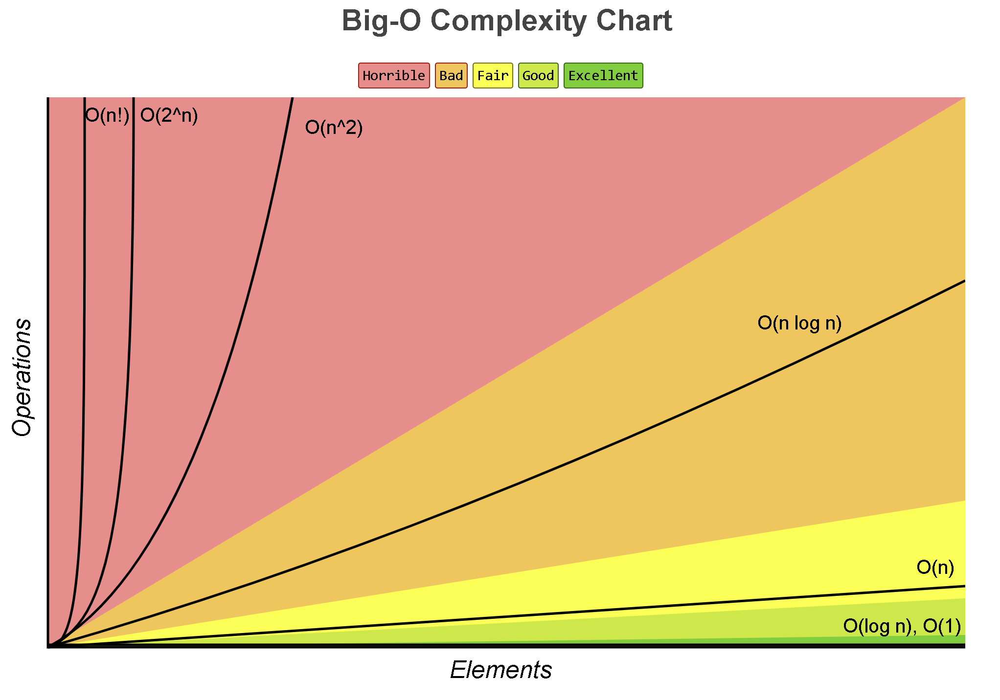
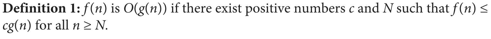
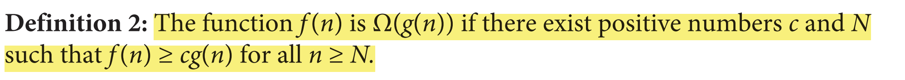
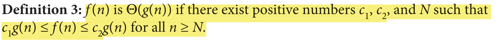
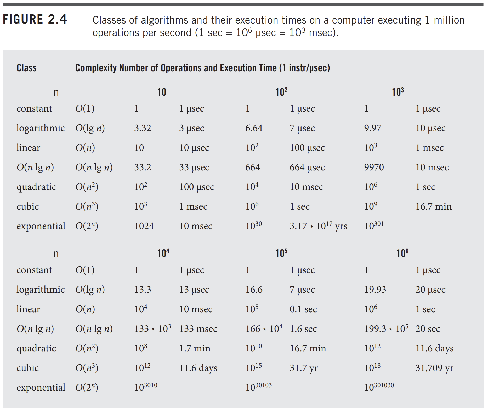
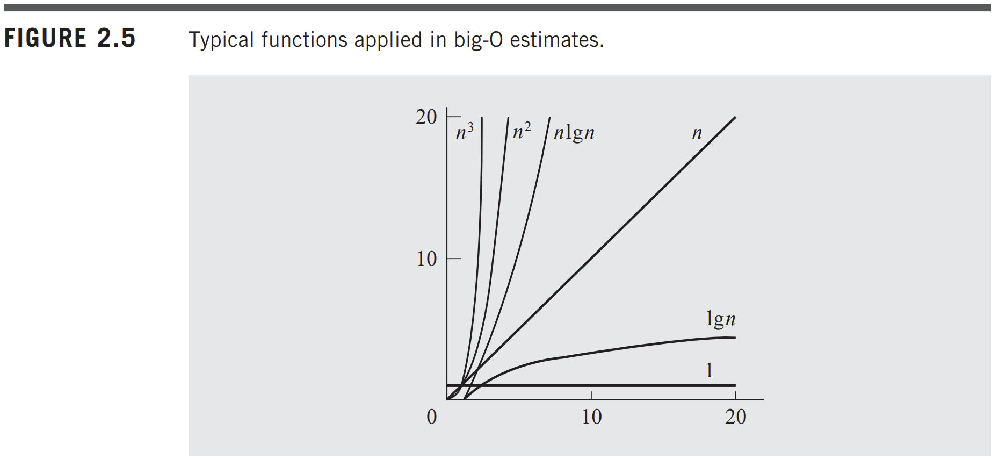
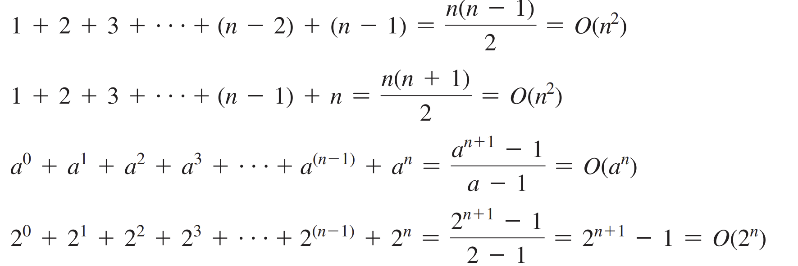

<h1 style=" color: cornflowerblue; text-align: center; font-family: 'Consolas', sans-serif;">
Data Structure And Algorithms | Algorithm Analysis | USFQ | Santiago Arellano
</h1>

***
<ul>
<code>Main Information Section</code>
<li><b style="color: cornflowerblue; font-weight: bold">Date:</b>: 26st of August 2024</li>
<li><b style="color: cornflowerblue; font-weight: bold">Unit</b>: Unit 1</li>
<li><b style="color: cornflowerblue; font-weight: bold">Description</b>: This file contains information about chapter 22 from Liang's book about
Java AAlgorithm Analysis</li>
</ul>

***
 
<h3 style=" color: cornflowerblue; text-align: center; font-family: 'Consolas', sans-serif;">
"Defining An Efficient AAlgorithm"
</h3>
<ul style="font-family: Consolas, sans-serif">
<li><code style="color: cornflowerblue; font-weight: bold">"Defining An Efficient Algorithm"</code>: 
Given that there are no algorithm defined in a "one-size fits all" kind of way, this means that most algorithms have
varied application styles, conditions to be effective, and requirements that must be met for them to perform
at their best. For example
<blockquote style="font-style: italic; color: bisque">Binary search, depending on the application might be more effective
or less than a linear search. Binary search often requires ordering of the data, whilst linear search effectively looks 
at every index before outputting a result.
  
This means that, for data that is unordered linear search might be easier to apply than binary search in terms of speed. 
In addition, in the case that data is ordered, even linear search can be easier to implement and to use, seeing as the search 
would only have to go until the algorithm detects we have gone <b>over the possibilities or lowest index than the one we 
are searching</b>
  
However, linear search has a major disadvantage which is that in the case of the key or data point not being in the 
dataset prior to using it to look up its position within it, the linear search algorithm will perform a search on <code>
n</code> entries, even though the entry is not there
</blockquote>
One important argument that we can notice is that our discussion was <b>language-agnostic</b> we never looked at implementations,
but we know that these implementations can be done in any language given that it allows for generics, classes, etc. 
  
Generally, when we are looking at these algorithms, we look to find the worst case scenario and analyze it, often we also
take into account the average cases, and rarely the best case scenario.
  
Conversely, <b>we are <code>wrong</code> by making assumptions of performance, timings, and memory utilization, when we 
talk about a computer algorithm. No single computer is equal and no development and test environment is made with the same 
components. Therefore, measuring times and memory on one computer, <code>does not provide us</code> with enough information
to make assumptions on performance.</b>
This leads us to think differently about our assumptions on algorithms, leading us to questions on how we can prove 
statistically and mathematically their efficiency.
<blockquote style="font-style: italic; color: bisque"> 
Often times, to understand an algorithm, we analyze the frequency and the efficiency of the actions that act between the 
algorithm and the data. Normally we are interested in <b>growth over time, the worst case scenario</b> rather than 
in specific cases. As an example, in the case of search the most important action to optimize is <code>comparison</code>
between elements </blockquote>
<blockquote style="font-style: italic; color: bisque">Another example could be the lookup and comparison of elements between 
to similar data structures, say vectors. We would compare items in every index, this, if we take into account both data
structures of which we are comparing, means that we have n cases on one and n cases on the other. If we have two n amount of 
of look up operations, this means that in total we have n^2 comparisons. If the amount of data objects grows linearly, then the computation
time would grow squarely that.</blockquote>
Then here is the gist:
<blockquote style="font-style: italic; color: bisque">
<ul>
<code>We do not measure:</code>
<li><b style="color: cornflowerblue; font-weight: bold">Execution Times</b>: not recommended since this depends on external, and internal, conditions
surrounding the language, hardware, OS, test environment, memory availability, etc.</li>
<code>We measure:</code>
<li><b style="color: cornflowerblue; font-weight: bold">Significant Actions</b>:we choose to measure directly an operation or
extract of operations within an algorithm to mathematically measure their performance. We do this on the <b>Worst Case Scenario (Big O) [Upper Bound of 
Functions], Best Case Scenario, Average Case, Compounded Cases, etc. </b>
</li>
<li><b style="color: cornflowerblue; font-weight: bold">Memory Usage [Memory Space] </b>: once other comparison tests have been exhausted,
two algorithms can be checked and compared through their memory usage. This might mean creating, modifying or duplicating
already existing data values, increasing memory usage.</li>
<li><b style="color: cornflowerblue; font-weight: bold">Growth Rate </b>: we take a look at growth in terms of how 
the algorithm responds to an increase of data values.</li>
</ul></blockquote>
<blockquote style="font-style: italic; color: bisque">There exist algorithm where so long as the dataset is at least half-ordered,
they will work just fine, and viceversa too</blockquote>
</li>
<code style="color: cornflowerblue; font-weight: bold">"Understanding Algorithm Complexity Through Charts"</code>:
<body>

</body>
The preceding image presents a graph of the complexities and the respective tolerances computer science has with the 
amount of operations done in relation to data elements present in a data structure.
 
In order for us to understand the complexity of an algorithm, we must use the worst-case scenario analysis or <b>Big O 
Notation</b>, this method for understanding algorithms focuses on the growth of an algorithm on the long run with large 
amounts of items. Mathematically, this can be defined in the following way:
<blockquote style="font-style: italic; color: bisque"> 
Big-O Notation [Upper Bound Asymptotic Analysis]

 
This means that for any two given functions, where f(n) refers to the function to approximate, and g(n) the approximation function,
we know that O(g(n)) is the approximation function for f(n) if there exists a constant c for which for any input number of N, the
approximation function will always be larger than the original function.
</blockquote>
<blockquote style="font-style: italic; color: bisque"> 
Big-&Omega; Notation [Lower Bound Asymptotic Analysis]
<body>

</body>
 
This definition essentially means: for any given function f(n) &longmapsto; representative of the operations taken to 
address a certain action by an algorithm, there exists another function g(n) for some numbers c and N where the function g(n) 
(now becoming an asymptotic lower bound) will always be lower than or equal to f(n), i.e. f(n) will behave either always 
higher than, or at least equal to g(n).
  
<blockquote style="font-style: italic; color: bisque"> 
Essentially, &Omega; is the lower bound for a given approximation function f(n), whereas &Ocy; is an upper bound of the approximation function.</blockquote>
</blockquote>
<blockquote style="font-style: italic; color: bisque"> 
Big-&Theta; Notation
<body>

</body>
This one is straightforward, theta refers to a function g(n) which approximates in terms of complexity the function that defines
the behavior of the algorithm, basically bounding the function f(n) with respect to g(n) and a set of constants and 
elements (n) where the function behaves like the g(n) approximation.
</blockquote>
It is of the upmost importance to analyze how the algorithm grows over time, and how loops in those algorithms grow over
time. In general <code>loops add the bulk to the algorithm analysis procedure, however lookup operations and if statements can 
also add onto the complexity and time taken by an algorithm</code>
<blockquote style="font-style: italic; color: bisque"> 
Thankfully for us, some people much smarter than us, mathematicians probably, have already defined and computed basic tables that show 
how these algorithms can behave

</blockquote>
 
 

Another important detail to have is that in most books, there is a T argument, which is the summation representation of 
the Big O notation, this can be seen in the following ways:
<blockquote style="font-style: italic; color: bisque"> 

</blockquote>
</blockquote>
</ul>