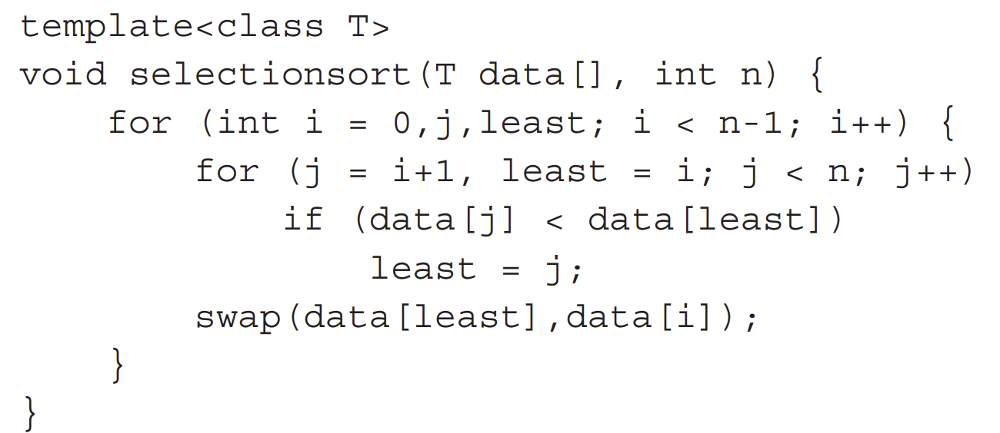
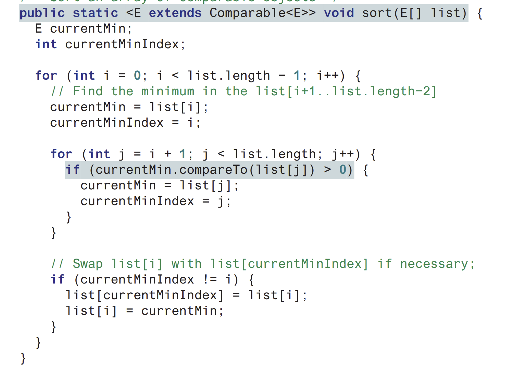

<h1 style=" color: cornflowerblue; text-align: center; font-family: 'Consolas', sans-serif;">
Data Structure And Algorithms | Generics in Java | USFQ | Santiago Arellano
</h1>


***
<ul>
<code>Main Information Section</code>
<li><b style="color: cornflowerblue; font-weight: bold">Date:</b>: 21st of August 2024</li>
<li><b style="color: cornflowerblue; font-weight: bold">Unit</b>: Unit 1</li>
<li><b style="color: cornflowerblue; font-weight: bold">Description</b>: This file contains information about the Generics
in Java class, which was covered in conjunction with the Deitel Book</li>
</ul>

***
<br>
<h3 style=" color: cornflowerblue; text-align: center; font-family: 'Consolas', sans-serif;">
"Generics in Java: The Basics"; "Comparable Interface: An Example", "First Approaches to Algorithm Analysis"
</h3>
<ul style="font-family: Consolas, sans-serif">
<li><code style="color: cornflowerblue; font-weight: bold">"Generics in Java: The Basics"</code>:
In Java, generics come in the way of classes or interfaces, etc. that have defined generic data types. These data types 
can have different restrictions (lower, upper, and unbounded) and can be used in many different aspects of the application. 
Moreover, generics can be used as return types in methods or even as parameter types in methods to compartmentalize the 
use of generics.
<br><br>
In order to understand the first aspect mentioned, we go back to an example on how to define generic classes or interfaces.
<blockquote style="font-style: italic; color: bisque"> 
Generic Class And Interface Example
<blockquote style="font-style: italic; color: bisque">
<body>

```java
package examples;

public sealed interface Complex<T> permits Complex<Number>
{
    //... Your code Goes here
    
}

class Complex<Number>
{
    //... Your code Goes Here
}
```
</body>
The previous definition presents how to work with templates and generic types. The first definition creates an interface
called Complex < T > with a generic type T. Note that this interface is sealed and only permits the subclass 
Complex < Number >. And then underneath we define the actual class which would implement the methods from the sealed 
interface. 
This is the most practical way for declaring interfaces in Java. </blockquote>
</blockquote>
Advancing on the basics of Java generic, let us take a look at how the book defines the ways we can organize or <b> bound
</b> our generic types to allow, or disallow certain types.
<blockquote style="font-style: italic; color: bisque"> 
<ul>
<code>You can use unbounded wildcards, bounded wildcards, or lower bound wildcards to specify
a range for a generic type</code>
<li><b style="color: cornflowerblue; font-weight: bold"> <code> < ? > </code> wildcard specification </b>: 
This is known as unbounded wildcard, it is the same as saying <code> < ? extends Object > </code>, which allows any 
class that directly inherits from Object, basically everything in Java.
</li>
<li><b style="color: cornflowerblue; font-weight: bold">Upper-Bounded Wildcard</b>:This can be represented as <code>
< ? extends T ></code>where T is our upper bounded generic type, this indicates that the bound will be all classes that 
inherit from T downwards including T</li>
<li><b style="color: cornflowerblue; font-weight: bold">Lower-Bounded Wildcard</b>:
This one is represented by <code> < ? super T></code> and basically means every class that is a supertype of T (
classes from which T inherits) and does include T
</li>
</ul>
</blockquote>
Through these declarations, which can be placed anywhere from class generic types or method generic types you can block or
allow certain classes from accessing the content you are defining.
<br><br>
Lastly, I would like to present a block of code that will allow us to showcase everything I have touched on in a concise example
<blockquote style="font-style: italic; color: bisque"> 

```java
package examples;

import java.util.ArrayList;
import java.util.List;

public class Generics<E, F extends CharSequence> {
private ArrayList<F> dataExample = new ArrayList<E>(); //This is how you define variables with generics
public List<F> listExample;

    public Generics() { //THe constructor stays the same in this type of classes
        //... your code goes here
        this.listExample = new ArrayList<String>();
    }

    //! This is how you define a method return type with generics
    public List<F> getListExample() {
        return listExample;
    }

    //! This is how you define a method that takes in a Generic type
    public <D> void redefineListExample(List<D> things) //THis order matters
    {
        this.listExample.clear();
        this.listExample = things;
    }
}
```

</blockquote>
</li>
<li><code style="color: cornflowerblue; font-weight: bold">"Comparable Interface: An Example"</code>:
One way to visualize the properties of templates and interfaces is to implement one. In my case I had been working over
the List< E > interface as a way to exercise my mind and remember how to code. As for Fausto, he wanted to try a code 
from GPT. However, annoying, this is, the code produced was somewhat apropiate. For starters, it defined constructos, 
getter and setters and even overwrote the specific <code>Comparable and Comparator</code> interfaces.
<br><br>
Interfaces, as we know. 
<blockquote style="font-style: italic; color: bisque"> Involve classes which only include abstract methods, i.e. those
whose implementation must be provided by the user</blockquote>
Moreover, the cases of Comparable and Comparator are both <code><b>Functional Interfaces</b></code>, this means that 
these interfaces have only one method that must be implemented.
<br><br>
In our analysis of the code, we note that there is a principal difference between the two:
<blockquote style="font-style: italic; color: bisque">Whereas Comparator provides a method with a signature that needs two
different objects from the same generic type. Comparable provides a single method which compares the <code>this</code> to the
external object</blockquote>
<blockquote style="font-style: italic; color: bisque">Whenever we want to implement the ideas of equality, higher than or lower than in relation to our classes, we should 
implement the Comparator functional interface. The <code>Comparator</code> functional interface allows us to work akin to friendly functions from C++, 
allowing for comparison between two instances of a class rather than self with another class.</blockquote>
Another, interesting fact to take into account is that the Comparable interface, with its method compareTo, provides the
natural order used by most sorting methods in Java.
<br><br>
<blockquote style="font-style: italic; color: bisque">In Java Collections.sort() method, the method only works with arrays of Objects and not arrays of
primitives. Furthermore, this method will utilize the natural ordering of the class, provided of course that we use this method. We could always use 
another method, be it, <code>public static < T > void sort(List< T > list,
 Comparator< ? super T > c)</code>
<br><br>
This method allows you to use both classes and lambdas to enter a comparator instance which is to be used to order your class
internally by the sort method.</blockquote>
</li>
<li> <code style="color: cornflowerblue; font-weight: bold">"First Approaches to Algorithm Analysis"</code>:
<blockquote style="font-style: italic; color: bisque">
Sequential search has two benefits, a) always works even with no ordering,
and b) if the data point is in the linear search then it will find it. <br>
<br>
 Sadly, this also means that when the data is not in the lookup data set, this means we will doing a long search and will 
have to take an O(n) algorithm.
</blockquote>
<blockquote style="font-style: italic; color: bisque"> 
Binary search relies on the data being ordered, parting it in the middle and evaluating how far away from the target they are.
</blockquote>
Selection Sort works like this
<ul>
<li>First looks at the first position and takes the index and value, then proceeds to linearly compare the value to the rest to find smallest.
Once found the algorithm swaps them and continues through the values, in both iterations</li>
</ul>
<br><br>
Interestingly, this algorithm can be implemented for any data type, hence why we mostly used it in the form of a generic 
data type. However, this generic data type must implement <code>Comparable</code>.This is the reason why, the following C++
algorithm


Became the following in Java

</li>
</ul>