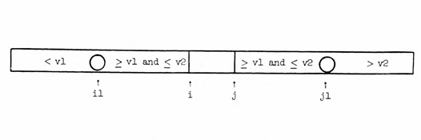
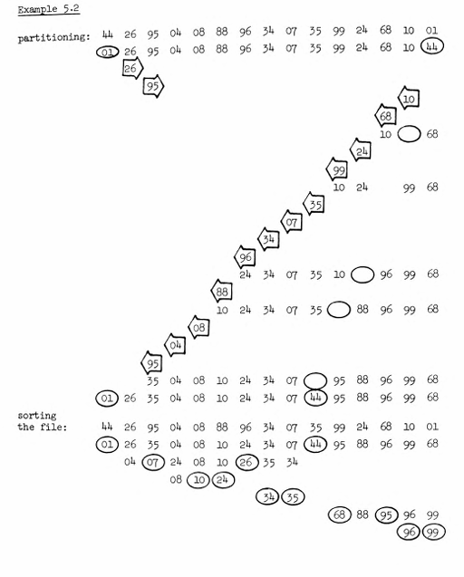
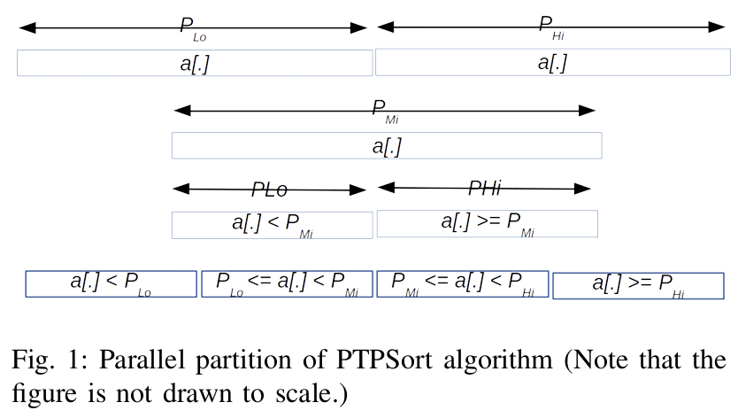

<h1 style=" color: cornflowerblue; text-align: center; font-family: 'Consolas', sans-serif;">
 Data Structures and Algorithms | Quick Sort Revisited | USFQ | Santiago Arellano
</h1>


***
<ul style="font-family: 'Consolas', sans-serif;">
<code >Main Information Section</code>
<li><b style="color: cornflowerblue; font-weight: bold">Date:</b>: November 27th, 2024. </li>
<li><b style="color: cornflowerblue; font-weight: bold">Unit</b>: 6.</li>
<li><b style="color: cornflowerblue; font-weight: bold">Description</b>: This file pertains the following contents: 
<code><b>Quick Sort Variants and the importance of their analysis</b></code>.</li>
</ul>

***
<br>
<h3 style=" color: cornflowerblue; text-align: center; font-family: 'Consolas', sans-serif;">
"Notes About Pivot Selection ", "Dual Pivot Selection Variants ", "Triple Pivot Selection Variants ",
"Tetra and Penta Pivot Partitioning Algorithms"
</h3>
<ul style="font-family: Consolas, sans-serif">
<li><code style="color: cornflowerblue; font-weight: bold">"Notes About Pivot Selection"</code>:
<p>In general, when it comes to quick sort implementations, the choice of pivot can have a great influence on the behavior of
an algorithm's implementation. Although this difference is not noticeable in small scale arrays and test programs, the 
chaotic behavior these algorithms can display is often due to a bad pivot decision. For this reason, one of the main ways
sorting algorithms, and specifically quick sort, are improved, is by modifying the underlying systems that make it do the 
sorting. In our case, this mechanism is the partition based on pivots.
<br><br>
When it comes to pivot selection, there are various strategies that have been discussed over the years, and whose implementations
have fallen into and out of fame due to either better versions coming along, or issues that directly disprove their mathematical
benefits. Some examples of pivot selection strategies involve <b>single, dual, triple, quadruple, quintuple, k-ary, and so on</b>, strategies
that often help in reducing the load on each of the sides of the partition algorithm, making it faster and sometimes even 
more reliable when it comes to duplicated data.
<br><br>
Howver, aside from these improvements, we also have improvements in the way these algorithms interact with the computer,
some are implemented as sequential (this is the case for most single, dual and triple basic implementations you can find 
in online sources) [2,4,5,6,7]. On the other hand, there are those algorithm implementations that are designed to run in parallel, 
and even other's that are designed to work on the GPU. This then leads us to consider, without broadening the scope of this 
research article, four distinct ideas where pivot selection matters.
</p>
<blockquote style="font-style: italic; color: whitesmoke"> <q>
Quick Sort Revisited: Thinking About Pivot Selection's Importance
</q> 
<ul>
<li><b style="color: cornflowerblue; font-weight: bold">Worst Case Probability</b>: Without doubt, one key area for quick 
sort optimization is the probability of the worst case scenario. In basic methods or partitioning an array, we will see that 
some of the worst times arise from the way the pivot is selected, or even from the way the partitioning method works (Hoare or Lomuto,
 for example).<br><br>
<p>
In general, the idea behind the optimizations that we carry out to these algorithms is to reduce the probability of the 
worst case scenario (often O(n^2)), to this end we vary the pivot selection strategies, working with multiple pivots or with 
modified partitioning techniques to produce a consistently lower asymptotic complexity than in the general single pivot basic 
quick sort implementation.
<br><br>
It is interesting to note that it is widely known that, through an effective pivot selection and partitioning scheme, we are 
more than capable of reducing the average complexity of the algorithm from the worst case to the nLog(n) version we often want.
<br><br>
This then means that for us to accurately arrive at the best performance possible for quick sort we have to think about 
both the pivot selection mechanism and the partition algorithm that is used, given that these two phases are the most important
parts of quick sort. [14][15]
</p></li>
<li><b style="color: cornflowerblue; font-weight: bold">Performance under diverse inputs</b>: 
<p>
While in class we analyzed mostly arrays where the data was assumed to have either a normal or at least close to normal distribution
where all values within a certain range had an equal opportunity of being selected, when it comes to quick sort the way these
data points are often found in the wild has nothing to do with ordered inputs, rather some arrays might contain all null or 
zero values, some might have values that are duplicated, all duplicated elements, reversed, almost sorted, half sorted, etc. 
<br><br>
All of these combinations often lead to quick sort having a harder time with sorting depending on the strategies used to 
improve its analysis, partitioning and pivot selection mechanism. In some cases, the partitioning methods that we use can 
end up being a nuisance when it comes to random input values, in other cases, they can become a helpful tool for quicker 
data analysis. As noted in [16], even through two of the best partitioning methods, Lomuto and Hoare, there is still room for 
improvement if we take a look at the way in which we select the pivot. In their paper, they used various input forms, from 
reversed, to ordered, to full-of-zeroes arrays that tested the efficiency of both single pivot algorithms, and both partitioning 
methods. 
<br><br>
The main idea is then that, for various input sizes, various input types and often for the types of arrays we will encounter,
it is critical for us to select both a good pivot selection method and a proven partitioning algorithm, preferably Hoare.
</p>
</li>
<li><b style="color: cornflowerblue; font-weight: bold">Recursion Trees</b>: 
<p>It is no secret, and as we have studied in class, that quick sort is a variation of the general pattern of divide-and-conquer
problem solving algorithms. Moreover, this algorithm lies in the same family as merge sort given that it divides the array 
recursively and through these calls sort it. 
<br><br>
The main difference that quick sort has with merge sort is that in general, the array is not divided and copied, and rather 
is sorted in place through recursive calls that only work with indexes and the memory layout of the array, not with the reference
to the entire array. For this reason, one of the problems that these types of algorithms can have is the depth of the tree
that is formed by consecutive recursive calls.
<br><br>
The issue with this, as with merge sort, is that in the division of the array, its size, the pivot, etc. can affect the 
balance of the tree. For example, if we were to divide an array using the first, single pivot, variants of quick sort we are
more likely to fall into the worst case scenarios if the input is an already sorted or half sorted array [6]. On the other, hand
, and quite surprisingly, this does not extend clearly to the cases of dual, triple, or n-ary pivot selections, as these methods
still rely on some pattern of value selection that can lead to the worst case scenario. This of course, does not mean that 
other implementations of quick sort are no different from single pivot quick sort, rather it means that without thinking clearly
of how the pivots are selected we can still run into the worst case partitioning and produce a large recursive tree.
<br><br>
It is interesting to note the use of Binary Search Trees and the relationship they have with the concept of quick sort partitioning.
For single pivot quick sort implementations, BST can be used to approximate the way in which the array has to be sorted, as each 
recursive call where the pivot is updated then results in an inputted node into the three that, when extracted using an inorder
traversal, produces the correct order of the array. [9] For other, non-singular pivot implementations the concept used of 
trees can be expanded onto s-way trees (advanced data structures that are way more involved than needed for this presentation).
<br><br>
Furthermore, and in addition to what was presented at [9], [17] shines a light on the way multi-pivot quick sort can help reduce
the height of the recursive call tree formed by quick sort as it partitions the array. Particularly, it is possible to note that,
to a certain extent, despite the present risk of going to a worse case scenario, in general more pivots reduce both the memory 
access required by reducing the height of the recursive call tree, but it increases the cost in terms of swaps and memory
footprint given that we require more space for variables.
</p>
</li>
<li><b style="color: cornflowerblue; font-weight: bold">Memory Management in Stack and Cache</b>: 
To finish up with this section of notes about pivot selection, we should take a look at the way in which the CPU works, 
the reason for this is that many quick sort variations that can be found are in some way dependent on either the 
Cache memory and its fast access times, or on branch mis-predictions and CPU-based logic that is outside the scope of this
document.
<br><br>
In essence, the core idea related to memory is the way in which these algorithms work is by often keeping values, memory 
addresses, and other core functionality parameters close to the CPU, i.e., Cache memory such that access times are shorter, since 
access times to main memory is often longer than that of the LP caches that some cores have. This then means that, in tandem
with the reduction of recursion size, it is also imperative for us to correctly select our partitioning and 
pivot selection mechanisms correctly to take advantage of the internal memory layout of our computer's. [18]
</li>
</ul>
</blockquote>
</li>
<!--! A comment to Separate them all -->
<li><code style="color: cornflowerblue; font-weight: bold">"Dual Pivot Selection Variants"</code>:
<p>
Dual pivot selection variants of quick sorts have existed ever since Robert Sedgewick postulated about them in 1975 on his 
dissertation titled "Quick Sort." In this dissertation, Sedgewick presents the main foundations for dual pivot quick sort but
ultimately fails to accept these notions, rendering them as "inefficient" with respect to the already wide-spread single pivot 
implementation (basic quick sort) that was present in many libraries at the time. [7,9, 19] 
<br><br>
Much to his surprise, later implementation of dual pivot quick sort, specifically its refined version commonly named
<b>YBB for Yaroslavskiy, Bentley, Both</b>, dual pivot implementation would prove transcendental in the field, as it 
forced more researches to devote time and attention to the concept of pivot selection increase, as well as the ways in which modern
computation, threading and GPUs could improve the efficiency and running times for these algorithms. Interestingly, <b>Java 7s 
standard library came preinstalled with YBB as its basis for the sorting algorithms it had.</b> [9]
<br><br>
Now, the idea behind quick sort remains the same here; we first find the pivots we would like to use,this of course is left
to the implementer of the algorithm, once these have been found, in the case of dual pivot two, we proceed to break down the array
into <b>three subsections</b>, these subsections then represent all elements lower than the left pivot, in between the left and 
right pivot (of course this means left < right ), and the last one is all elements higher than the right pivot.[9]
<br><br>
Despite this, the real algorithm that we will be implementing makes use of more complicated pointer logic and elements. This algorithm 
is best described in the following blockquote 
</p>
<blockquote style="font-style: italic; color: whitesmoke"> <q>Quick Sort Revisited: YBB Mechanism</q> 
<p>
The YBB algorithm makes use of five different invariants (sections where values can lie) and five different pointers that it 
keeps track of at all times. There are five pointers that are invaluable
</p>
<ul>
<li><code>P (Often noted as P1)</code>: that corresponds to the leftmost value of the array (left)</li>
<li><code>Q (Often noted as P2)</code>: that corresponds to the rightmost value of the array (right)</li>
<li><code>k </code>: a pointer that usually starts at the left end of the array </li>
<li><code>g</code>: a pointer that usually starts at the right end of the array</li>
<code>These two k,g scan the array until they meet</code>
<li><code>l</code>: a pointer that often lags behind k and allows for separation into four respective areas</li>
</ul>
<p>Through these pointers we divide the array into four areas, those values between P and l are those that are smaller
than P from the group between l and k, i.e., those that are in between the pivots. The region between k and g contains all the rest of 
the elements that must be reviewed. Finally, the section between g and Q represents those values that higher than Q. [9, 19, 20]</p>
<br><br>
<p>Having defined the way in which this algorithm divides its data, it appears of upmost importance for us to present the 
pseudocode for it</p>
<br><br>
<body>

```text
procedure YBBQuickSortImplementation [20]
1. Para arreglos menores de 17 valores, usar ordenamiento por inserción
2. Elegir does valores P, Q para ser los pivotes, por ejemplo los valores del inicio y final del arreglo, en donde
P < Q, si no lo son se intercambian
3. Este intercambio/seleccion produce estas partes:
    3.1 Parte 1: valores entre left + 1 y L -1 en donde se guardan aquellos valores menores de P
    3.2 Parte 2: valores entre L y k-1 en donde se guardan aquellos valores entre P y Q inclusivo
    3.3 Parte 3: valores entre G + 1 y Q - 1 en donde se guardan aquellos valores mayores a Q
    3.4 Parte 4: valores con indices entre K y G
Loop Mientras K <= G
4. El siguiente element a[k] de la parte 4 se compara con los pivotes y se mueve hacia una de las secciones 1,2, o 3.
5. Los pivotes se ajustan en sus direcciones correspondientes
Intercambios de pivotes 
El pivote P se intercambia con el ultimo elemento de la parte 1
El pivote Q se intercambia con el primer elemento de la parte 3
```
<code>Clearer pseudocode</code>

```text
algorithm YBBPartition(A, left, right, P, Q) [9]
    l <- left, k <- l, g <- right;
    while k <= g
        if A[k] < P
            swap(A[l],A[k]);
            l++;
        else 
            if A[k] >= Q
                while A[g] > Q && k < g
                    g--;
                if A[g] >= P
                    swap(A[k], A[g])
                else 
                    CyclicShiftLeft(A, k, l,g);
                    l++;
                end if
                g--;
            end if 
        end if
        k--
    end while
    return (l -1, g+1);
    
algorithm CyclicShiftLeft(A, i1,... il)
    tmp <- A[i1];
    for r<- 2 to l
        A[ir - 1] <- A[ir];
    end for
    A[il] = tmp;         
```
</body>
<p>Now for a more concrete implementation of this algorithm it would be beneficial to take a look at the implementation that is 
provided by Vladimir in his own article[19]</p>
<body>

```java
package QuickSortVariants;


public class YBBQuickSortVariant{

    /**
     * Prevents instantiation.
     */
    private YBBQuickSortVariant() {}

    /*
     * Tuning parameters.
     */

    /**
     * The maximum number of runs in merge sort.
     */
    private static final int MAX_RUN_COUNT = 67;

    /**
     * The maximum length of run in merge sort.
     */
    private static final int MAX_RUN_LENGTH = 33;

    /**
     * If the length of an array to be sorted is less than this
     * constant, Quicksort is used in preference to merge sort.
     */
    private static final int QUICKSORT_THRESHOLD = 286;

    /**
     * If the length of an array to be sorted is less than this
     * constant, insertion sort is used in preference to Quicksort.
     */
    private static final int INSERTION_SORT_THRESHOLD = 47;

    /**
     * If the length of a byte array to be sorted is greater than this
     * constant, counting sort is used in preference to insertion sort.
     */
    private static final int COUNTING_SORT_THRESHOLD_FOR_BYTE = 29;

    /**
     * If the length of a short or char array to be sorted is greater
     * than this constant, counting sort is used in preference to Quicksort.
     */
    private static final int COUNTING_SORT_THRESHOLD_FOR_SHORT_OR_CHAR = 3200;

    /**
     * Sorts the specified array.
     *
     * @param a the array to be sorted
     */
    public static void sort(Integer[] a) {
        sort(a, 0, a.length - 1);
    }

    /**
     * Sorts the specified range of the array.
     *
     * @param a the array to be sorted
     * @param left the index of the first element, inclusive, to be sorted
     * @param right the index of the last element, inclusive, to be sorted
     */
    public static void sort(Integer[] a, int left, int right) {
        // Use Quicksort on small arrays
        if (right - left < QUICKSORT_THRESHOLD) {
            sort(a, left, right, true);
            return;
        }

        /*
         * Index run[i] is the start of i-th run
         * (ascending or descending sequence).
         */
        int[] run = new int[MAX_RUN_COUNT + 1];
        int count = 0; run[0] = left;

        // Check if the array is nearly sorted
        for (int k = left; k < right; run[count] = k) {
            if (a[k] < a[k + 1]) { // ascending
                while (++k <= right && a[k - 1] <= a[k]);
            } else if (a[k] > a[k + 1]) { // descending
                while (++k <= right && a[k - 1] >= a[k]);
                for (int lo = run[count] - 1, hi = k; ++lo < --hi; ) {
                    int t = a[lo]; a[lo] = a[hi]; a[hi] = t;
                }
            } else { // equal
                for (int m = MAX_RUN_LENGTH; ++k <= right && a[k - 1] == a[k]; ) {
                    if (--m == 0) {
                        sort(a, left, right, true);
                        return;
                    }
                }
            }

            /*
             * The array is not highly structured,
             * use Quicksort instead of merge sort.
             */
            if (++count == MAX_RUN_COUNT) {
                sort(a, left, right, true);
                return;
            }
        }

        // Check special cases
        if (run[count] == right++) { // The last run contains one element
            run[++count] = right;
        } else if (count == 1) { // The array is already sorted
            return;
        }

        /*
         * Create temporary array, which is used for merging.
         * Implementation note: variable "right" is increased by 1.
         */
        Integer[] b; byte odd = 0;
        for (int n = 1; (n <<= 1) < count; odd ^= 1);

        if (odd == 0) {
            b = a; a = new Integer[b.length];
            for (int i = left - 1; ++i < right; a[i] = b[i]);
        } else {
            b = new Integer[a.length];
        }

        // Merging
        for (int last; count > 1; count = last) {
            for (int k = (last = 0) + 2; k <= count; k += 2) {
                int hi = run[k], mi = run[k - 1];
                for (int i = run[k - 2], p = i, q = mi; i < hi; ++i) {
                    if (q >= hi || p < mi && a[p] <= a[q]) {
                        b[i] = a[p++];
                    } else {
                        b[i] = a[q++];
                    }
                }
                run[++last] = hi;
            }
            if ((count & 1) != 0) {
                for (int i = right, lo = run[count - 1]; --i >= lo;
                     b[i] = a[i]
                );
                run[++last] = right;
            }
            Integer[] t = a; a = b; b = t;
        }
    }

    /**
     * Sorts the specified range of the array by Dual-Pivot Quicksort.
     *
     * @param a the array to be sorted
     * @param left the index of the first element, inclusive, to be sorted
     * @param right the index of the last element, inclusive, to be sorted
     * @param leftmost indicates if this part is the leftmost in the range
     */
    private static void sort(Integer[] a, int left, int right, boolean leftmost) {
        int length = right - left + 1;

        // Use insertion sort on tiny arrays
        if (length < INSERTION_SORT_THRESHOLD) {
            if (leftmost) {
                /*
                 * Traditional (without sentinel) insertion sort,
                 * optimized for server VM, is used in case of
                 * the leftmost part.
                 */
                for (int i = left, j = i; i < right; j = ++i) {
                    int ai = a[i + 1];
                    while (ai < a[j]) {
                        a[j + 1] = a[j];
                        if (j-- == left) {
                            break;
                        }
                    }
                    a[j + 1] = ai;
                }
            } else {
                /*
                 * Skip the longest ascending sequence.
                 */
                do {
                    if (left >= right) {
                        return;
                    }
                } while (a[++left] >= a[left - 1]);

                /*
                 * Every element from adjoining part plays the role
                 * of sentinel, therefore this allows us to avoid the
                 * left range check on each iteration. Moreover, we use
                 * the more optimized algorithm, so called pair insertion
                 * sort, which is faster (in the context of Quicksort)
                 * than traditional implementation of insertion sort.
                 */
                for (int k = left; ++left <= right; k = ++left) {
                    int a1 = a[k], a2 = a[left];

                    if (a1 < a2) {
                        a2 = a1; a1 = a[left];
                    }
                    while (a1 < a[--k]) {
                        a[k + 2] = a[k];
                    }
                    a[++k + 1] = a1;

                    while (a2 < a[--k]) {
                        a[k + 1] = a[k];
                    }
                    a[k + 1] = a2;
                }
                int last = a[right];

                while (last < a[--right]) {
                    a[right + 1] = a[right];
                }
                a[right + 1] = last;
            }
            return;
        }

        // Inexpensive approximation of length / 7
        int seventh = (length >> 3) + (length >> 6) + 1;

        /*
         * Sort five evenly spaced elements around (and including) the
         * center element in the range. These elements will be used for
         * pivot selection as described below. The choice for spacing
         * these elements was empirically determined to work well on
         * a wide variety of inputs.
         */
        int e3 = (left + right) >>> 1; // The midpoint
        int e2 = e3 - seventh;
        int e1 = e2 - seventh;
        int e4 = e3 + seventh;
        int e5 = e4 + seventh;

        // Sort these elements using insertion sort
        if (a[e2] < a[e1]) { int t = a[e2]; a[e2] = a[e1]; a[e1] = t; }

        if (a[e3] < a[e2]) { int t = a[e3]; a[e3] = a[e2]; a[e2] = t;
            if (t < a[e1]) { a[e2] = a[e1]; a[e1] = t; }
        }
        if (a[e4] < a[e3]) { int t = a[e4]; a[e4] = a[e3]; a[e3] = t;
            if (t < a[e2]) { a[e3] = a[e2]; a[e2] = t;
                if (t < a[e1]) { a[e2] = a[e1]; a[e1] = t; }
            }
        }
        if (a[e5] < a[e4]) { int t = a[e5]; a[e5] = a[e4]; a[e4] = t;
            if (t < a[e3]) { a[e4] = a[e3]; a[e3] = t;
                if (t < a[e2]) { a[e3] = a[e2]; a[e2] = t;
                    if (t < a[e1]) { a[e2] = a[e1]; a[e1] = t; }
                }
            }
        }

        // Pointers
        int less  = left;  // The index of the first element of center part
        int great = right; // The index before the first element of right part

        if (a[e1] != a[e2] && a[e2] != a[e3] && a[e3] != a[e4] && a[e4] != a[e5]) {
            /*
             * Use the second and fourth of the five sorted elements as pivots.
             * These values are inexpensive approximations of the first and
             * second terciles of the array. Note that pivot1 <= pivot2.
             */
            int pivot1 = a[e2];
            int pivot2 = a[e4];

            /*
             * The first and the last elements to be sorted are moved to the
             * locations formerly occupied by the pivots. When partitioning
             * is complete, the pivots are swapped back into their final
             * positions, and excluded from subsequent sorting.
             */
            a[e2] = a[left];
            a[e4] = a[right];

            /*
             * Skip elements, which are less or greater than pivot values.
             */
            while (a[++less] < pivot1);
            while (a[--great] > pivot2);

            /*
             * Partitioning:
             *
             *   left part           center part                   right part
             * +--------------------------------------------------------------+
             * |  < pivot1  |  pivot1 <= && <= pivot2  |    ?    |  > pivot2  |
             * +--------------------------------------------------------------+
             *               ^                          ^       ^
             *               |                          |       |
             *              less                        k     great
             *
             * Invariants:
             *
             *              all in (left, less)   < pivot1
             *    pivot1 <= all in [less, k)     <= pivot2
             *              all in (great, right) > pivot2
             *
             * Pointer k is the first index of ?-part.
             */
            outer:
            for (int k = less - 1; ++k <= great; ) {
                int ak = a[k];
                if (ak < pivot1) { // Move a[k] to left part
                    a[k] = a[less];
                    /*
                     * Here and below we use "a[i] = b; i++;" instead
                     * of "a[i++] = b;" due to performance issue.
                     */
                    a[less] = ak;
                    ++less;
                } else if (ak > pivot2) { // Move a[k] to right part
                    while (a[great] > pivot2) {
                        if (great-- == k) {
                            break outer;
                        }
                    }
                    if (a[great] < pivot1) { // a[great] <= pivot2
                        a[k] = a[less];
                        a[less] = a[great];
                        ++less;
                    } else { // pivot1 <= a[great] <= pivot2
                        a[k] = a[great];
                    }
                    /*
                     * Here and below we use "a[i] = b; i--;" instead
                     * of "a[i--] = b;" due to performance issue.
                     */
                    a[great] = ak;
                    --great;
                }
            }

            // Swap pivots into their final positions
            a[left]  = a[less  - 1]; a[less  - 1] = pivot1;
            a[right] = a[great + 1]; a[great + 1] = pivot2;

            // Sort left and right parts recursively, excluding known pivots
            sort(a, left, less - 2, leftmost);
            sort(a, great + 2, right, false);

            /*
             * If center part is too large (comprises > 4/7 of the array),
             * swap internal pivot values to ends.
             */
            if (less < e1 && e5 < great) {
                /*
                 * Skip elements, which are equal to pivot values.
                 */
                while (a[less] == pivot1) {
                    ++less;
                }

                while (a[great] == pivot2) {
                    --great;
                }

                /*
                 * Partitioning:
                 *
                 *   left part         center part                  right part
                 * +----------------------------------------------------------+
                 * | == pivot1 |  pivot1 < && < pivot2  |    ?    | == pivot2 |
                 * +----------------------------------------------------------+
                 *              ^                        ^       ^
                 *              |                        |       |
                 *             less                      k     great
                 *
                 * Invariants:
                 *
                 *              all in (*,  less) == pivot1
                 *     pivot1 < all in [less,  k)  < pivot2
                 *              all in (great, *) == pivot2
                 *
                 * Pointer k is the first index of ?-part.
                 */
                outer:
                for (int k = less - 1; ++k <= great; ) {
                    int ak = a[k];
                    if (ak == pivot1) { // Move a[k] to left part
                        a[k] = a[less];
                        a[less] = ak;
                        ++less;
                    } else if (ak == pivot2) { // Move a[k] to right part
                        while (a[great] == pivot2) {
                            if (great-- == k) {
                                break outer;
                            }
                        }
                        if (a[great] == pivot1) { // a[great] < pivot2
                            a[k] = a[less];
                            /*
                             * Even though a[great] equals to pivot1, the
                             * assignment a[less] = pivot1 may be incorrect,
                             * if a[great] and pivot1 are floating-point zeros
                             * of different signs. Therefore in float and
                             * double sorting methods we have to use more
                             * accurate assignment a[less] = a[great].
                             */
                            a[less] = pivot1;
                            ++less;
                        } else { // pivot1 < a[great] < pivot2
                            a[k] = a[great];
                        }
                        a[great] = ak;
                        --great;
                    }
                }
            }

            // Sort center part recursively
            sort(a, less, great, false);

        } else { // Partitioning with one pivot
            /*
             * Use the third of the five sorted elements as pivot.
             * This value is inexpensive approximation of the median.
             */
            int pivot = a[e3];

            /*
             * Partitioning degenerates to the traditional 3-way
             * (or "Dutch National Flag") schema:
             *
             *   left part    center part              right part
             * +-------------------------------------------------+
             * |  < pivot  |   == pivot   |     ?    |  > pivot  |
             * +-------------------------------------------------+
             *              ^              ^        ^
             *              |              |        |
             *             less            k      great
             *
             * Invariants:
             *
             *   all in (left, less)   < pivot
             *   all in [less, k)     == pivot
             *   all in (great, right) > pivot
             *
             * Pointer k is the first index of ?-part.
             */
            for (int k = less; k <= great; ++k) {
                if (a[k] == pivot) {
                    continue;
                }
                int ak = a[k];
                if (ak < pivot) { // Move a[k] to left part
                    a[k] = a[less];
                    a[less] = ak;
                    ++less;
                } else { // a[k] > pivot - Move a[k] to right part
                    while (a[great] > pivot) {
                        --great;
                    }
                    if (a[great] < pivot) { // a[great] <= pivot
                        a[k] = a[less];
                        a[less] = a[great];
                        ++less;
                    } else { // a[great] == pivot
                        /*
                         * Even though a[great] equals to pivot, the
                         * assignment a[k] = pivot may be incorrect,
                         * if a[great] and pivot are floating-point
                         * zeros of different signs. Therefore in float
                         * and double sorting methods we have to use
                         * more accurate assignment a[k] = a[great].
                         */
                        a[k] = pivot;
                    }
                    a[great] = ak;
                    --great;
                }
            }

            /*
             * Sort left and right parts recursively.
             * All elements from center part are equal
             * and, therefore, already sorted.
             */
            sort(a, left, less - 1, leftmost);
            sort(a, great + 1, right, false);
        }
    }

}
```
</body>
</blockquote>
<blockquote style="font-style: italic; color: whitesmoke"> <q>Quick Sort Revisited: Sedgewick Dual Pivot Algorithm</q> 
<p>Interestingly, and much to the contrary of what might be thought based on the nobility and recent implementations that 
YBB has, that much earlier, around 1975 (only published publicly sometime around 1980), Robert Sedgewick developed an experimental version
of dual pivot quick sort (commonly named after him), which at the time, as he pointed out, was of lower performance when compared
to the, then current, single pivot implementation.[19] 
<br><br>
Interestingly, the implementation is somewhat similar to the one done by Vladimir in his article. It keeps the same four 
identifier two pivot structure. Two pivot values v1, and v2, are kept at all times to determine the elements that would fall in
either of the divisions that the pointers i and j create.
<br><br>
The concept of region divisions are conceptually similar to the vladimir dual pivot version, where two regions are created, 
below j all elements below v1, between me and j all elements between v1 and v2, and above j all elements above v2. [7]<br><br>
Knowing that the theory is the same as the one explained above, we proceed with the implementation of the algorithm.
</p>
<body>

```java
package QuickSortVariants;

import java.util.Arrays;

public class SedgewickQuickSortVariant {
    private static void swap(int[] arr, int i, int j) {
        int temp = arr[i];
        arr[i] = arr[j];
        arr[j] = temp;
    }

    public static void quicksort(int[] arr, int left, int right) {
        if (right - left < 1) return;

        // Initial check and swap if needed
        if (arr[left] > arr[right]) {
            swap(arr, left, right);
        }

        int i = left + 1;
        int k = left + 1;
        int j = right - 1;
        int v1 = arr[left];
        int v2 = arr[right];

        while (k <= j) {
            // Handle elements smaller than v1
            if (arr[k] < v1) {
                swap(arr, k, i);
                i++;
            }
            // Handle elements larger than v2
            else if (arr[k] > v2) {
                while (arr[j] > v2 && k < j) {
                    j--;
                }
                swap(arr, k, j);
                j--;

                if (arr[k] < v1) {
                    swap(arr, k, i);
                    i++;
                }
            }
            k++;
        }

        i--;
        j++;

        // Place the pivots in their final positions
        swap(arr, left, i);
        swap(arr, right, j);

        // Recursive calls
        quicksort(arr, left, i - 1);    // Sort left subarray
        quicksort(arr, i + 1, j - 1);   // Sort middle subarray
        quicksort(arr, j + 1, right);   // Sort right subarray
    }

    // Utility method to sort an array
    public static void sort(int[] arr) {
        if (arr == null || arr.length < 2) return;
        quicksort(arr, 0, arr.length - 1);
    }

}
```
</body>
<p>
The presented algorithm is a reduction from the original proposed in Sedgewick's paper, which is based on the idea of four pivots
partitioning the array into three regions, the left region where all values are smaller than the left pivot, the middle region
where all values are between the left and right pivots, and the right region where all values are larger than the right pivot.
<br><br>
To do this, the original approach kept track of four pointers and two pivots, however in our implementation, which is based
on another book's implementation, we have reduced the implementation to only three pointers and two pivots. The pointers outlined
are named i,j,k where i is the leftmost pointer (left + 1), j is the rightmost pointer (right - 1), and k is the middle pointer, a pointer that 
is used as a scanning pointer to determine where to put the values that are out of place. Additionally, we keep track of two pivots, 
left (v1), and right (v2), which are values that are used to determine the ordering of th array in general.
<br><br>
The algorithm works internally by first doing an iterative loop until the pointers k, and j cross, i.e., the scanning pointer
crosses into the right region where all values are larger than the right pivot. Once in this loop, the main check is 
<b>whether the element at the scanning pointer is smaller than the left pivot</b>. If it is, then we swap the element with the
leftmost pointer i, and increment the leftmost pointer i (This then means that we constantly update the positions of values and 
swap them rather than pushing them like single pivot did). On the other hand, <b>if the element at the scanning pointer is larger than the right pivot</b>
the process is reversed. Internally, we find through a while loop the optimal position of the scanning pointer k, where the value should go by constantly
making sure that the value at index j (rightmost pointer) is larger than the right pivot, and that the search and rightmost pointers have not crossed. Inside the loop, we 
decremnt the j variable one step at the ie and then proceed to swap these values with the rightmost pointer j. 
<br><br>
The purpose of this loop is to find the first element that is not greater than v2 and then swap k with the rightmost pointer j, that at 
that point would be at this position. If this operation is executed, then we check for an additionally swapping operation that 
might be needed if the value at the scanning pointer is less than the left pivot. Once this is done we swap it with the leftmost pointer i, and increment i.
<br><br>
Lastly we increase the scanning pointer k by one. Outside the loop we perform a reduction on the positions of the ith pointer, and 
an increase on the j pointer to adjust them to the correct positions where the pivots should go. Doing this, we proceed to call the recursive calls
to the left, middle and right sections of the array.
<br><br>
Two graphical views of this process as presented here.
</p>
</blockquote>
<blockquote style="font-style: italic; color: whitesmoke"> <q>Graphical View of Sedgewicks Quick Sort</q>
<div style="display: flex; justify-content: center; align-content: center"> 


<br>

<br>
<br>

</div>
<p>
Interestingly, as can be noted by the second graphical view, the partitioning mechanism is lineara and although less practical
than those of Lomuto of Hoare, it produces correct outputs in linear time. The recursive section, as we know, is logarithmic, as it
creates a ternary tree of recursive calls which is on average log(n) in height.
</p>
</blockquote>
<p>In general, the way this algorithm works is quite similar to the way YBB works, however, their partitioning methods involve different numbers of pivots 
and in general more sections. This of course is not the best we can get, and there are other implementations that are mentioned in the slides that 
improve performance by performing parallelism.</p>
</li>
<li><code style="color: cornflowerblue; font-weight: bold">"Triple Pivot Selection Variants"</code>:
<p>Another improvement often overlooked when speaking about quick sort is increasing the number of pivots used to 3, 4
or more pivots. Despite the improvements in performance that these algorithms have shown[3], there are still some drawbacks specifically when we start
increasing the number of pivots to higher dimensions above five or six, but higher than this has proven to be inconsequential, and effectively 
daamging to performance for this algorithm [13]. In this sense, our study for this section focuses on the ways in which we can implement triple pivot sorting variants
 that are done in single threaded contexts, while there are those implementations that use multithreading to increase their performance, their complex
analysis and implementation, although given, lay somewhat outside the scope of this document.
<br><br>
We begin with one of the main methods that has been described in literature, Kushagra's three pivot quick sort, or more 
commonly known as Waterloo triple pivot quick sort, because it was developed by various researchers working in the University of 
Waterloo.
</p>
<blockquote style="font-style: italic; color: whitesmoke"> <q>Quick Sort Revisited: Waterloo triple pivot quick sort</q> 
<p>
One of the main ways this algorithm optimizes previous dual pivot and single pivot implementations of quick sort is in the way
that it divides the array. Waterloo triple pivot quick sort, as the name implies, uses a strategy of finding three different pivot values 
one the rightmost element, another the leftmost and the third the second to a leftmost element (as described by their 
partitioning mechanism). Additionally, they keep track of four pointers, a,b,c,d used to delineate, as with the other algorithms
we have worked on, the partitioned sections for elements.
<br><br>
Internally the array is partitioned in five sections, below the first pointer <b>a</b>, are all the elements that are smaller than
the leftmost pivot. Between it and <b>b</b> lie all the elements that are in between the leftmost and second to leftmost pivots. The third section, 
defined between b and c is an invariant region defined for those elements that have yet to be compared. Additionally, there is the region
between c and d, lies the region for elements between q and r, and lastly above pointer d lies the region of elements whose value
is larger than the rightmost pointer.
<br><br>
The partitioning algorithm first checks, before even calling itself the distribution of the pivots inside of the array, making
any necessary changes to satisfy the condition that <code>A[left] < A[left + 1] < A[right]</code> at all times. Moreover, if we were
to go extra performant we could add a little check for small array sizes and use a different algorithm, like selection sort, as 
recommended by [9]. Nevertheless, once we have calculated these pivots, we proceed to calculate the pointers.
<br><br>
Pointers a, and b are initialized to the same value, namely <b>left + 2</b>,this then guarantees that these two pointers are 
at least an element above the left + 1 (q) pivot value. On the other hand, pointers c and d are implemented as <b>right -1 </b>, given that 
these are simply one step behind the last element of the array (rightmost pivot). Once these are created 
we initialize a loop that traverses the entire array so long as b and c, the main pointers in the middle do not cross.
<br><br>
So long as this loop is maintained, we have various other internal conditions to uphold. First, the secondary while loop that 
is executed right after entering the larger loop checks our values so long as the values stored at the second to last pointer are less 
than those of the first leftmost pivot, if they are then we head on in. Inside the loop if we see a value at b whose position is smaller than q, i.e. 
the center pivot, we swap these two with the pointer at position a. This then ensures that any pointer that was stored 
within the ternary partition (i.e., those in between b and c, will be traversed individually and moved to the two bottom partitions, 
if required. If not then the entirety of the while loop will execute, displacing b to a point where it will be equal but not cross it.
In the second while loop, we do a check for the upper values, if the value on c (i.e., the upper-bound pointer on the third lookup region is larger
than the center pivot, then we are meant to move it to section 4 of the partitioning, effectively swapping it to those values that are in the fourth 
region if the value stored at c is higher than the value at r. Since this is the opposite action of the first loop, then we 
indubitably decrease pointers c and d.
<br><br>
Indubitably, there will be recursive calls that do not require doing the secondary if condition to analyze the rest
of the swapping operations, however we ought to know what they are doing to understand the entire partitioning technique. The complicated
procedure here can happen if there are cross-cases, like rotations in an AVL tree one has to rotate depending on 
a values relationships to two pivots, the position it finds itself in.
<br><br>
In the beginning of the if statement, the second section determines that if the value stored at b (recall second pointer deliminiting
left bound for an internal analysis section), is higher than r then we can have to distinct cases
</p>
<ul>
<li>The value stored ad c is lower than p (the leftmost pivot): in which case we do a double swapping operation to send b to 
its correct position on a, and c to its correct position on a. This way we effectively reorganize the array by putting
c, that was lower than the pivot, near or at a, b which was higher than r (rightmost pivot) over at or near it, and c which was
somewhere in between in the somewhere in between positions that we were left with.</li>
<li>Swapping b and c directly, if the value of c is higher than the leftmost pivot, then b indicates a value that is larger than r,
and there should push b to this position, at or above r.</li>
</ul>
<p>Finally, using another swapping operation, we position c and d on their correct positions, this because c was at an incorrect position, if we assume
that it is not larger than r, and therefore d comes to swap it to its correct position.
<br><br>
Another entire section is devoted to the opposite operations, what would happen if the value of c at the array is smaller than p. This in theory,
would force a swapping of variables a and b, and then a and c again, pushing the values to be located, as for c, on b's position 
whilst a would move to b's position and b's to cs. If it is not larger than p, it is simply swapped with the position of b.
<br><br>
The final part of this algorithm is the pointer and pivot adjustment section, in here both of the left pointers are decreased by one, and all right pointers 
increased by one. After this, a swapping operation between the middle pivot and a  is followed by one around b moving to a's position. 
Then, we have a swap betweeen the leftmost pivot and the value of a, and the rightmost pivot with the value of d.
</p>
<br><br>
<p>While all of this has been incredibly confusing, even to me, I believe that presenting the code in its totality will help</p>
<body>

```java
package QuickSortVariants;

import java.util.Arrays;
import java.util.Collections;

public class WaterlooThreePivotQuickSort {

    public static void sort(Integer[] arr) {

        if (arr == null || arr.length < 2) return;
        WaterlooQuickSort(arr, 0, arr.length -1);
    }

    private static void WaterlooQuickSort(Integer[] arr, int left, int right){
        if (right - left < 1 ){
            return;
        }
        else {
            if (arr[left] > arr[left + 1]){
                swap(arr, left, left + 1);
            }
            if (arr[left + 1] > arr[right]){
                swap(arr, left + 1, right);
            }
            if (arr[left] > arr[left + 1]){
                swap(arr, left, left + 1);
            }

            WaterlooQuickSortPartition(arr, left, right);

            //! Recursive Calls
            WaterlooQuickSort(arr, left, a);
            WaterlooQuickSort(arr, a + 1, b);
            WaterlooQuickSort(arr, b +1 , d-1 );
            WaterlooQuickSort(arr, d, right);
        }
    }
    private static int a;
    private static int b;
    private static int d;
    
    private static void WaterlooQuickSortPartition(Integer[] arr, int left, int right){
        a = left + 2;
        b = left + 2;
        int c = right - 1;
        d = right - 1;
        int p = arr[left], q = arr[left + 1], r = arr[right];

        while (b <= c){
            while (b <= c && arr[b] < q){
                if (arr[b] < p){
                    swap(arr, a, b);
                    a++;
                }
                b++;
            }
            while (b <= c && arr[c] > q){
                if (arr[c] > r){
                    swap(arr, c, d);
                    d--;
                }
                c--;
            }
            if (b <= c){
                if (arr[b] > r){
                    if (arr[c] < p){
                        swap(arr,b, a);
                        swap(arr, a, c);
                        a++;
                    }
                    else {
                        swap(arr, b, c);
                    }
                    swap(arr, c, d);
                    b++; c--; d--;
                }
                else {
                    if (arr[c] < p){
                        swap(arr,b, a);
                        swap(arr, a, c);
                        a++;
                    }
                    else {
                        swap(arr,b, c);
                    }
                    b++;
                    c--;
                }
            }
        }


        a--;
        b--;
        c++;
        d++;
        swap(arr, left + 1, a);
        swap(arr, a, b);
        a--;
        swap(arr, left, a);
        swap(arr, right, d);
    }

    public static void swap(Integer[] arr, int i, int j){
        int temp = arr[i];
        arr[i] = arr[j];
        arr[j] = temp;
    }
    
}

```
</body>
<p>This algorithm has been tested to indeed produce timings that are on average in between single pivot and dual pivot applications.</p>
</blockquote>
<p>Aside from this implementation, another notable proposal for an algorithm usable in the context of triple pivot sorting, 
is a parallel implementation proposed in [12] that we shall implement using the pseudocode they have provided.</p>
<blockquote style="font-style: italic; color: whitesmoke"> <q>Quick Sort Revisited: Parallel Triple Pivot Quick Sort </q> 
<p>As the name implies, the following algorithm is a parallel implementation (i.e., it takes advatanges of multithreading in
modern CPUs), that takes uses branches or runs of data, sorts them and incrementally builds to a completely sorted solution 
after these forks or in the thread pool have finished. Interestingly, the algorithm specified in the research article 
did not mention the ways they had tackled concurrent modifications into an array , or under what conditions had they implemented
locks to prevent race conditions (something I encountered along with thread de-synchronization, as parts of the array would appear
<b>sorted</b>but in place of the logical segments that would've gone there.
<br><br>
Given that I do not have a real background in parallel programming yet, I had to consult both [12] and other sources, to understand
the way in which we should handle these race conditions, thankfully the implementation of these checks was widely available and 
I brought these to the code</p>
<body>

```java
package QuickSortVariants;
import java.util.Arrays;
import java.util.concurrent.CountDownLatch;
import java.util.concurrent.ExecutorService;
import java.util.concurrent.Executors;
import java.util.Random;

public class ParallelTriplePivotQuickSort {
    private static final int Ustl = 100000;
    private static final ExecutorService executor = Executors.newFixedThreadPool(24);
    private static final Random random = new Random();
    private static boolean partitionOnly = false;

    public static void ptpSort(Integer[] a, int beg, int end) throws InterruptedException {
        if (end - beg + 1 < Ustl) {
            if (!partitionOnly) {
                Arrays.sort(a, beg, end + 1);
            }
            executor.shutdown();
            return;
        }

        int len = (end - beg) / 2;

        // Sample and get three pivots
        int[] pivots = sampling(a, beg, end);
        int PLo = pivots[0];
        int PMi = pivots[1];
        int PHi = pivots[2];

        // Use CountDownLatch for synchronization
        CountDownLatch partitionLatch = new CountDownLatch(2);
        final int[] iL = new int[1];
        final int[] iH = new int[1];

        // Left partition
        executor.submit(() -> {
            try {
                iL[0] = hoare(a, beg, beg + len - 1, PLo);
            } finally {
                partitionLatch.countDown();
            }
        });

        // Right partition
        executor.submit(() -> {
            try {
                iH[0] = hoare(a, beg + len, end, PHi);
            } finally {
                partitionLatch.countDown();
            }
        });

        // Wait for both partitions to complete
        partitionLatch.await();

        // Middle partition
        int iM = hoare(a, iL[0], iH[0] - 1, PMi);

        // Use CountDownLatch for recursive calls
        CountDownLatch recursiveLatch = new CountDownLatch(2);

        // Left recursive calls
        executor.submit(() -> {
            try {
                int ilm = hoare(a, iL[0], iM - 1, PLo);
                ptpSort(a, beg, ilm - 1);
                ptpSort(a, ilm, iM - 1);
            } catch (InterruptedException e) {
                Thread.currentThread().interrupt();
            } finally {
                recursiveLatch.countDown();
            }
        });

        // Right recursive calls
        executor.submit(() -> {
            try {
                int imh = hoare(a, iM, iH[0] - 1, PHi);
                ptpSort(a, iM, imh - 1);
                ptpSort(a, imh, end);
            } catch (InterruptedException e) {
                Thread.currentThread().interrupt();
            } finally {
                recursiveLatch.countDown();
            }
        });

        // Wait for all recursive calls to complete
        recursiveLatch.await();
    }

    private static synchronized int hoare(Integer[] a, int b, int e, int P) {
        int i = b;
        int j = e;

        while (true) {
            while (i <= e && a[i] < P) i++;
            while (j >= b && a[j] >= P) j--;

            if (i > j) return j + 1;

            // Synchronized swap
            int temp = a[i];
            a[i] = a[j];
            a[j] = temp;
            i++;
            j--;
        }
    }

    private static int[] sampling(Integer[] a, int beg, int end) {
        int[] pivots = new int[3];
        for (int i = 0; i < 3; i++) {
            pivots[i] = a[beg + random.nextInt(end - beg + 1)];
        }
        Arrays.sort(pivots);
        return pivots;
    }

}

```
</body>
<p>The previous body of code presents the rather complex implementation that must be done to transfer 
the procedure (algorithm) presented in [13] towards a Java-based implementation. Starting with the way concurrency
in java works, the framework they used was a C++ based concurrent and threading framework that had some of the safety features
that Java threads did not have by default. For this reason we had to import classes like <code>CountDownLatch, Executors, 
and ExecutorService</code>. These classes (and one final interface), allowed us to work with, Latches of threads where 
each would wait for another operation in the executor to finish  before executing their own code as specified within the 
Executor instance. An executor instance is a class that gathers threads and assigns them a priority internally in the 
CPU, putting them in a sort of queue where the user gets a future used to handle the thread before or during execution.
<br><br>
As can be noted in line 10, he first thing we are doing is defining a thread pool of 24 threads, an average 
number of threads on which the running of the code will be spread about. Once these variables are declare, 
the main access point of the program happens in <code>ptpSort</code> a static method that 
takes in the array, its bounds and performs two different algorithms. If the size of the array is less than 100_000 items, 
then it simply calls the more optimized <code>TimSort</code> of Java's own Arrays implementation, however if its larger
then we find the length of the array, and through this method what we do is we
call an internal sampling method defined to <b>take the array and its bounds, producing a set of three</b> pseudo-random 
pivot positions that once sorted are returned to the user for analysis.
<br><br>
With the pivots, we have essentially taken advantage of a pseudo-median-of-three partitioning method, where the pivot
are selected in a way that respects the natural ordering of themselves rather than simply choosing pivots at 0, half and max
positions. Once we do this, we create a countdown latch, the idea behind this latch is that, as we defined, we have
to manage partitioning (i.e., the preprocessing of data to make it somewhat more ordered), in different sides of the 
array without having concurrent modifications be an issue. For this reason, we use this countDownLatch that while running the first
partition, keeps the second one on hold for as long as it takes to guarantee synchronized partitioning (This method is run
through the <code>partitionLatch.await()</code> method invocation. Once these two are done, the middle partition is executed
separately, as this partition, using Hoare, sorts those elements that are in between the pivot values and positions then between the 
pivots for low and high (Il, and Ih respectively).
<br><br>
Lastly, a set of recursive calls are executed on both the left and right partitions, these two are placed within 
executors operations to enforce proper synchronization and effectively securing the algorithm from concurrent modification
issues.
</p>
<p>It is interesting to note, also, that the algorithm works by dividing the array into four different sections that 
are treated in different threads on the same computer. For example, the main sections create two
distinct partitions, one for elements above the high pivot, and another one for elements beneath the low pivot.
In parallel to this partitioning, another Hoare partitioning algorithm is being executed on half of the array on the elements. 
THe main diference here, with other sorting methods, is that the pointers are only found by executing these parallel
threads, these two find the low and high pivots respectively which helps the middle partition work effctively. Therefore, 
we need both to execute in parallel but correctly such that the middle partition is done too.
<br><br>
Additionally, after this partition, we notice that the third, middle section partition, creates the micdle pointer, this is because
it will look for the pivot by performing Hoare's partitioning, a method which simply works by, given a pivot value, reducing 
two pointers i adn j towards each other until they cross. This is the basic implementation of quick sort
that was even presented in the book.
<br><br>
With these pointers, we then proceed to locating in parallel the middle pinter that separates the first and second 
partitions, into the first, second, third and fourth partitions by virtue of being the mid of the 
pivot to low, and mid of pivot to high partitions. Once these are found, parallel calls to the initial entry point method
allows the algorithm to effectively sort recursively as quick sort requires, but in parallel to two different sections
of the array, one lower section and one higher section with their respective sub-partitions.
<br><br>
This will be more visible in the following image
</p>
<div style="display: flex; justify-content: center; align-content: center"> 


</div>
<p>Due to the limited time constraints of this presentation I will not be introducing more sorting algorithms in this section,
however I will be doing privately a study on various multi-pivot sorting mechanisms and the logic behind them to understand 
them better.</p>
</blockquote>
</li>
<li><code style="color: cornflowerblue; font-weight: bold">"Tetra and Penta Pivot Partitioning Algorithms"</code>:
<p>Recently, as mentioned above there have been a number of strides towards larger and more efficient partitioning algorihtms based on the number
of pivots that are selected. Inherently, there are some risks to this, like was presented in previous sources cited in this
document, there is a risk to performance as we keep increasing the number of pivots as these can incur in performance losses rather
than gains. In this case, the idea has become more about randomizing pivot selection, or reducing the number of operations needed
to find appropriate pivots with random methods.  Additionally, recently sources like [2] have explored with median-of-five, median-of-seven or
even median-of-nine pivot selection techniques, however recent advances in the field have centered around dynamic, random or median pivot selection with 
smaller numbers, increasing the number of pivots, parallelization or even GPU-accelerated sorting.
<br><br>
Nevertheless, the study of higher order partitioning mechanisms is essential for a thorough understanding of quick sort, as 
there are entire fields of study dedicated to the study of multi-pivot sorting techniques. In this section however, due to time
constraints, we will focus on tetra and penta pivot selection quick sort implementations. The theory for these algorithms
is sparse, but their implementations are promising as shown in [13]. So here they come!
</p>
<blockquote style="font-style: italic; color: whitesmoke"> <q>Quick Sort Revisited: Tetra Pivot Implementation</q> 
<p>Given that there are little sources available online that provide either an implementation directly, or some form of 
pseudo-code we have relied only on the sources and implementations provided form [13]. The main idea behind the four pivot 
quick sort is the usage of four pivots, defined as the first four values of the array(which are removed from it to force
the values to not be repeated during analysis
<br><br>
Once the values have been selected, the idea is to sort the pivots such that they are ordered in ascending order. This of course, 
means that our pivots might lead to an incorrect partitioning if the pivots are closed together or if the values are repeated. 
Nevertheless, the partitioning method works equally well to create five different sections a,b,c,d and e.
</p>
<ul>
<li>Region a: defined as all those elements lower than the leftmost pivot</li>
<li>Region b: defined as all those elements higher than the leftmost pivot and lower than the second to leftmost pivot</li>
<li>Region c: defined as all those elements higher than the second to leftmost pivot and lower than the second to rightmost pivot</li>
<li>Region d: defined as all those elements higher than the second to last rightmost pivot and lower than the rightmost pivot</li>
<li>Region e: defined as all those elements that are higher than the rightmost pivot</li>
</ul>
<p>The idea behind this sorting mechanism is that we distribute the elements in and around these sections, filling elements up as 
they fall into these sections. The idea of the algorithm then is to, in each pass, fill up these subsections of the original array.
The recursive calls are done in sequence in an appending operation to the original array.</p>
<br><br>
<p>The code that illustrates this is shown now.</p>
<body>

```java
package QuickSortVariants;

import org.apache.commons.collections4.ArrayStack;

import java.util.ArrayList;
import java.util.Arrays;
import java.util.Collections;
import java.util.List;

public class TetraPivotQuickSort {

    public static List<Integer> sort(List<Integer> arr){
            var result = TetraPivotQuickSort(arr);
            arr.clear();
            return result;

    }

    private static List<Integer> TetraPivotQuickSort(List<Integer> arr) {
        int length = arr.size();
        if (length <= 1) {
            return arr;
        } else if (length == 2 || length == 3) {
            Collections.sort(arr);
            return arr;
        }
        List<Integer> pivots = new ArrayList<>(4) {{
            add(arr.removeFirst());
            add(arr.removeFirst());
            add(arr.removeFirst());
            add(arr.removeFirst());
        }};
        Collections.sort(pivots);
        ArrayList<Integer> a = new ArrayList<>();
        ArrayList<Integer> b = new ArrayList<>();
        ArrayList<Integer> c = new ArrayList<>();
        ArrayList<Integer> d = new ArrayList<>();
        ArrayList<Integer> e = new ArrayList<>();
        particionInternaPorSegmentos(arr, pivots, a, b, c, d, e);

        ArrayList<Integer> result = new ArrayList<>();
        result.addAll(TetraPivotQuickSort(a));
        result.add(pivots.getFirst());
        result.addAll(TetraPivotQuickSort(b));
        result.add(pivots.get(1));
        result.addAll(TetraPivotQuickSort(c));
        result.add(pivots.get(2));
        result.addAll(TetraPivotQuickSort(d));
        result.add(pivots.get(3));
        result.addAll(TetraPivotQuickSort(e));

        return result;
    }

    private static void particionInternaPorSegmentos(List<Integer> arr,
                                                     List<Integer> pivots,
                                                     ArrayList<Integer> a,
                                                     ArrayList<Integer> b,
                                                     ArrayList<Integer> c,
                                                     ArrayList<Integer> d,
                                                     ArrayList<Integer> e) {
        for (Integer element : arr) {
            if (element < pivots.getFirst()) {
                a.add(element);
            } else if (pivots.getFirst() <= element && element < pivots.get(1)) {
                b.add(element);
            } else if (pivots.get(1) <= element && element < pivots.get(2)) {
                c.add(element);
            } else if (pivots.get(2) <= element && element < pivots.get(3)) {
                d.add(element);
            } else {
                e.add(element);
            }
        }
    }

    private static void swap(Integer[] arr, int i, int j){
        Integer temp = arr[i];
        arr[i] = arr[j];
        arr[j] = temp;
    }
}
```
</body>
<p>
As can be seen, the algorithm is quite simple and direct. There is no complication on the recursive calls, nor 
do we perform any
</p>

</blockquote>
</li>
</ul>